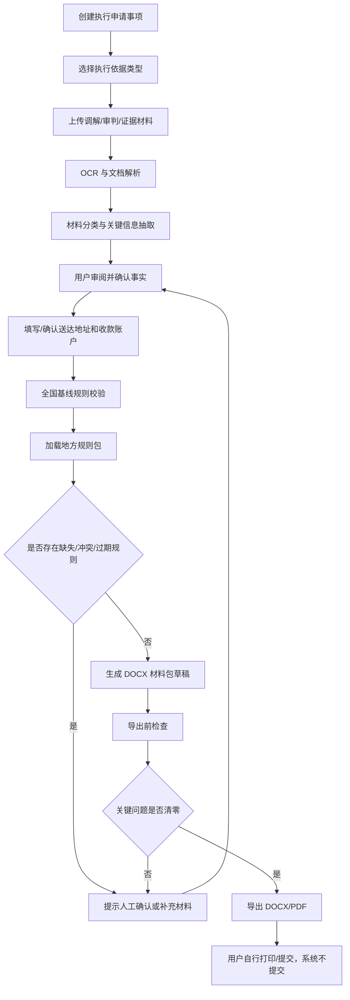
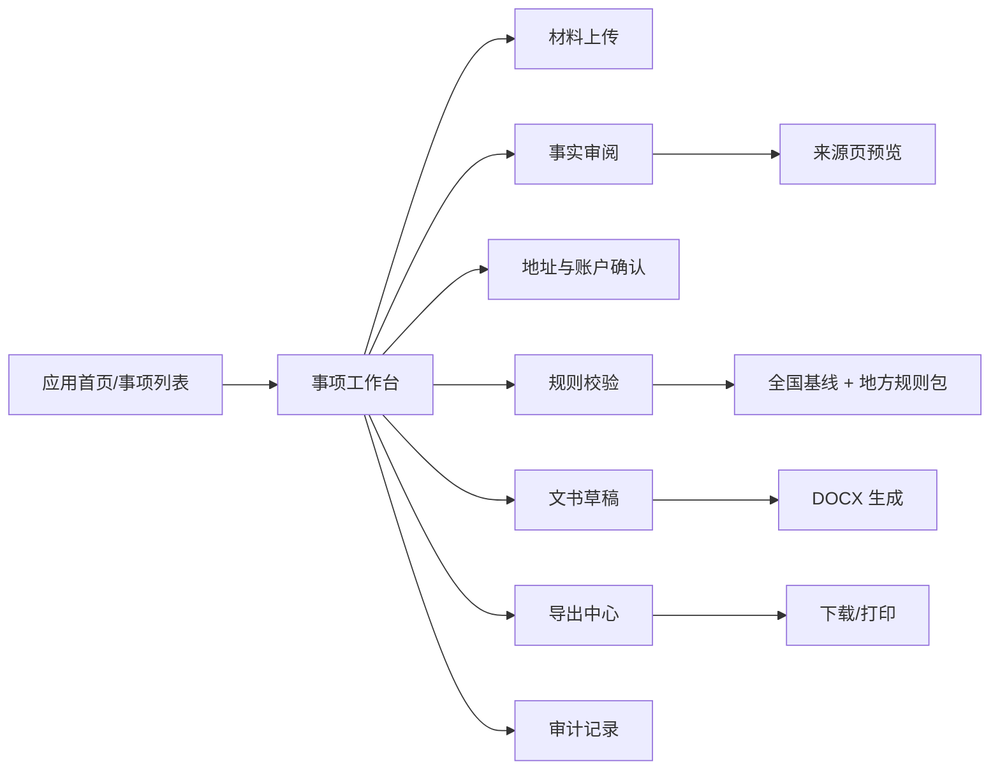
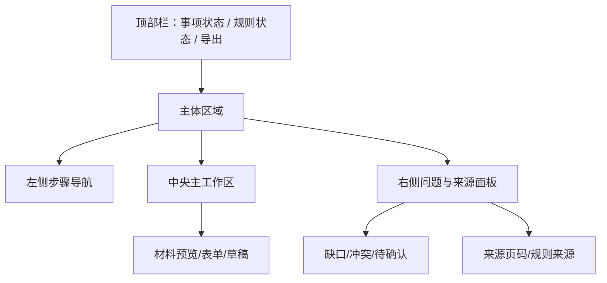
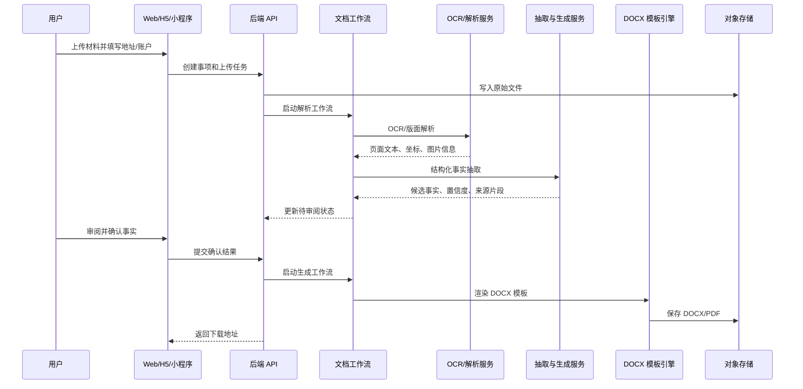

# 全国版强制执行材料生成助手：产品方案

版本：v0.1

日期：2026-08-04

适用对象：中国大陆法律科技、产品、研发、法务审核团队
产品边界：仅生成草稿/审阅版材料包，不进行法院提交、网上立案、费用支付、送达、法院联系或对外发送。

## 1. 产品定位

本产品是面向中国大陆申请强制执行场景的法律文书助手。MVP 以桌面 Web 页面为标准体验，同时适配移动端 Web 与微信小程序。用户上传证据、调解/审判材料、身份证明、账户信息、地址信息和财产线索后，系统完成材料分类、关键信息识别、敏感信息脱敏、事实核验、缺口提示，并生成类似用户提供模板的 DOCX 材料包。

全国版产品不绑定某一个省、市或法院。全国性法律、最高人民法院规则和最高人民法院公开文书样式作为基线；各地法院材料要求、电子材料格式、份数、模板差异、窗口习惯和平台要求作为可配置地方规则包叠加。任何地方规则缺失、冲突或过期，必须提示用户或法务审核人员确认。

## 2. MVP 目标

- 支持用户创建一个申请强制执行事项。
- 支持上传 PDF、DOCX、图片、压缩包内图片等材料。
- 自动识别调解书/判决书/裁定书、身份证明、账户材料、地址材料、财产线索、付款记录等类型。
- 自动抽取案号、法院、案由、申请执行人、被执行人、金额、履行期限、生效日期、地址、联系方式、账户和财产线索。
- 对姓名、身份证号、手机号、地址、银行卡号、微信/支付宝账号、案号、金额、图片证件等敏感信息进行分级识别和脱敏展示。
- 引导用户补充送达地址信息，生成“送达地址确认书”。
- 基于确认后的事实生成 DOCX 材料包。
- 导出前检查关键事实、关键附件、金额计算、占位符、地方规则状态和人工确认记录。
- 输出 DOCX/PDF 预览与下载，不做任何外部提交。

## 3. 模板提炼结果

已读取用户提供的 `强制执行立案材料模板.docx`。该模板已包含脱敏字段，但仍呈现出完整材料包结构。方案中不复述具体个人身份证号、手机号、详细住址、银行账号等真实样例信息，只提炼为字段与生成规则。

### 3.1 材料包模块

| 模块 | 生成目标 | 数据来源 |
|---|---|---|
| 封面 | 展示材料包标题、案件简称 | 用户确认后的案由、当事人、执行依据 |
| 材料目录 | 列出全包材料名称和用途 | 系统模板 + 已生成材料 |
| 强制执行申请书 | 核心申请文书 | 调解/判决/裁定材料 + 用户确认事实 |
| 申请执行人身份证明材料 | 身份信息表和证件页 | 用户上传身份证/营业执照/主体材料 |
| 执行案款收款账户确认书 | 收款账户确认 | 用户填写或上传账户材料 |
| 申请执行人送达地址确认书 | 执行程序送达地址 | 用户填写地址、电话、电子送达意愿 |
| 被执行人身份信息材料 | 被执行人基础身份与地址 | 执行依据、用户上传材料、人工补充 |
| 被执行人财产线索清单 | 银行、支付账户、不动产、车辆、股权等线索 | 用户上传证据、人工填写 |
| 纸质递交材料清单 | 打印/邮寄/窗口递交核对 | 全国基线 + 地方规则包 |

### 3.2 关键字段

| 字段组 | 字段示例 | 风险级别 | 处理策略 |
|---|---|---:|---|
| 当事人身份 | 姓名、性别、民族、出生日期、身份证号 | 高 | 存储加密，日志脱敏，导出前确认 |
| 地址联系方式 | 户籍地、现住址、送达地址、手机号、电子送达方式 | 高 | 分级展示，地址确认书单独确认 |
| 案件信息 | 法院、案号、案由、文书类型、作出日期、生效日期 | 中 | 来源追踪，允许完整进入正式草稿 |
| 金额信息 | 本金、利息、案件受理费、迟延履行期间债务利息、暂计金额 | 中高 | 计算过程可追溯，最终以法院核算提示 |
| 账户信息 | 户名、开户行、银行账号、支付宝/微信账号 | 高 | 默认掩码展示，正式导出需用户确认 |
| 财产线索 | 银行账户、不动产、车辆、股权、证券、公积金、家属联系线索 | 高 | 仅授权角色可见，导出前二次确认 |
| 证件图片 | 身份证正反面、营业执照、授权材料 | 高 | 加密存储，预览加水印，导出原图需确认 |

### 3.3 脱敏规则

| 类型 | 展示脱敏 | 日志/埋点 | 正式 DOCX |
|---|---|---|---|
| 姓名 | `张*`、`申请执行人A` | 不记录明文 | 用户确认后可写入 |
| 身份证号 | 前 6 后 4，中间 `*` | 不记录明文 | 用户确认后可写入 |
| 手机号 | 前 3 后 4，中间 `*` | 不记录明文 | 用户确认后可写入 |
| 银行卡号 | 仅后 4 位 | 不记录明文 | 用户确认后可写入 |
| 地址 | 省市区可见，详细门牌掩码 | 不记录明文 | 用户确认后可写入 |
| 案号 | 默认完整展示 | 可记录 | 可写入 |
| 金额 | 默认完整展示 | 可记录范围或哈希 | 可写入 |
| 图片证件 | 预览水印 + 局部遮罩 | 不记录图像内容 | 用户确认后插入 |

## 4. 用户角色

- 个人用户：上传材料、填写地址和账户、确认事实、下载材料。
- 企业/法务用户：批量管理事项、上传主体材料、确认被执行人线索。
- 律师/代理人：补充代理材料、复核事实、确认导出。
- 内部法务审核员：维护规则包、审核模板、处理规则冲突。
- 平台运营：处理账户、权限、工单、异常任务，不查看非授权敏感材料。

## 5. 核心用户流程

## 6. 信息架构

## 7. 页面设计稿说明

### 7.1 桌面 Web 标准页面

桌面端采用“左侧步骤导航 + 中央工作区 + 右侧问题面板”的审阅式布局。

- 顶部：事项名称、状态、目标法院、规则包状态、导出按钮。
- 左侧：上传材料、事实确认、地址账户、金额计算、规则校验、草稿审阅、导出。
- 中央：当前步骤主内容，例如文档预览、表单、表格、草稿编辑器。
- 右侧：缺失材料、冲突事实、规则提示、来源引用、人工例外记录。

### 7.2 移动 Web

移动端保留完整业务能力，但页面从三栏切换为单列步骤流：

- 底部 Tab：事项、上传、审阅、导出。
- 右侧问题面板改为底部抽屉。
- 文档预览使用分页图片/PDF 预览，避免在移动端直接渲染复杂 DOCX。
- 表单采用分组卡片，不使用密集表格。

### 7.3 微信小程序

微信小程序定位为轻量事项入口：

- 适合材料补传、地址确认、账户确认、事实确认、进度查看和下载链接获取。
- 大文件上传、复杂文书预览和批量材料审阅，优先引导至 Web/H5。
- 小程序端通过微信能力选择图片或会话文件，再使用服务端签名直传对象存储。

## 8. 文档生成流程

## 9. 规则与人工确认策略

| 场景 | 系统行为 | 是否允许导出 |
|---|---|---|
| 全国基线规则命中且无冲突 | 正常生成 | 允许 |
| 地方规则包缺失 | 显示“目标法院地方要求未确认” | 允许带风险提示导出 |
| 地方规则过期 | 要求人工确认是否继续 | 审核后允许 |
| 地方规则与全国基线冲突 | 标记高风险冲突 | 默认阻断 |
| 关键事实无来源 | 要求用户补充或手动确认 | 默认阻断，人工例外后允许 |
| 金额计算未确认 | 标记金额高风险 | 默认阻断 |
| 占位符未替换 | 阻断 | 不允许 |

## 10. MVP 功能清单

### P0 必须实现

- 登录、事项创建、事项列表。
- 材料上传、分类、预览。
- OCR 和 DOCX/PDF 文本抽取。
- 核心事实抽取与人工确认。
- 地址确认书表单。
- 收款账户确认表单。
- 金额计算表。
- 全国基线规则校验。
- DOCX 材料包生成。
- 导出前检查。
- 审计日志。

### P1 建议实现

- 地方规则包管理台。
- 被执行人财产线索结构化录入。
- 证件图片自动旋转、裁剪、清晰度评分。
- 草稿对照来源高亮。
- 规则来源附录。
- 批注与多人审阅。

### P2 后续扩展

- 仲裁裁决、公证债权文书、行政非诉执行等专项流程。
- 批量事项管理。
- 企业法务和律所模板库。
- 只读公共来源检索。
- 经专项审批后的平台集成，但不属于当前 MVP。

## 11. 验收标准

- 用户能在桌面 Web 完成从上传到导出 DOCX 的完整流程。
- 移动 Web 和微信小程序能完成上传、补充地址、确认事实和查看结果。
- 生成材料包结构与模板一致或更清晰，包括申请执行书、身份证明、账户确认、送达地址确认、财产线索、材料清单。
- 每个事实性字段可追溯到上传材料、用户录入或规则包。
- 日志不记录身份证号、手机号、银行卡号、详细地址等明文敏感信息。
- 导出前能发现未确认事实、占位符、金额未确认、规则冲突和关键附件缺失。
- 全流程不发生外部提交、送达、支付或法院联系。

## 12. 已核验参考

- 最高人民法院《执行程序须知》列明可申请执行文书、管辖、期限、材料和申请书格式：https://www.court.gov.cn/zixun/xiangqing/78732.html
- 最高人民法院诉讼文书样式《申请书（申请执行用）》：https://www.court.gov.cn/susongyangshi/xiangqing/639.html
- 最高人民法院诉讼文书样式执行程序目录：https://www.court.gov.cn/susongyangshi/97.html
- 全国人大 2023 年修改《中华人民共和国民事诉讼法》的决定，2024-01-01 施行：https://www.npc.gov.cn/npc/c2/c30834/202309/t20230901_431419.html
- 《中华人民共和国个人信息保护法》：https://www.npc.gov.cn/WZWSREL25wYy9jMi9jMzA4MzQvMjAyMTA4L3QyMDIxMDgyMF8zMTMwODguaHRtbD9yZWY9aW1i
