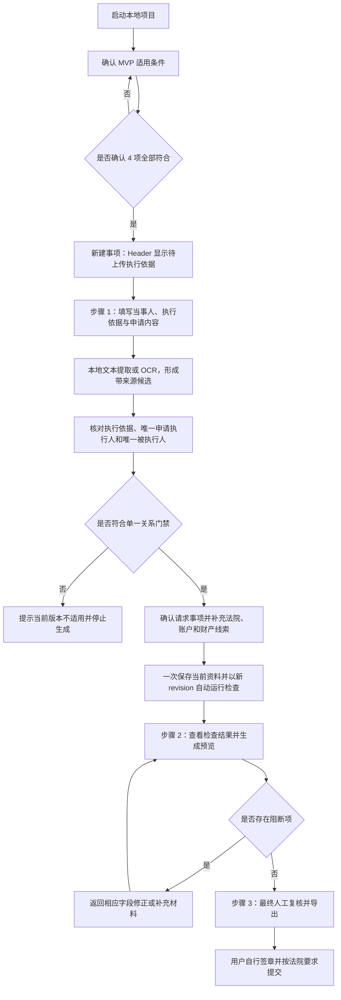

# 全国版强制执行材料生成助手：产品方案

版本：v0.5

日期：2026-08-06

决策状态：本人办理、单一申请执行人、单一被执行人的本地 MVP

产品边界：MVP 仅作为本地运行的材料分析与文书生成工具，不提供登录、用户管理、律师工作台、组织管理、后台管理、法院平台登录、网上立案、缴费、送达、联系法院或任何对外提交行为。

## 0. 本次 Review 结论

MVP 不再面向一般化强制执行案件，而是只解决一种明确场景：

> 用户本人是申请执行人，案件只有一名申请执行人和一名被执行人，不委托律师或其他代理人，根据民事调解书或民事判决书生成可人工复核的强制执行申请材料。

核心决策：

- MVP 用户是准备自行申请强制执行的当事人本人，不是律师。
- MVP 固定支持一名申请执行人和一名被执行人。
- MVP 不支持共同申请人、多个被执行人、代理人、法定代理人、委托诉讼代理人和复杂主体关系。
- 第一批可靠性验收以自然人申请执行人对自然人被执行人为主。法人、非法人组织及其法定代表人材料进入第二版。
- MVP 优先支持明确的金钱给付义务。多个独立义务、复杂条件履行和需要法律判断的履行安排不纳入可靠性承诺。
- MVP 不实现生成式 AI。材料解析依靠本地文本提取、OCR、确定性规则和用户确认。
- OCR、规则或材料识别失败时，用户可以手工填写；失败不得阻止简单案件继续生成。
- 首页适用性门禁固定为 4 条编号条件和 1 个总确认复选框；未确认时不能新建事项。
- 工作台固定为“资料填写—检查与预览—导出”三步；当事人与依据、申请内容在步骤 1 的同一页面完成。
- 新事项在上传执行依据前统一显示“待上传执行依据”；只有解析得到并经用户核对的案号才可替换为事项标题。
- 申请执行人和被执行人的身份证人像面、国徽面都是进入后续步骤前的必传材料；执行依据同样必须上传，三个区域都需在 UI 明确显示“必传”。
- 步骤 1 的主要金钱义务、文书金额和请求事项候选只能来自同页上传的执行依据或用户明确填写，不得凭空生成。
- 第二版的身份入口、律师模式、复杂角色和 AI 增强仅作为规划留档，不进入当前界面、接口和开发里程碑。

本文中的“原告、被告”只用于描述原诉讼关系。进入执行申请流程后，界面和文书统一使用“申请执行人、被执行人”。

## 1. 产品定位

Case Filing Assistant MVP 是一个帮助简单案件当事人本人整理材料并生成强制执行申请书的本地工具。

目标用户通常具有以下特征：

- 已取得民事调解书或民事判决书。
- 对方未履行或未完全履行明确的金钱给付义务。
- 案件只有自己和一名对方当事人。
- 不准备委托律师办理申请执行。
- 希望系统从材料中提取基础信息，减少重复填写。

产品价值不是替代法律判断，而是把“阅读材料、录入申请信息、检查遗漏、套用文书格式”变成一个可核对的本地流程。

## 2. MVP 适用门禁

新建事项前展示以下 4 条编号条件。用户逐条阅读后，只需勾选 1 个总确认复选框“我已阅读并确认以上 4 项全部符合”，即可启用“新建强制执行事项”：

1. 我是生效法律文书中享有权利、准备本人办理申请执行的当事人，不委托律师或其他代理人。
2. 本次申请只有一名自然人申请执行人和一名自然人被执行人。
3. 执行依据是民事调解书或民事判决书，且只有一项明确的金钱给付义务。
4. 我会人工核对姓名、证件号、金额、履行情况和请求事项。

该总确认是服务端生成门禁的一部分，不只是前端提示。新建时应记录适用条件版本、流程版本、确认时间和确认结果；条件版本变化或用户撤销确认后，旧校验与旧文书失效。

出现以下情况时，MVP 应明确提示“当前版本不适用”，不得勉强生成：

- 共同原告、共同被告或执行阶段有多名申请执行人、被执行人。
- 需要填写律师、委托代理人、法定代理人或其他代理人。
- 任一方是法人或其他组织，且需要处理法定代表人、负责人或授权关系。
- 执行依据不是民事调解书或民事判决书。
- 存在多个相互独立的执行义务，无法归并为一个明确请求。
- 条件是否成就、履行主体、债权转让、继承或权利承受等关系需要额外法律判断。

如果系统仅因 OCR 误识别而检测出多个人名，用户可以回到步骤 1 的执行依据区域修正材料类型或识别结果；业务门禁不能被简单跳过。

## 3. 本地运行方式

- 用户在本机启动项目并通过浏览器访问本地工作台。
- 材料、数据库、OCR 结果、预览和生成文件保存在本机持久化目录。
- MVP 不提供任何生成式 AI 配置或外部模型调用入口。
- OCR 模型提前安装在本地，处理案件时不静默联网下载模型。
- 用户可以重新打开、继续和删除本地事项。

## 4. MVP 输入与输出

### 4.1 输入材料

必需材料：

- 一份民事调解书或民事判决书，作为执行依据。
- 申请执行人身份证人像面（正面）和国徽面（反面）照片。
- 被执行人身份证人像面（正面）和国徽面（反面）照片。

用户填写：

- 被执行人身份信息中材料未明确的部分。
- 申请法院。
- 收款账户。
- 送达地址和联系方式。
- 已知财产线索。

文件格式按材料类型约束：

- 执行依据：文本型或扫描型 PDF、DOCX、JPG、PNG。
- 申请执行人和被执行人身份证正反面：JPG、PNG。

P0 不接收 ZIP 和批量目录。

### 4.2 输出材料

P0 输出：

- `强制执行申请书.docx`。
- `提交材料清单.pdf` 或 DOCX。
- `内部来源核对表.html` 或 PDF，仅供用户复核。

用户上传的身份证明和执行依据作为附件原件存在，不重新伪造或合并为新的身份证明文件。

第二版再考虑独立生成收款账户确认书、送达地址确认书、财产线索表和律师版本材料包。

## 5. 三步用户流程

任何材料、确认事实、金额或申请法院变化后，旧校验和旧文书立即失效，必须重新检查和生成。

## 6. 页面与功能

### 第一步：资料填写

- 新建后 Header 标题显示“待上传执行依据”；上传、解析并核对案号后，才改为案号标题。处理中可显示“正在识别执行依据”，不能提前使用示例案号或文件名冒充案号。
- 页面先展示执行依据上传区，支持查看材料类型、解析状态、分页预览和 OCR 文本，并允许替换、删除或重新解析。
- 上传执行依据后，展示案号、作出法院、文书类型、文书日期和生效信息候选；点击字段可定位到来源文件、页码、片段和可用时的坐标。
- 固定展示一个“申请执行人”区域和一个“被执行人”区域，不提供“新增当事人”“新增代理人”或角色类型菜单。
- 申请执行人区域分别引导上传身份证人像面和国徽面；两面上传完成、识别候选经人工核对并确认后，才能进入下一步。
- 身份证住址只能作为“证件记载住址”候选，不能自动等同于送达地址；送达地址必须由用户确认或另行填写。若提供“复制证件住址”操作，也必须由用户显式触发并重新确认。
- 被执行人区域同样分别上传身份证人像面和国徽面；任一面缺失都会阻断进入下一步，姓名仍须从执行依据候选或用户填写中得到人工确认。
- 显示“待上传、处理中、已提取待确认、用户已确认、低质量、失败重试、失效待重确认”等明确状态。
- 当事人和依据区域下方直接展示申请内容，不再要求用户切换页面。
- 从执行依据中提取一项主要金钱给付义务、文书金额和请求事项候选，并默认展示来源片段；候选不会自动进入申请书。
- 填写申请法院、请求事项、收款账户、送达信息和财产线索。
- 作出法院可以作为来源候选展示，但不能自动等同于有管辖权的申请法院；申请法院必须由用户选择或填写并确认。若提供“复制作出法院”操作，也不得继承原字段的确认状态。
- 步骤 1 不展示履行情况材料入口、金额计算器或“申请内容与未履行金额”面板；金额关系仍由服务端以 Decimal 规则处理，并在检查与预览阶段供用户复核。
- 步骤 1 只有一个主按钮；点击后先在 Modal 中按“执行依据、申请执行人、被执行人、请求与联系信息”列出缺失项。资料齐全后，同一 Modal 按“收集—保存—检查”展示进度并锁定表单；系统使用保存响应中的新 revision 运行检查，保存失败或 revision 冲突时保留未提交输入。

### 第二步：检查与预览

- 检查单一当事人门禁、字段确认、材料完整性和来源状态。
- 展示阻断项、警告和信息提示。
- 生成 DOCX 后转换为 PDF/PNG 预览。
- 检查占位符、分页、签章位置和字段溢出。
- 点击生成预览后弹出不可关闭的任务进度弹窗并锁定页面；只有生成任务及预览记录进入成功、失败或失效终态后才恢复操作。

### 第三步：导出

- 用户确认已人工核对姓名、证件号、案号、法院、金额和请求事项。
- 提示系统未向法院提交，地方材料要求仍需用户自行核对。
- 下载当前数据版本对应的申请书、材料清单和内部来源核对表。

## 7. 候选事实与确认事实

候选事实是材料解析结果的审核状态，不是生成式 AI 功能。

规则和 OCR 可以产生以下候选：

- 案号、法院名称、文书类型和日期。
- 申请执行人姓名和身份证号。
- 被执行人姓名和材料中已有的身份信息。
- 判决主文或调解协议附近的金额、期限和履行文字片段。

每个候选必须包含：

- 字段标识和候选值。
- 来源文件、页码、文本片段和可用时的坐标。
- 产生方式、标准化置信度和解析质量；规则命中也必须明确标记产生方式，不能用高置信度替代人工确认。
- 待确认、已采纳或已驳回状态。

最终文书只能读取用户确认的数据快照。规则候选、OCR 全文和未确认字段不得直接进入模板。

候选与确认状态统一为“待上传 → 处理中 → 已提取待确认 → 用户已确认/已修改”。来源文件被替换或删除、确认事实被修改时，相关字段进入“失效待重确认”；不允许仅在界面上保留绿色确认状态。

### 7.1 MVP 跨端产品契约

以下名称由产品、前端和后端共同使用，避免同一状态在不同方案中含义漂移：

| 对象 | MVP 契约 |
|---|---|
| 流程 | `workflow_profile=self_single_v1`；工作台固定三步，服务端仍以字段确认、校验和生成为门禁权威 |
| 适用确认 | `eligibility_version=self_single_v1`、`eligibility_confirmed=true`、`confirmed_at`；创建事项时原子记录 |
| Header | `title_state=pending_basis|processing_basis|case_number_pending_confirmation|case_number_ready`；只有案号经用户确认后才允许显示案号标题 |
| 材料类型 | `legal_basis`、`applicant_id_front`、`applicant_id_back`、`respondent_id_front`、`respondent_id_back`、`performance_evidence` |
| 字段来源 | 可确认候选使用 `origin=source|user`；材料来源至少包含文件、解析版本、页码、片段，版面可用时包含坐标。确定性金额结果不伪装成材料候选，独立保存输入字段和公式/规则版本并经用户确认；用户显式复制到目标字段后仍记为 `origin=user` 并重新确认 |
| 候选信息 | `extraction_method`、`confidence`、`confirmation_status=pending|processing|extracted_pending_confirmation|confirmed|invalidated` |
| 版本失效 | 来源、确认事实、金额或申请法院变化时推进数据版本，使旧校验和旧文书过期；只有直接受影响的来源字段进入 `invalidated` |
| 最终导出 | 零阻断、当前数据版本已校验且生成、最终复核声明由服务端记录后，才允许下载生成文件 |

前端不得自行推导或覆盖服务端门禁结果。后端也不得以“高置信度”代替用户确认，或把尚未确认的案号发布为 Header 标题。

## 8. 可靠性策略

MVP 的可靠性不以“自动识别所有内容”为目标，而以“简单案件可以稳定完成并且错误可被发现”为目标。

### 8.1 自动化边界

- 案号、法院、日期、证件号和金额字面值优先使用规则提取。
- 申请执行人和被执行人由用户最终指定，系统不根据复杂角色关系自动判断。
- 判决主文或调解条款只提供来源片段和金额候选，用户确认最终义务和未履行金额。
- OCR 失败时允许用户手工填写。
- 检测到多名核心当事人或代理关系时阻断，而不是猜测。

### 8.2 金额边界

MVP 支持：

- 一项明确金钱给付义务。
- 用户确认的文书金额。
- 用户确认的已履行金额。
- 确定性的减法和合计。

MVP 不自动处理：

- 复杂分期到期判断。
- 条件履行是否成就。
- 分段利率和迟延履行利息法律参数。
- 多项债务抵扣顺序。

用户可以手工填写已经核对的最终申请金额，并保留“用户确认”记录。

### 8.3 交互反馈与可访问性

动效用于解释“操作—处理—结果”的因果关系，不用于装饰或制造已完成假象：

- 约 140ms：按钮按压、悬停、焦点与状态标签切换。
- 约 220ms：Header 标题替换、步骤推进、来源高亮和弹窗进入。
- 约 420ms：上传完成、候选内容展开和预览生成。
- 上传与 OCR 处理可显示进度或等待反馈，但只有服务端状态完成后才能进入“解析完成”或“已确认”。
- 系统开启 `prefers-reduced-motion: reduce` 时，全部非必要动画降为即时状态切换；不能依赖动画、颜色或位移单独传达状态。
- 动效结束后的 DOM、焦点和辅助技术状态必须与视觉状态一致，键盘操作不因动画被阻断。

## 9. 校验门禁

`blocking`：

- 未提交当前版本的适用条件总确认，或 4 项条件中任一项不符合。
- 检测或录入了多个申请执行人、多个被执行人或代理人。
- 执行依据未上传，或解析候选/人工录入的文书类型、案号、作出法院等执行依据关键字段尚未完成确认。
- 申请执行人身份证正反面未上传并核对，或唯一申请执行人、唯一被执行人姓名尚未确认。
- 申请法院、送达地址、主要义务、金额或请求事项缺失或尚未确认。
- 关键正文事实未确认。
- 金额、请求事项或来源状态未确认。
- 当前数据版本未通过校验。
- 模板占位符残留或预览生成失败。

`warning`：

- 生效信息不明确。
- 申请期间可能需要进一步核对。
- 目标法院及地方材料要求未核验。
- OCR 质量较低或用户使用了较多手工填写字段。

`info`：

- 当前文件必须人工复核，系统没有提交法院。
- 用户需自行签字或盖章并按目标法院要求准备附件。

## 10. MVP 验收场景

### 场景 A：文本型民事调解书

一名虚构自然人申请执行人、一名虚构自然人被执行人、无代理人。用户确认首页 4 项条件后新建事项，Header 先显示“待上传执行依据”；上传文本型调解书并核对案号后，Header 改为案号。用户上传申请执行人身份证正反面、确认一项金钱给付义务，生成可打开和预览的 DOCX。

### 场景 B：扫描型民事判决书

系统完成 OCR、来源定位和置信度标记。用户修正低质量字段，确认单一当事人和一项金钱请求后生成文书；OCR 置信度高也不能跳过人工确认。

### 场景 C：部分履行

用户确认文书金额和已履行金额，系统执行确定性减法并展示计算过程，用户确认尚未履行金额后生成请求事项。

### 场景 D：不支持的复杂案件

材料中存在两名被执行人或代理关系。系统明确阻断生成并提示当前版本只用于单一被执行人的本人办理场景。

### 场景 E：修改使旧文书失效

用户生成后修改被执行人信息、金额或申请法院。旧文书立即标记过期，必须重新校验和生成。

### 场景 F：重启恢复

关闭并重新启动本地项目后，事项、材料、确认事实和任务状态可以恢复，不产生重复候选或孤立文件。

### 场景 G：减少动态效果

操作系统开启“减少动态效果”后，三步流程、上传、来源查看、预览和阻断仍可完整操作；状态通过文字、图标和可访问属性表达，不依赖动画或颜色。

## 11. MVP 验收标准

- 用户无需登录，也不会看到律师模式或身份选择入口。
- 首页以 1、2、3、4 展示适用条件，且只有一个总确认复选框；未勾选时“新建强制执行事项”不可用。
- 工作台固定为三步：资料填写、检查与预览、导出；当事人与依据和申请内容在步骤 1 同页完成。
- 新事项 Header 在执行依据上传前显示“待上传执行依据”，处理中显示处理状态，解析并核对案号后才显示案号。
- UI 固定只有一个申请执行人和一个被执行人，不能新增代理人或其他角色。
- 执行依据及申请执行人、被执行人身份证正反面未上传时，步骤 1 Modal 必须列出对应缺失模块并阻断保存进入检查。
- 民事调解书和民事判决书的文本型及扫描型虚构样本可以进入审核流程。
- 步骤 1 的主要义务、金额和请求事项候选来自同页执行依据，不存在无来源的自动生成内容。
- 每个正文关键字段都有材料来源或“用户填写”记录，机器提取候选同时显示产生方式、置信度和人工确认状态。
- 复杂角色和多当事人样本被稳定阻断，不被错误生成。
- OCR 和规则解析失败后可以通过手工填写完成支持范围内的案件。
- 未确认字段、金额、申请法院、执行依据、过期校验或占位符阻断导出。
- 生成 DOCX 可被 Word/WPS 打开，渲染预览无明显分页、字体、页眉页脚和字段溢出问题。
- 处理案件时不调用生成式 AI，不向外部服务发送案件内容。
- 全流程没有法院登录、提交、缴费、送达、短信、邮件或法院联系功能。
- 标准动效与 `prefers-reduced-motion` 模式均通过键盘、焦点和状态可访问性验收。
- 桌面 Web 是视觉与效率基准；移动 Web 使用同一三步流程并可完成上传、核对、阻断处理、预览和导出，不建立第二套业务流程。

## 12. MVP 交付顺序

### 里程碑 1：固定单一关系的手工生成闭环

- 4 条编号适用条件和 1 个总确认门禁。
- 三步工作台、Header 待上传/处理中/案号状态和一个申请执行人、一个被执行人的固定表单。
- 申请执行人和被执行人身份证正反面上传门禁及缺失项 Modal 提示。
- 执行依据和申请内容手工填写。
- 基础门禁、DOCX 生成和预览。

### 里程碑 2：材料读取与来源

- 文本型 PDF、DOCX 读取。
- 扫描 PDF、JPG、PNG OCR。
- 分页预览、来源片段、置信度和解析失败恢复。

### 里程碑 3：规则候选与一致性

- 案号、法院、日期、证件号和金额规则候选。
- 单一当事人检测和不支持案件阻断。
- 数据版本、旧校验和旧文书失效。

### 里程碑 4：可靠性与发布准备

- 30 至 50 份完全虚构的简单案件样本。
- 不支持样本阻断测试。
- DOCX/PDF/PNG 视觉回归。
- 本地启动、备份、删除和错误恢复说明。

MVP 里程碑不包含生成式 AI、律师入口、多角色编辑和法人主体流程。

## 13. 多端兼容与微信演进

- MVP 同时提供桌面 Web 与移动 Web 兼容形态，以桌面 Web 作为视觉和效率基准；两者使用同一三步流程、同一领域契约和同一生成门禁，不增加第二套流程。
- 移动 Web 将桌面右侧来源区转为抽屉或弹窗、压缩三步导航，但必须保留来源查看、人工确认、阻断原因、人工复核与未提交提示和关键操作的可访问性。
- 微信小程序仅作为后续适配方向，保持适用门禁、三步流程、来源、确认、阻断、人工复核和未提交边界一致。
- 多端只复用领域契约、字段元数据、校验结果和设计 token；不强求 Web DOM 组件直接复用到微信小程序。
- 在 MVP 阶段不创建 `apps/miniprogram` 空壳、不引入小程序构建依赖，也不为未来平台化提前加入登录、云存储或远程案件传输。

## 14. 第二版规划留档，不进入当前实现

第二版启动页增加办理身份选择：

### 14.1 自己是当事人

- 默认进入“单一被执行人材料生成”。
- 明确提示当前流程用于一名申请执行人对一名被执行人的强制执行材料。
- 保持规则优先、人工确认和确定性生成。

### 14.2 我是律师

- 进入专业案件工作台。
- 支持多名申请执行人、多名被执行人、代理人、法定代表人和复杂组织关系。
- 提示用户可以激活 AI 协助解析复杂材料。
- 激活前说明处理时间可能增加，并要求确认模型提供方、发送范围和数据风险。
- AI 只生成带来源的候选事实，仍不得直接生成未经确认的最终文书。

### 14.3 第二版技术预留

- 前端保留可新增 `self`、`lawyer` 工作流模块的路由和状态边界。
- 后端当事人数据使用可扩展集合结构，但 MVP 校验基数必须为一对一。
- 文件存储、任务执行和身份上下文通过接口隔离，便于平台化替换。
- 不为第二版提前创建登录页、律师入口、AI 设置页、代理人表单或隐藏功能开关。

第二版只有在 MVP 的支持样本生成正确、不支持样本稳定阻断、文书视觉质量达标后才开始实现。

## 15. 已核验参考来源

- 最高人民法院《执行程序须知》：https://www.court.gov.cn/zixun/xiangqing/78732.html
- 最高人民法院诉讼文书样式《申请书（申请执行用）》：https://www.court.gov.cn/susongyangshi/xiangqing/639.html
- 最高人民法院诉讼文书样式执行程序目录：https://www.court.gov.cn/susongyangshi/97.html
- 全国人大 2023 年修改《中华人民共和国民事诉讼法》的决定：https://www.npc.gov.cn/npc/c2/c30834/202309/t20230901_431419.html
