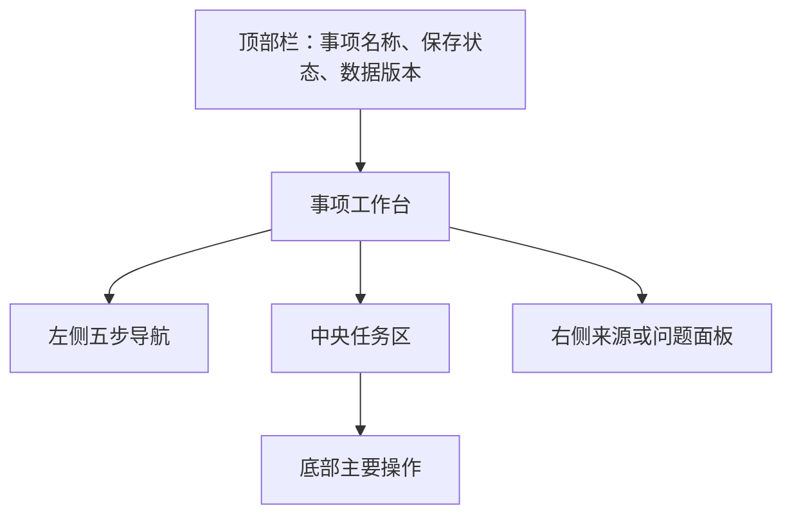

# 全国版强制执行材料生成助手：前端技术方案

版本：v0.4

日期：2026-08-05

目标：使用可延续到第二版和平台化阶段的前端技术基线，实现“本人办理、单一申请执行人、单一被执行人”的本地 MVP。当前版本不实现身份入口、律师模式、多角色表单或生成式 AI 设置。

## 0. 本次 Review 结论

前端不再使用 Vite SPA 作为最终技术基线，调整为：

- 使用 React + React DOM 作为组件和渲染基础，Next.js App Router 作为 React 应用框架，保留以后登录、律师工作台、服务端渲染、路由权限和平台部署能力。
- 使用 React-Redux 将 Redux store 接入 React；Redux Toolkit 管理跨页面、可变的工作台状态，RTK Query 管理 API 数据和缓存。
- 根据 FastAPI OpenAPI 自动生成 RTK Query endpoints，避免手写两套请求类型。
- 建立轻量 `packages/ui`，统一布局、字段状态、问题状态和敏感信息展示，不在 MVP 制作独立组件文档站或完整设计系统产品。
- 使用 Turborepo + pnpm workspace 管理 Web 和共享包，为第二版新增律师工作台或其他客户端保留清晰边界。
- 本地 MVP 运行 Next.js Node 服务，由 Next.js 同源代理 FastAPI；不使用静态导出，以免限制动态事项路由和未来服务端能力。
- MVP 页面固定为一个申请执行人和一个被执行人，不提供动态新增角色能力。

扩展性通过技术栈、模块边界和数据契约实现，不通过提前开发第二版页面实现。

## 1. 技术选型

| 层 | MVP 选型 | 现在与未来的作用 |
|---|---|---|
| Monorepo | pnpm workspace + Turborepo | 统一构建 Web、契约和 UI 包，后续增加应用 |
| UI 运行时 | React + React DOM + TypeScript | 组件、hooks、浏览器渲染和 hydration |
| Web 框架 | Next.js App Router | 路由、布局、Server/Client Components 和自托管 |
| React 状态绑定 | React-Redux | 通过 Provider 和类型化 hooks 把 Redux 接入 React |
| 全局状态管理 | Redux Toolkit | 管理跨步骤工作台 UI 和全局可变状态 |
| API 状态 | RTK Query | 查询、mutation、缓存、轮询和失效管理 |
| API 生成 | `@rtk-query/codegen-openapi` | 从 FastAPI OpenAPI 生成 endpoints 和类型 |
| UI 基础 | Ant Design + `@ant-design/nextjs-registry` | 表单能力和 App Router 首屏样式注入 |
| 共享 UI | `packages/ui` | 包装领域通用控件、设计 token 和状态样式 |
| 表单 | React Hook Form + Zod | 复杂表单性能、交互校验和提交前整理 |
| 文档预览 | PDF.js | PDF 页面、缩放、文本层和来源高亮 |
| 图标 | lucide-react | 工具按钮和状态入口使用统一图标 |
| 单元测试 | Vitest + Testing Library + MSW | reducer、表单、组件和 API 状态 |
| 端到端测试 | Playwright | 主流程、阻断、版本失效和布局回归 |

### 1.1 React、Next.js 与 Redux 的关系

三者不是替代关系，而是不同层次：

```text
React + React DOM       组件、hooks、渲染和 hydration
        ↓
Next.js App Router      React 应用框架、路由、布局和 Node.js 自托管
        ↓
React-Redux             将 Redux store 通过 Provider/hooks 提供给 React 组件
        ↓
Redux Toolkit           跨页面、全局可变状态
RTK Query               服务端 API 数据、缓存、轮询和失效
```

MVP Web 应用的直接运行依赖至少包括：

```text
next
react
react-dom
@reduxjs/toolkit
react-redux
```

状态归属：

- 组件内部临时交互使用 React `useState`、`useReducer` 或自定义 hooks。
- 表单草稿和字段错误使用 React Hook Form。
- 跨页面且需要共享的可变 UI 状态使用 Redux Toolkit slice。
- 事项、材料、事实、任务、校验和生成记录使用 RTK Query，不复制到普通 slice。
- 路由参数和筛选条件优先使用 Next.js params、search params，不为了“统一”全部塞入 Redux。

### 1.2 为什么使用 Next.js

MVP 虽然只在本地运行，但第二版将出现不同办理身份、律师工作台和后续登录需求。App Router 可以让公共布局、自助流程和律师流程按路由分区，并支持 Node.js 自托管和容器部署。

MVP 不把法律业务写入 Next.js Route Handler 或 Server Action。FastAPI 仍是业务 API 的唯一服务端；Next.js 负责页面、同源代理和将来需要的 Web 层能力。

### 1.3 为什么使用 Redux Toolkit

Redux 只保存需要跨组件、跨步骤共享且会变化的前端状态：

- 当前事项和当前步骤。
- 来源查看器选中的文件、页码和高亮。
- 工作台面板宽度和展开状态。
- 本地运行能力和连接状态。
- 第二版才会增加的办理身份状态。

按钮 hover、抽屉内部临时输入、单个组件 loading 等局部状态不进入 Redux，避免 store 膨胀和无关组件重渲染。

案件正文、候选事实、确认事实、任务和生成文件由 RTK Query 从后端获取，不复制进普通 Redux slice，也不持久化到浏览器存储。

Next.js App Router 下 Redux store 必须通过 `makeStore` 创建，并在工作台客户端 Provider 内按请求或工作台实例隔离，不能使用服务端全局单例。

## 2. 前端目录

```text
apps/web/
  src/
    app/
      layout.tsx
      page.tsx
      StoreProvider.tsx
      matters/
        [matterId]/
          layout.tsx
          materials/page.tsx
          facts/page.tsx
          application/page.tsx
          review/page.tsx
          export/page.tsx
      settings/
        local/page.tsx
    store/
      makeStore.ts
      hooks.ts
      api/
        emptyApi.ts
        generatedApi.ts          # OpenAPI 自动生成
        endpointEnhancements.ts  # 精确 cache tags 和轮询配置
      slices/
        workspaceUiSlice.ts
        sourceViewerSlice.ts
        runtimeSlice.ts
    features/
      eligibility/
      matters/
      documents/
      facts/
      application/
      validation/
      generation/
    components/
      MatterShell.tsx
      StepNavigation.tsx
      WorkspaceHeader.tsx
    lib/
      runtimeConfig.ts
      redaction.ts
      download.ts
    test/
      fixtures/
      server.ts
packages/
  contracts/
    openapi.json
    rtk-query-codegen.ts
  ui/
    src/
      tokens/
      fields/
      feedback/
      layout/
  doc-fields/
    src/
      fieldMetadata.ts
  redaction/
    src/
```

边界：

- `app/*/page.tsx` 只组合 feature 和布局。
- `features/*` 不直接使用裸 `fetch`，统一使用生成的 RTK Query hooks。
- `packages/ui` 不依赖案件领域模型，领域组件留在 `features`。
- 根 layout 使用 `AntdRegistry`；需要 Ant Design context 或复合子组件的封装统一放在标记为 Client Component 的 `packages/ui` 入口。
- `doc-fields` 只保存展示标签、分组和风险级别，并受生成的 `FieldKey` 类型约束。
- 生成的 `generatedApi.ts` 不手工修改，定制通过 `enhanceEndpoints` 完成。

## 3. MVP 路由

```text
/
/matters/[matterId]/materials
/matters/[matterId]/facts
/matters/[matterId]/application
/matters/[matterId]/review
/matters/[matterId]/export
/settings/local
```

首页只提供：

- MVP 适用条件确认。
- 新建“单一被执行人申请”事项。
- 打开最近本地事项。
- 删除本地事项。

MVP 不出现：

- “自己是当事人/我是律师”选择。
- 律师工作台入口。
- 登录、注册和组织入口。
- AI 开关、模型提供方和 API Key 设置。
- 多当事人或代理人入口。

第二版可以在 `/start` 增加身份选择，并新增 `/self/*`、`/lawyer/*` 路由组；当前版本不创建这些空页面。

## 4. 五步工作台

### 4.1 材料

- 上传 PDF、DOCX、JPG 和 PNG。
- 显示上传、排队、解析、成功、需关注和失败状态。
- 修改材料类型、删除和重新解析。
- 并排查看文件列表、页预览和 OCR 文本。
- 解析失败时提供“继续手工填写”，不显示 AI 建议。

### 4.2 当事人与执行依据

页面固定包含：

- 一个 `ApplicantForm`。
- 一个 `RespondentForm`。
- 一个 `LegalDocumentForm`。

不提供数组新增按钮、角色菜单和 `RepresentativeEditor`。如果后端返回 `unsupported_multiple_applicants`、`unsupported_multiple_respondents` 或 `unsupported_representative`，页面显示当前版本不适用，并禁止进入生成阶段。

字段点击后打开右侧 `SourceViewer`，跳到来源页和高亮区域。候选可以采纳、编辑后采纳、驳回或改为用户填写。

### 4.3 申请内容

- 一个主要金钱给付义务表单。
- 文书金额、已履行金额和用户确认的其他金额。
- 尚未履行金额及确定性计算说明。
- 申请法院、请求事项、账户、地址和财产线索。

不提供多义务列表、复杂分期设计器和自动法律利息参数。

### 4.4 检查与预览

- 运行后端校验。
- 按阻断、警告和信息展示问题。
- 每个问题跳转到对应材料或字段。
- 校验通过后启动生成任务。
- 使用 PDF.js 查看后端生成的申请书预览。

检测到复杂案件时使用明确的“不适用当前版本”状态，不把它包装成普通警告让用户继续。

### 4.5 导出

- 显示生成文件对应的数据版本、模板版本和时间。
- 用户确认已核对关键字段和地方要求。
- 下载强制执行申请书、材料清单和来源核对表。
- 当前数据版本高于生成版本时，禁用下载并要求重新生成。

## 5. 工作台布局



布局要求：

- 桌面基准宽度 1280px；更窄时右侧面板转抽屉，不承诺完整移动端体验。
- 使用 CSS Grid 的稳定列宽和 `minmax(0, 1fr)`，避免长字段改变布局。
- 字段标签、状态和操作按钮使用 `packages/ui` 统一 token。
- 高风险字段默认脱敏，查看明文使用图标按钮和 tooltip。
- 页面标题保持工具界面尺度，不使用营销式大标题和装饰卡片。
- 阻断提示直接说明“当前版本只支持一名申请执行人和一名被执行人”。

## 6. Redux 与 RTK Query

### 6.1 Store 创建

```ts
export const makeStore = () =>
  configureStore({
    reducer: {
      [api.reducerPath]: api.reducer,
      workspaceUi: workspaceUiReducer,
      sourceViewer: sourceViewerReducer,
      runtime: runtimeReducer,
    },
    middleware: (getDefaultMiddleware) =>
      getDefaultMiddleware().concat(api.middleware),
  });
```

要求：

- 不导出全局单例 store。
- `StoreProvider` 是 Client Component，在工作台 layout 中创建 store。
- React Server Component 不读取或写入 Redux。
- Redux DevTools 仅开发环境启用，并检查不暴露材料正文。
- Ant Design 组件遵循 App Router 客户端边界，不在 Server Component 中直接使用点式子组件 API。

### 6.2 Slice 职责

`workspaceUiSlice`：

- 当前步骤。
- 面板展开状态。
- 未提交表单提示。

`sourceViewerSlice`：

- 当前文档、页码、缩放和来源高亮。

`runtimeSlice`：

- API 连接状态。
- OCR、LibreOffice 和预览能力。
- 本地运行模式。

不能进入普通 slice：

- 身份证号、银行卡号、地址全文。
- OCR 全文。
- 确认卷宗和生成文书正文。
- 外部模型密钥。

### 6.3 RTK Query

RTK Query 负责：

- 事项、材料、候选事实和确认卷宗。
- 任务轮询。
- 校验结果。
- 生成记录和文件下载元数据。

OpenAPI codegen 生成基础 endpoints，再通过 `enhanceEndpoints` 配置精确 tag：

```text
Matter:{matterId}
Documents:{matterId}
Facts:{matterId}
Dossier:{matterId}
Validation:{matterId}:{revision}
Generation:{matterId}:{revision}
Job:{jobId}
```

Mutation 成功后使用返回的 `data_revision` 更新相关缓存并使旧校验、旧生成 tag 失效。

## 7. Next.js 数据与缓存策略

案件工作台主要是 Client Components，通过 RTK Query 访问同源 API。

约束：

- 事项路由使用动态渲染，不把案件内容写入 Next.js 静态产物。
- 案件 API 响应使用 `Cache-Control: no-store`。
- 不在 Server Component、`generateMetadata` 或构建日志中读取案件正文。
- Next.js 只代理 `/api/*` 和文件下载，不复制 FastAPI 业务逻辑。
- 平台化前重新审核多实例缓存、反向代理和认证 cookie 策略。

## 8. API 契约

契约流程：

1. FastAPI Pydantic 定义请求和响应。
2. FastAPI 生成 OpenAPI。
3. CI 导出到 `packages/contracts/openapi.json`。
4. `@rtk-query/codegen-openapi` 生成 RTK Query endpoints 和 hooks。
5. CI 检查 OpenAPI 和生成文件没有未提交差异。

主要动作：

| 用户动作 | API | 缓存处理 |
|---|---|---|
| 新建事项 | `POST /matters` | 创建 Matter cache |
| 上传材料 | `POST /matters/{id}/documents` | 刷新 Documents 和 Matter |
| 查询任务 | `GET /jobs/{jobId}` | 运行时轮询 |
| 查看来源 | `GET /documents/{id}/pages/{page}` | 按页缓存于内存 |
| 获取事实 | `GET /matters/{id}/fact-fields` | Facts tag |
| 确认字段 | `PUT /matters/{id}/fact-fields/{fieldId}` | 失效 Dossier/Validation/Generation |
| 保存申请 | `PUT /matters/{id}/application` | 同上 |
| 运行校验 | `POST /matters/{id}/validations` | 写入版本化 Validation |
| 生成文书 | `POST /matters/{id}/generations` | 创建 Job 和 Generation |
| 查看能力 | `GET /runtime/capabilities` | 启动时获取 |

任务轮询：

- `queued`、`running` 时前台每 1 秒轮询。
- 页面不可见时降低到每 5 秒。
- 完成、失败、事项删除或组件卸载时停止。
- 第二版任务量增加后可切换 SSE/WebSocket，API 层不改变业务 schema。

## 9. 表单与字段模型

MVP 表单：

- `EligibilityForm`：本人办理、单一关系和执行依据确认。
- `ApplicantForm`：唯一申请执行人的自然人信息。
- `RespondentForm`：唯一被执行人的自然人信息。
- `LegalDocumentForm`：案号、法院、文书类型、日期和生效信息。
- `SingleObligationForm`：单一金钱义务、期限和履行情况。
- `AmountWorksheet`：文书金额、已履行金额、用户确认金额和计算结果。
- `ApplicationForm`：申请法院、请求事项、账户、地址和财产线索。

前端 Zod 负责输入格式和交互提示，后端再次校验所有基数、字段和业务门禁。

即使后端数据结构为可扩展集合，MVP 前端也只读取和提交固定的 applicant、respondent 视图，不实现通用角色编辑器。

## 10. 错误恢复与一致性

- 表单 mutation 包含 `expected_revision`，`409 revision_conflict` 时提示刷新并保留未提交输入。
- 上传使用文件 hash 和幂等键，避免重复文档。
- 重新解析只替换该文档产生的未确认候选。
- 删除来源材料前展示受影响字段；删除后刷新来源失效状态。
- 文档解析失败不等于事项失败，简单案件仍可手工填写。
- 多当事人或代理关系属于产品不支持，不提供“忽略并继续”按钮。
- 浏览器刷新后从 API 恢复，不使用 `localStorage` 保存案件数据。

## 11. 本地运行与安全

Docker Compose 管理：

```text
web       Next.js Node server
api       FastAPI
worker    文档解析和生成 worker
postgres  PostgreSQL
```

网络边界：

- 仅 `web` 映射到 `127.0.0.1`。
- Next.js 将 `/api/*` 代理到内部 FastAPI 服务。
- API、worker 和 PostgreSQL 不对宿主机公网接口暴露。
- 不接入第三方分析、错误上报、CDN 字体或远程资源。
- 浏览器日志、Redux DevTools 和错误消息不得包含敏感字段明文。
- 处理案件时没有生成式 AI 网络请求。

## 12. 测试策略

### 12.1 Redux 和组件测试

- store 按实例创建，不使用服务端全局单例。
- `AntdRegistry` 注入首屏样式，无样式闪烁和 hydration error。
- RTK Query tag 失效和任务轮询停止。
- 唯一申请执行人和唯一被执行人表单。
- 页面不存在新增当事人、代理人或 AI 设置入口。
- 候选采纳、用户填写和来源跳转。
- 版本过期、阻断问题和下载禁用。
- 脱敏展示和日志无敏感内容。

### 12.2 Playwright

- 文本型调解书的单一关系主流程。
- 扫描型判决书 OCR 后修正并导出。
- 部分履行的确定性金额计算。
- 两名被执行人样本被阻断。
- 代理关系样本被阻断。
- 修改数据后旧文书失效。
- API、worker 失败和页面刷新恢复。
- 1280px、1440px 和高分屏无遮挡、溢出和布局跳动。

测试材料必须完全虚构。

## 13. 前端交付顺序

### 里程碑 1：技术基线和固定表单

- pnpm、Turborepo、Next.js App Router。
- Redux Toolkit、RTK Query 和 OpenAPI codegen。
- `packages/ui` 基础 token 和状态组件。
- 适用条件、事项首页和五步布局。
- 固定 applicant、respondent 和申请内容表单。

### 里程碑 2：材料与来源

- 上传、材料状态和任务轮询。
- PDF.js 来源查看器。
- OCR 页图、来源高亮和手工回退。

### 里程碑 3：检查、预览和导出

- 问题跳转和复杂案件阻断。
- 数据版本失效体验。
- 文书预览、导出确认和下载。

### 里程碑 4：可靠性

- Redux/RTK Query 测试。
- Playwright 支持与不支持场景。
- 布局、错误恢复和隐私检查。

## 14. 第二版扩展点，只规划不实现

第二版可以新增：

```text
app/start/page.tsx
app/self/...
app/lawyer/...
features/actor-mode/
features/complex-parties/
features/representatives/
features/ai-extraction/
```

扩展规则：

- `actorMode=self` 继续使用单一被执行人工作流。
- `actorMode=lawyer` 加载复杂角色 feature 和专业校验。
- 律师启用 AI 前展示耗时、模型提供方、发送范围和风险确认。
- Redux 增加办理身份和专业工作台 slice；MVP store 不提前加入空状态。
- 共享 `packages/ui`、OpenAPI 契约和基础工作台布局继续复用。

## 15. 技术风险与对策

| 风险 | 对策 |
|---|---|
| Next.js 与 Redux 使用方式不当导致跨请求状态污染 | 使用 `makeStore`，客户端 Provider 按实例创建，RSC 不访问 Redux |
| Ant Design App Router 样式闪烁或子组件错误 | 使用 `@ant-design/nextjs-registry`，复合组件经 Client Component 包装导出 |
| Redux 同时存储 API 数据形成双数据源 | API 数据只由 RTK Query 管理，普通 slice 只存 UI 状态 |
| OpenAPI codegen tags 过粗 | 使用 `enhanceEndpoints` 按事项和版本细化 tag |
| Next.js 缓存敏感案件数据 | 动态工作台、API `no-store`、不在 RSC 读取正文 |
| 技术栈增加本地启动复杂度 | Docker Compose 一条命令管理四个服务和持久化卷 |
| 为第二版过度开发 | 只建立模块边界，不创建律师、AI 和多角色页面 |
| 用户把复杂案件继续生成 | 后端返回不可绕过的产品门禁，前端显示明确终止状态 |

## 16. 官方技术依据

- Next.js App Router：https://nextjs.org/docs/app
- Next.js 安装依赖 `next`、`react`、`react-dom`：https://nextjs.org/docs/app/getting-started/installation
- Next.js 自托管：https://nextjs.org/docs/app/guides/self-hosting
- Redux Toolkit 与 Next.js App Router：https://redux.js.org/usage/nextjs
- React-Redux Provider：https://react-redux.js.org/api/provider
- RTK Query OpenAPI code generation：https://redux-toolkit.js.org/rtk-query/usage/code-generation
- Ant Design 与 Next.js App Router：https://ant.design/docs/react/use-with-next/
- Docker Compose：https://docs.docker.com/compose/
