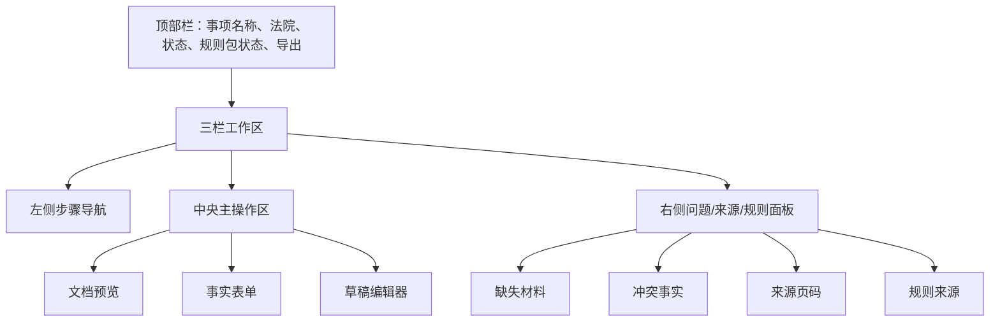
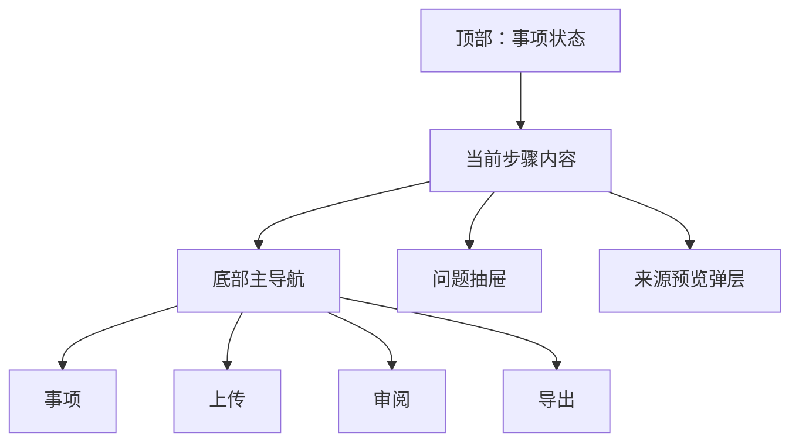
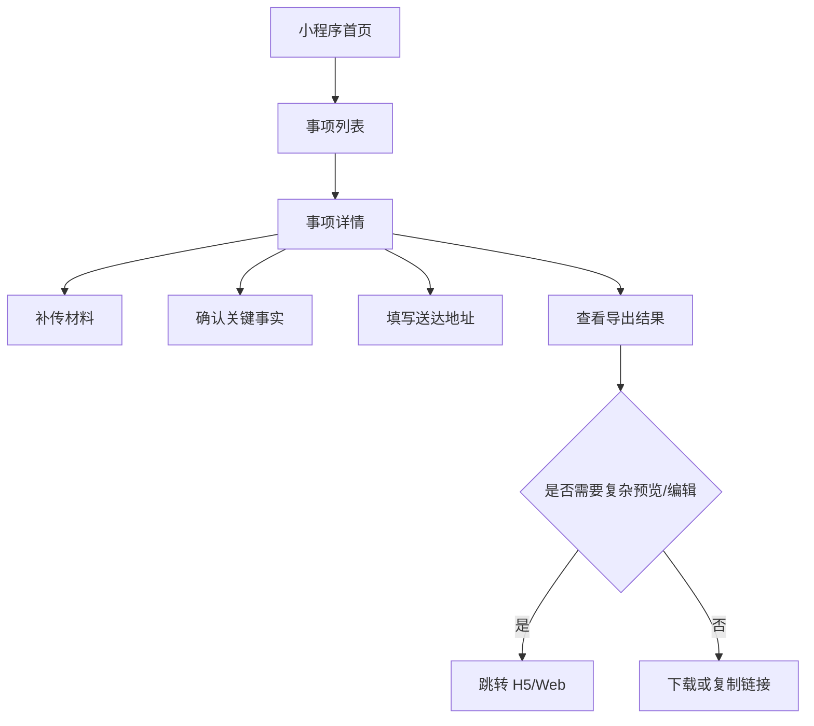
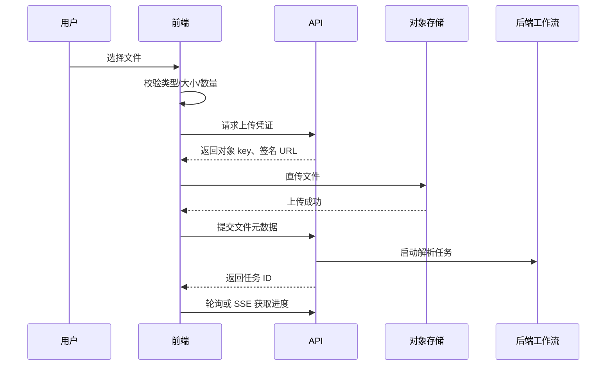
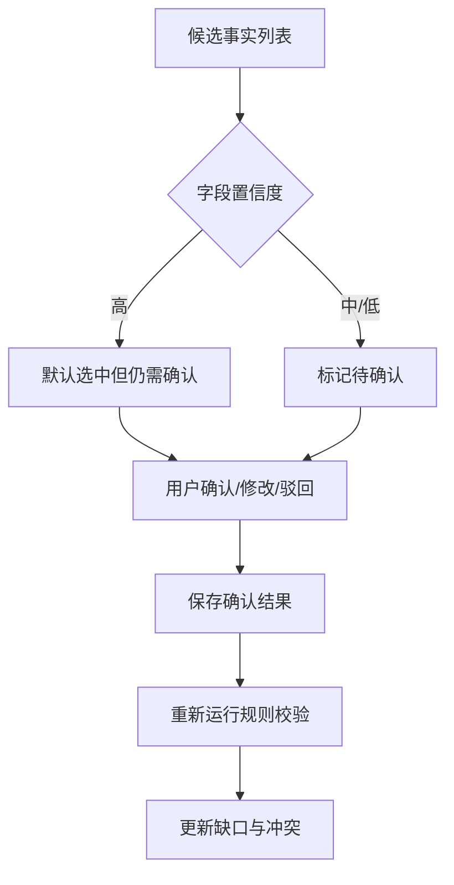
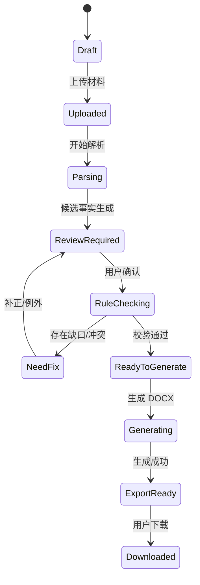

# 全国版强制执行材料生成助手：前端技术方案

版本：v0.1

日期：2026-08-04
目标：桌面 Web 为标准体验，完整适配移动 Web，并提供微信小程序入口。

## 1. 技术选型结论

采用“Web 主应用 + 小程序应用 + 共享业务包”的架构，而不是强行用一套 UI 代码覆盖所有端。

原因：

- 桌面端需要复杂的文档预览、事实审阅、表格编辑、草稿对照、规则问题面板，Web 原生能力更强。
- 微信小程序在文件选择、文件预览、包体积、运行时和组件能力上有边界，适合轻量上传、确认和进度查看。
- 移动 Web 可以复用 Web 主应用的业务流程，但需要单列布局、底部导航和抽屉式问题面板。
- 共享 TypeScript 类型、API SDK、表单 schema、规则状态枚举和设计 token，减少业务逻辑重复。

## 2. 推荐技术栈

| 层 | 选型 | 说明 |
|---|---|---|
| 包管理/仓库 | pnpm 11 + monorepo | pnpm 适合 monorepo，依赖严格、锁定可复现 |
| Web 框架 | Next.js 16.2+ | 官方 16 版已发布，Turbopack、路由和平台适配能力增强 |
| UI 运行时 | React 19.2+ | React 19 已稳定，支持新的并发和表单能力 |
| 语言 | TypeScript 5.9+ | 强类型约束表单、API、规则状态和文档字段 |
| 桌面 UI | Ant Design 6 | 企业级表格、表单、上传、步骤、抽屉、消息反馈成熟 |
| 移动 H5 UI | Ant Design Mobile 5 + 自适应布局 | 表单、上传、列表、弹层更贴合移动端 |
| 小程序 | Taro 4.2 + React + TypeScript | 支持微信小程序和 H5，多端 API 能力成熟 |
| 状态管理 | Zustand + TanStack Query | 本地 UI 状态轻量，服务端状态缓存可控 |
| 表单 | React Hook Form + Zod | 表单性能好，schema 可与后端 JSON Schema 对齐 |
| 文档预览 | PDF.js + 服务端 PNG/PDF 预览 | 移动端和小程序优先看图片/PDF，避免复杂 DOCX 前端渲染 |
| 图表/流程 | Mermaid 渲染或静态 SVG | 用于内部规则流程、状态说明，不进入法院材料 |
| 测试 | Vitest + Testing Library + Playwright | 单元、组件、端到端覆盖 |

版本依据：

- Next.js 16 官方发布，要求 Node.js 20.9+，并提供 Turbopack 和 React 19.2 支持：https://nextjs.org/blog/next-16
- React 19 已稳定发布：https://react.dev/blog/2024/12/05/react-19
- Taro 官方说明支持 React/Vue 开发微信小程序、H5、RN 等多端应用：https://docs.taro.zone/docs/
- Ant Design npm 最新稳定版为 6.x，定位企业级 React UI：https://www.npmjs.com/package/antd
- Node.js v24 为 LTS，v26 为 Current；生产建议用 Node 24 LTS：https://nodejs.org/en/about/previous-releases

## 3. 前端仓库结构

```text
apps/
  web/                 # Next.js 桌面 Web + 移动 H5
  miniapp/             # Taro 微信小程序
packages/
  api-client/          # OpenAPI 生成 SDK
  domain/              # 事项、材料、事实、规则、导出类型
  schemas/             # Zod/JSON Schema 表单与字段校验
  ui-tokens/           # 颜色、字号、间距、状态色
  doc-fields/          # DOCX 模板字段定义
  redaction/           # 前端脱敏展示工具
  shared-utils/        # 日期、金额、文件大小、错误码
```

## 4. 端能力划分

| 能力 | 桌面 Web | 移动 Web | 微信小程序 |
|---|---:|---:|---:|
| 创建事项 | 完整 | 完整 | 简化 |
| 批量上传材料 | 完整 | 支持 | 受小程序能力限制，支持图片和会话文件 |
| 文档分页预览 | 完整 | 支持 | 支持图片/PDF 预览，不做复杂 DOCX 渲染 |
| OCR 结果审阅 | 完整 | 支持核心字段 | 仅支持高优先级字段确认 |
| 地址确认书填写 | 完整 | 完整 | 完整 |
| 金额计算表 | 完整 | 简化 | 查看/确认为主 |
| 草稿编辑 | 完整 | 简化编辑 | 不建议完整编辑 |
| 导出下载 | 完整 | 支持 | 获取下载链接或转 H5 |
| 规则包管理 | 管理端 | 不支持 | 不支持 |

## 5. 页面与路由设计

### 5.1 Web 路由

```text
/login
/matters
/matters/new
/matters/[matterId]/overview
/matters/[matterId]/upload
/matters/[matterId]/review
/matters/[matterId]/address
/matters/[matterId]/amounts
/matters/[matterId]/checklist
/matters/[matterId]/draft
/matters/[matterId]/export
/admin/rule-packs
/admin/templates
```

### 5.2 小程序页面

```text
pages/matters/index
pages/matters/detail
pages/upload/index
pages/review/key-facts
pages/address/index
pages/export/index
```

## 6. 桌面 Web 布局



桌面端关键设计：

- 左侧步骤固定，支持保存草稿和跳转。
- 中央区域最大化文档和表单空间。
- 右侧面板一直展示“为什么不能导出”。
- 文档预览与事实表单支持联动：点击事实字段，预览定位到来源页。

## 7. 移动 Web 布局



移动端适配原则：

- 单列，不出现横向大表格。
- 财产线索、金额计算等表格改为卡片列表。
- 右侧问题面板改为底部抽屉。
- 文档预览采用服务端生成的页面图片或 PDF。
- 长表单拆为分步卡片：身份、地址、账户、电子送达、确认。

## 8. 微信小程序设计

小程序不承担完整复杂文档编辑。小程序主要解决：

- 拍照上传身份证、判决/调解材料、账户材料。
- 从微信会话选择文件并上传。
- 填写送达地址确认书。
- 确认关键事实。
- 查看生成进度。
- 获取下载链接或打开 H5。



小程序上传建议：

- 图片使用相册/拍照入口。
- PDF/DOCX 使用会话文件选择能力。
- 上传采用服务端签名直传对象存储，降低 API 服务压力。
- 大文件必须支持分片、断点续传和失败重试。
- 小程序端只保存临时文件路径，不持久化敏感材料。

## 9. 前端关键流程

### 9.1 上传流程



### 9.2 事实确认流程



## 10. 表单 schema

所有表单使用共享 schema，前端负责即时校验，后端负责最终校验。

核心表单：

- `MatterForm`：执行依据类型、目标法院、案由。
- `PartyForm`：主体类型、姓名/名称、证件号、地址、联系方式。
- `AddressConfirmationForm`：送达地址、电话、电子送达方式、是否同意电子送达、确认日期。
- `AccountConfirmationForm`：户名、开户行、账号、联系电话、用途确认。
- `AmountForm`：本金、利息、费用、已付款、计算截止日、计算方式。
- `AssetClueForm`：线索类别、具体线索、来源、请求措施备注。

## 11. 前端脱敏实现

前端不负责最终安全边界，但必须减少误展示。

```text
redactName("张三") -> "张*"
redactIdNo("<ID_NUMBER>") -> "<MASKED_ID_NUMBER>"
redactPhone("<PHONE_NUMBER>") -> "<MASKED_PHONE_NUMBER>"
redactBankNo("6222...") -> "**** **** **** 1234"
redactAddress("江西省赣州市...门牌") -> "江西省赣州市***"
```

实现原则：

- 默认列表页、日志、错误提示、埋点均使用脱敏值。
- 详情页按权限显示明文，并记录查看行为。
- 图片预览默认加水印。
- 导出前弹窗要求用户确认材料将写入明文。

## 12. 前端状态模型



## 13. 落地里程碑

### 第 1 周：前端骨架

- monorepo 初始化。
- Web 登录、事项列表、事项工作台。
- Taro 小程序基础路由。
- API SDK 生成链路。

### 第 2-3 周：上传与预览

- Web 上传组件、直传对象存储。
- 小程序上传入口。
- 材料列表和状态进度。
- PDF/图片预览。

### 第 4-5 周：事实审阅与表单

- 候选事实表。
- 来源页联动。
- 地址确认表。
- 账户确认表。
- 金额计算表。

### 第 6 周：草稿与导出

- 草稿预览。
- 导出前检查。
- DOCX/PDF 下载。
- 移动端适配。

### 第 7-8 周：小程序补齐与验收

- 小程序关键事实确认。
- 小程序地址确认。
- 小程序导出结果页。
- Playwright 回归。
- 真机测试和灰度。

## 14. 前端风险与对策

| 风险 | 对策 |
|---|---|
| 小程序复杂文档预览能力不足 | 统一使用服务端生成图片/PDF 预览 |
| 桌面与小程序代码重复 | 共享 domain、schema、api-client、redaction 包 |
| 大文件上传失败 | 签名直传、分片、断点续传、进度恢复 |
| 敏感信息误展示 | 默认脱敏、查看明文审计、埋点禁明文 |
| 规则提示过多影响用户 | 按阻断/高风险/提示三级展示 |
| 移动端表格不可读 | 表格转卡片，金额和线索分组展示 |

## 15. 参考资料

- Next.js 16 官方发布说明：https://nextjs.org/blog/next-16
- React 19 稳定版说明：https://react.dev/blog/2024/12/05/react-19
- Taro 官方介绍：https://docs.taro.zone/docs/
- Ant Design npm 包说明：https://www.npmjs.com/package/antd
- Ant Design Mobile 发布页：https://github.com/ant-design/ant-design-mobile/releases
- Node.js 发布与 LTS 状态：https://nodejs.org/en/about/previous-releases
- 腾讯云 COS 小程序直传实践，说明小程序直传对象存储方案：https://cloud.tencent.com/document/product/436/34929
