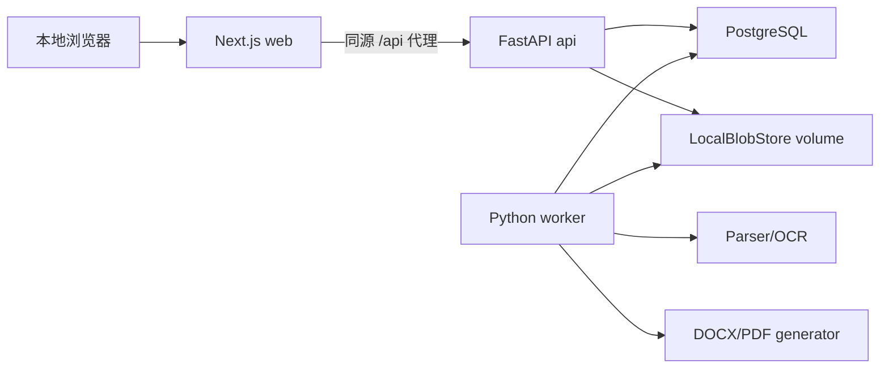
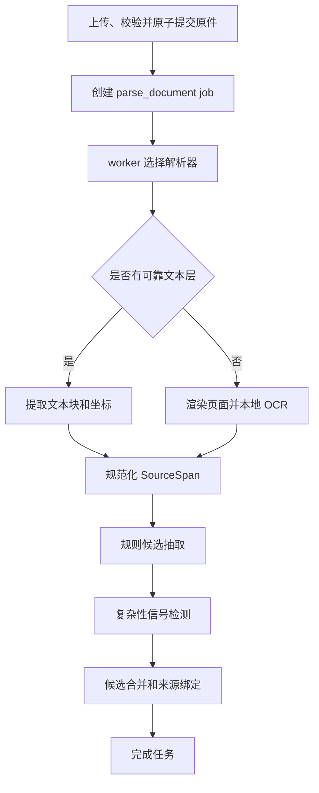
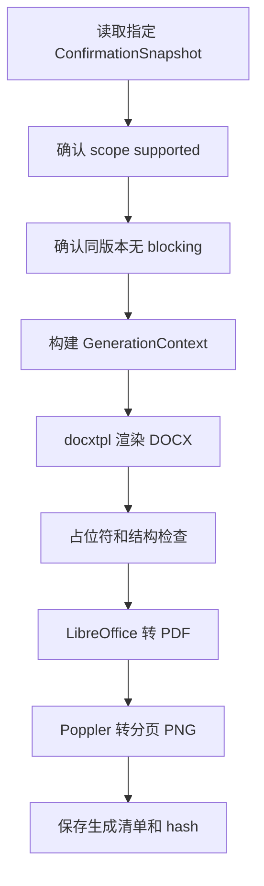

# 全国版强制执行材料生成助手：后端技术方案

版本：v0.6

日期：2026-08-07

目标：以设计稿的四步工作台为产品契约，实现“本人办理、单一自然人申请执行人、单一自然人被执行人、无代理人”的可靠本地 MVP。后端负责来源追踪、人工确认、版本失效和强制执行申请材料生成的一致性，并为当前 Web 与未来微信小程序提供稳定的 `/api/v1` 契约；当前不提前实现账号、平台或小程序业务。

### v0.6 架构优化落实

- Job claim 返回不可变 `ClaimedJob(id, lease_token, input_revision, kind)`；续租、完成、失败与重试都必须匹配 `id + running + lease_token`，失租 worker 无权发布状态。
- OCR/解析和渲染在业务事务之外执行；回写时重新开启短事务并锁定当前 Matter，旧 revision 或 inactive 材料只收敛为 superseded，不能覆盖用户已确认字段。
- 新增持久化 `ValidationRun` 和 Generation 不可变 `input_snapshot/input_hash`。renderer 只读取纯数据 `GenerationContext`，不再导入或读取 SQLAlchemy `Matter`。
- 同类主材料具备显式 `active/parse_revision` 生命周期；替换后旧材料保留审计记录，但不再参与提取、校验和标题推导。
- Blob 写入区分 staging 与 publish；数据库提交失败或租约 CAS 失败时执行幂等清理，降低孤儿正式文件风险。
- HTTP route 将校验、启动生成和最终确认委托给显式应用用例；保持模块化单体，不引入 CQRS 框架、通用 Repository 或第二套 worker 项目。
- `0002_architecture_hardening` 使用显式 Alembic 操作，并覆盖空库、v0.1.0 前向升级及本 revision downgrade；CI 额外使用 PostgreSQL 验证双 worker `SKIP LOCKED` 领取语义。
- capability 增加脱敏 worker 心跳状态与稳定原因码；API readiness 仍只表示 API 自身可服务，worker 故障不再阻止 Web 启动和事项查看。

## 0. 本次 Review 与优化结论

后端同时进行产品收敛和技术基线升级。

产品收敛：

- MVP 固定 `workflow_profile=self_single_v1`。
- 只允许一名申请执行人和一名被执行人。
- 不接受代理人、法定代理人、委托代理人或复杂主体关系进入最终卷宗。
- 首批可靠性验收以自然人对自然人的民事调解书和民事判决书为主。
- 只支持一项明确的主要金钱给付义务和确定性金额运算。
- MVP 不实现生成式 AI、模型网关、AI 配置接口或模型任务。
- 检测到复杂关系时返回不可绕过的产品门禁，不尝试猜测或降级生成。

技术升级：

- 元数据数据库从 SQLite 调整为 PostgreSQL，避免第二版再迁移事务、JSONB、并发任务和多用户数据。
- 文档解析和生成从 API 进程分离为独立 worker。
- 任务队列使用 PostgreSQL job 表和 `FOR UPDATE SKIP LOCKED`，MVP 不额外引入 Redis/Celery。
- 通过 Docker Compose 统一运行 Next.js、FastAPI、worker 和 PostgreSQL。
- 文件仍保存在本地持久化卷，但通过 `BlobStore` 接口隔离，后续可替换对象存储。
- 保留模块化单体，不在 MVP 拆分微服务或提前实现登录、律师和 AI 业务。
- 产品流程统一为四步：`当事人与依据 -> 申请内容 -> 检查与预览 -> 导出`；不存在独立“材料”步骤或 `/materials` 工作流状态。
- 首页四条适用条件通过一次总确认，在创建事项时原子记录 `workflow_profile`、`eligibility_version` 和 `confirmed_at`。
- API、worker 和 migrate 使用同一 Python 代码包与同一容器镜像，通过不同进程入口隔离；避免复制依赖、业务代码和模板。
- 所有生成动作读取不可变确认快照。来源、确认事实、金额或申请法院变化后，旧检查、预览和下载权限立即失效。
- 任务队列明确采用租约、心跳、有限重试、退避和终态失败，追求“副作用恰好一次”，不宣称任务只执行一次。
- 本地启动采用 Compose 健康门禁；构建上下文和运行镜像显式排除 `outputs/`、设计稿、需求文档、测试样本及本地案件数据。

## 1. 产品与技术契约

### 1.1 支持范围

一个事项必须满足：

```text
workflow_profile = self_single_v1
applicant_count = 1
respondent_count = 1
representative_count = 0
party_type = natural_person（首批验收范围）
basis_type in [civil_mediation, civil_judgment]
primary_obligation_count = 1
primary_obligation_kind = monetary
```

用户可以通过手工填写完成支持范围内的字段。OCR 和规则自动化不是生成成功的前置条件。

创建事项时必须一次性提交并原子保存：

```json
{
  "workflow_profile": "self_single_v1",
  "eligibility_version": "self_single_v1",
  "eligibility_confirmed": true,
  "confirmed_at": "server_datetime"
}
```

`eligibility_confirmed` 对应设计稿中“四项条件全部符合”的单一复选框，而不是四个可分别绕过的布尔值。条件内容发生实质变化时必须提升 `eligibility_version`；旧确认不会自动适用于新版本。

### 1.2 四步服务端门禁

| 步骤 | 后端完成条件 | 失败处理 |
|---|---|---|
| 1 当事人与依据 | 有一个已通过上传格式门禁并成功保存的执行依据；文书类型、案号和作出法院已确认；申请执行人身份证正反面均已上传且身份字段已确认；唯一被执行人姓名已确认；无范围阻断 | “已保存”不要求 OCR/规则成功；解析失败时开放固定字段手工录入，缺失字段或稳定 blocker 仍阻断下一步 |
| 2 申请内容 | 单一金钱义务、金额、请求事项、申请法院和送达地址已确认；义务来自执行依据候选，或由用户查看执行依据后手工录入并确认；已履行金额来自履行材料或用户填写 | OCR/规则失败不构成硬门禁；不自动推定金额、利率、法院或法律结论 |
| 3 检查与预览 | 当前 `data_revision` 生成不可变确认快照并通过校验；零 blocking 后才可创建生成任务 | warning 可带入预览，blocking 不可“知晓后继续” |
| 4 导出 | 生成版本仍等于当前版本，预览成功，且同一生成记录的最终人工确认已保存 | 任一版本不一致立即禁用下载 |

身份证 OCR 失败时，只要申请执行人身份证正反面原件已经存在，用户仍可手工录入并确认身份字段。被执行人身份证图片为可选材料，但被执行人姓名必须确认。

### 1.3 必须阻断

以下信号触发 `unsupported_case`，不得生成最终申请书：

- 多名申请执行人或多名被执行人。
- 代理人、律师、法定代理人、法定代表人或负责人需要进入当前申请关系。
- 法人、非法人组织或权利承受关系需要额外主体材料。
- 多个独立执行义务。
- 条件履行、复杂分期、债权转让、继承等需要额外法律判断。
- 执行依据不属于当前支持类型。

材料中出现原诉讼律师姓名不一定代表执行申请使用代理人。系统可以把它标记为复杂性信号，但最终门禁以材料结构、用户确认和服务端规则共同判断；系统不得把律师误填为申请执行人或被执行人。

### 1.4 正确术语与禁止隐式映射

源文书中的原告、被告是诉讼角色。确认卷宗和生成文书统一使用申请执行人、被执行人。API 字段不得继续使用 `plaintiff`、`defendant` 作为最终角色名。

以下字段必须分开建模，不允许服务端自动复制或继承确认状态：

- 身份证件住址 `identity_document_address` 不等于送达地址 `service_address`。
- 作出法院 `rendering_court` 不等于申请法院 `filing_court`。

前端若提供“复制”操作，必须作为显式用户 mutation 写入目标字段，目标字段记录 `origin=user`、`confirmation_status=extracted_pending_confirmation` 并重新确认；`copied_from_field_id` 只可用于审计，可把原字段来源保存在 `related_source_refs` 形成辅助追溯，但不得替代目标字段确认。

## 2. 技术选型

后端采用 Python 模块化单体，API 与 worker 使用同一业务包和不同启动命令。

| 层 | MVP 选型 | 扩展价值 |
|---|---|---|
| 运行时 | Python 3.12 | 文档、OCR 和服务端生态成熟 |
| API | FastAPI + Pydantic v2 | OpenAPI 契约、强校验和后续多实例部署 |
| ORM/迁移 | SQLAlchemy 2 + Alembic | 明确事务边界和版本化迁移 |
| 数据库 | PostgreSQL 16 | JSONB、事务、并发 worker 和未来多用户 |
| 数据库驱动 | psycopg 3 | PostgreSQL 官方能力和 SQLAlchemy 支持 |
| 任务 | PostgreSQL job table + 独立 worker | 本地可靠运行，可横向增加 worker |
| 文件 | LocalBlobStore | 本地持久化，未来替换 S3/MinIO/OSS/COS |
| PDF | PyMuPDF + pdfplumber | 文本块、页面坐标和表格辅助 |
| DOCX 读取 | LibreOffice 派生 PDF + python-docx | 稳定页码坐标和结构读取 |
| OCR | PaddleOCR 基础 OCR + 可选 PP-StructureV3 | 本地处理，按硬件分档 |
| 图像 | OpenCV + Pillow | 方向、裁剪、去噪和页图 |
| 候选抽取 | Python regex/dictionary/layout extractors | 可测试、可解释、无生成式模型依赖 |
| 业务校验 | Python rules + 版本化元数据 | 简单案件门禁和全国基础提示 |
| DOCX | docxtpl + python-docx | 确定性模板和 OOXML 后处理 |
| 预览 | LibreOffice headless + Poppler | DOCX 转 PDF/PNG 视觉核验 |
| 容器 | Docker Compose | 一条命令运行多进程和持久化依赖 |
| 测试 | pytest + golden files + Playwright | 单元、集成、文书和端到端 |
| 依赖锁定 | `pyproject.toml` + `uv.lock` | API、worker、迁移和 CI 使用同一组精确依赖 |

### 2.1 为什么 MVP 使用 PostgreSQL

使用 Next.js 和 Redux 只是前端扩展基线，服务端同样需要避免第二版重做核心存储。第二版的登录、律师事项、多 worker、AI 长任务和审计都会依赖更稳定的并发事务和查询能力，因此从 MVP 起使用 PostgreSQL。

代价是本地多一个数据库服务。Docker Compose、固定镜像版本、健康检查和持久化 volume 将这一复杂度封装在启动流程中。

### 2.2 为什么暂不使用 Redis/Celery

MVP 已经需要 PostgreSQL。使用 PostgreSQL job table 可以可靠保存任务、重试、进度和 lease，并使用 `SKIP LOCKED` 支持多个 worker 领取不同任务。

当前不再增加 Redis/Celery，避免本地依赖继续膨胀。任务访问通过 `JobQueue` 接口隔离；第二版只有在任务吞吐、调度或路由需求超过 PostgreSQL 队列时再替换。

## 3. 本地部署架构



长期运行服务：

```text
web       Next.js Node server
api       FastAPI API
worker    文档解析和生成 worker
postgres  PostgreSQL
```

另有一次性 `migrate` 命令在 API 和 worker 启动前执行 `alembic upgrade head`。

`api`、`worker`、`migrate` 三个 Compose service 引用同一个 `case-filing-backend` 镜像，只覆盖启动命令：

```text
api      python -m app.entrypoints.api
worker   python -m app.entrypoints.worker
migrate  python -m app.entrypoints.migrate
```

选择同一镜像的理由是 MVP 只有一个 Python 领域代码库、同一套迁移、规则和模板；Docker 只保存一份镜像层，避免 API/worker 依赖和资源漂移。运行时仍保持一容器一主进程，OCR 或 LibreOffice 崩溃不会直接带走 API 进程。代价是 API 容器可见但不调用 worker 依赖；只有出现独立扩缩容或安全边界需求时才拆镜像，当前不拆两个 Python 项目。

网络：

- 只把 `web` 映射到宿主机 `127.0.0.1`。
- API、worker 和 PostgreSQL 只在 Compose 内部网络通信。
- Next.js 代理 `/api/*`，浏览器不直接访问内部 API 端口。
- 开发调试如需暴露 API，必须使用仅 loopback 的 override 文件。

持久化：

- PostgreSQL 使用独立 volume。
- 原件、解析结果、预览和导出使用独立本地 data volume。
- 删除容器不得默认删除 volume。

## 4. 服务端模块

```text
services/api/
  pyproject.toml
  uv.lock
  Dockerfile
  app/
    entrypoints/
      api.py
      worker.py
      migrate.py
    api/
      dependencies.py
      errors.py
      routes/
        matters.py
        documents.py
        fact_fields.py
        application.py
        validations.py
        generations.py
        jobs.py
        runtime.py
    core/
      config.py
      logging.py
      security.py
    db/
      session.py
      models.py
      migrations/
      repositories/
    matters/
      schemas.py
      service.py
      revisions.py
      eligibility.py
    documents/
      schemas.py
      service.py
      parsers/
      ocr/
    extraction/
      schemas.py
      pipeline.py
      merge.py
      rule_extractors/
    validation/
      engine.py
      rules/
        product_scope/
        national/
    amounts/
      service.py
      schemas.py
    generation/
      context.py
      service.py
      render.py
      verify.py
    jobs/
      queue.py
      schemas.py
      handlers.py
    storage/
      base.py
      local.py
    audit/
      service.py
    shared/
      enums.py
      errors.py
  resources/
    templates/cn-national/
    rule_metadata/cn-national/
  tests/
    fixtures/
    unit/
    integration/
    golden/
```

边界：

- API route 只做协议转换、请求上下文和 application service 调用。
- 文档解析模块不决定谁是最终申请执行人。
- extraction 只生成候选和复杂性信号，不修改确认卷宗。
- validation 是产品范围门禁和生成门禁的唯一权威来源。
- generation 只能读取指定版本的已确认卷宗。
- worker 与 API 从同一 Python package 导入 application services，不允许出现 `services/worker` 的第二份领域模型、schema、迁移或模板。
- entrypoint 只负责进程生命周期、依赖装配和健康状态，不承载业务规则。

## 5. 扩展接口

MVP 实现以下接口，而不是绑定具体基础设施：

```python
class BlobStore(Protocol):
    def put(self, key: str, source: BinaryIO) -> BlobMetadata: ...
    def open(self, key: str) -> BinaryIO: ...
    def delete_prefix(self, prefix: str) -> None: ...

class JobQueue(Protocol):
    def enqueue(self, command: JobCommand) -> JobRecord: ...
    def claim(self, worker_id: str) -> JobRecord | None: ...
    def heartbeat(self, job_id: UUID, lease_token: str) -> None: ...

class ActorContext(Protocol):
    actor_kind: str
    actor_id: str
```

MVP `ActorContext` 固定为本地匿名操作者，仅用于审计字段，不创建用户表、登录逻辑或权限分支。第二版平台化时可以替换请求上下文，不改变领域 service 签名。

MVP 不定义或实现 `ModelGateway`。第二版 AI 规划保留在文档末尾，防止当前代码出现未使用的模型依赖和配置入口。

## 6. 核心数据模型

### 6.1 Matter

```json
{
  "id": "uuid",
  "workflow_profile": "self_single_v1",
  "workflow_stage": "parties_and_basis|application|review|export",
  "title_state": "pending_basis|processing_basis|case_number_pending_confirmation|case_number_ready",
  "display_title": "待上传执行依据",
  "data_revision": 7,
  "validated_revision": 6,
  "generated_revision": 6,
  "scope_status": "pending|supported|unsupported",
  "created_at": "datetime",
  "updated_at": "datetime"
}
```

`workflow_stage` 只记录最近步骤。能否生成由 `scope_status`、步骤门禁、版本和校验结果共同决定。

`display_title` 是服务端派生字段，不接受客户端任意写入：

- 未上传有效执行依据：`pending_basis` / `待上传执行依据`。
- 执行依据解析中：`processing_basis` / `正在识别执行依据`。
- 已提取案号但尚未确认：`case_number_pending_confirmation` / `案号待确认`，不得把候选案号显示成正式标题。
- 用户确认案号后：`case_number_ready` / 已确认案号。

案号候选被修改、撤销确认或其来源失效时，标题在同一事务内退回待确认状态。

### 6.2 EligibilityAttestation

```json
{
  "matter_id": "uuid",
  "workflow_profile": "self_single_v1",
  "eligibility_version": "self_single_v1",
  "eligibility_confirmed": true,
  "confirmed_at": "datetime"
}
```

适用条件属于生成门禁并进入版本记录，不只是前端提示。`confirmed_at` 使用服务端时间；创建请求中为 `false` 或版本未知时不创建事项。

### 6.3 SourceDocument 与 SourceSpan

```json
{
  "source_document": {
    "id": "uuid",
    "matter_id": "uuid",
    "original_filename": "string",
    "media_type": "application/pdf",
    "sha256": "string",
    "size_bytes": 12345,
    "document_kind": "legal_basis|applicant_id_front|applicant_id_back|respondent_id_front|respondent_id_back|performance_evidence",
    "processing_status": "pending|processing|succeeded|needs_attention|failed|invalidated",
    "confirmation_status": "pending|processing|extracted_pending_confirmation|confirmed|invalidated",
    "storage_status": "staged|ready|deleting|deleted",
    "parse_revision": 2,
    "parser_version": "string|null",
    "parse_error_code": "string|null"
  },
  "source_span": {
    "id": "uuid",
    "document_id": "uuid",
    "page_number": 1,
    "sequence": 10,
    "text": "string",
    "bbox_normalized": [0.10, 0.20, 0.80, 0.25],
    "text_method": "embedded|ocr",
    "text_quality": 0.91
  }
}
```

页码从 1 开始。坐标统一为 `[left, top, right, bottom]` 的页面归一化值。

P0 每个事项只允许一个 active `legal_basis`、一份 active `applicant_id_front` 和一份 active `applicant_id_back`。替换不是覆盖原 Blob：服务端创建新文档版本、推进 `data_revision`、使旧来源引用失效，再由清理任务删除不可达 Blob。被执行人证件图片可选；`performance_evidence` 可有多份。

### 6.4 FactCandidate

```json
{
  "id": "uuid",
  "matter_id": "uuid",
  "subject_key": "legal_document|applicant|respondent|obligation",
  "field_key": "case_no|name|id_number|amount|due_date",
  "value": "json",
  "origin": "source|user",
  "source_refs": [
    {
      "document_id": "uuid",
      "parse_revision": 2,
      "source_span_id": "uuid",
      "page_number": 1,
      "bbox_normalized": [0.10, 0.20, 0.80, 0.25]
    }
  ],
  "copied_from_field_id": null,
  "related_source_refs": [],
  "extraction_method": "embedded_text|ocr|regex|dictionary|layout|user_input",
  "extractor_id": "case-number-regex",
  "extractor_version": "1.0.0",
  "confidence": 0.93,
  "confirmation_status": "pending|processing|extracted_pending_confirmation|confirmed|invalidated"
}
```

MVP `extraction_method` 不包含 `model`。一个字段可以有多个候选，但最终只能由用户确认一个值。`origin=user` 时 `confidence` 必须为 `null`。确定性金额结果不伪装成 ConfirmableField 候选，而由独立 `AmountComputation` 保存输入字段版本、公式版本和结果，并在用户确认后进入 DossierRevision。

应用内容来源白名单：

- 主要义务、文书金额和履行期限只能从 active `legal_basis` 产生候选，或由用户手工填写。
- 已履行金额可以来自 `performance_evidence` 或用户填写。
- 尚未履行金额只能由已确认金额通过版本化确定性公式计算，不能标成材料直接来源。
- 请求事项候选必须来自执行依据的义务片段；系统可用确定性模板帮助整理格式，但用户修改并确认后的目标字段记录 `origin=user`，同时保留相关义务的 `related_source_refs`。
- 身份证件不得作为义务或金额候选来源。

### 6.5 ComplexitySignal

```json
{
  "id": "uuid",
  "matter_id": "uuid",
  "code": "multiple_respondents_detected|representative_detected|organization_party_detected|complex_obligation_detected",
  "source_span_ids": ["uuid"],
  "detector_id": "party-heading-detector",
  "status": "open|dismissed_as_parse_error|confirmed_unsupported"
}
```

复杂性信号不能仅凭关键词永久阻断，因为源判决可能包含原诉讼代理人。用户可以把误识别标记为解析错误，但服务端必须重新运行范围校验并记录原因。

### 6.6 DossierRevision 与确认字段

底层使用可扩展集合，MVP Pydantic validator 强制角色基数。这为第二版扩容保留数据形状，但不开放多角色业务。

```json
{
  "matter_id": "uuid",
  "revision": 7,
  "dossier_schema_version": "self-single-1.0",
  "dossier": {
    "legal_document": {},
    "parties": [
      {"role": "applicant", "party_type": "natural_person"},
      {"role": "respondent", "party_type": "natural_person"}
    ],
    "primary_obligation": {
      "kind": "monetary"
    },
    "performance": {},
    "application": {},
    "payment_account": {},
    "service_address": {},
    "asset_clues": []
  },
  "confirmed_fields": {},
  "created_at": "datetime"
}
```

MVP 不包含 `representatives`。如果请求提交额外角色、多个 applicant/respondent 或多个 primary obligation，Pydantic 和 service 同时拒绝。

`confirmed_fields` 每项必须保存 `value`、`origin`、`source_refs` 或用户输入审计、`confirmation_status`、`confirmed_at` 和 `confirmed_revision`。来源文件删除、替换、重解析或对应 `SourceSpan` 消失时，只把受影响字段改为 `invalidated`；但无论影响范围大小，当前校验和当前生成都整体过期。

### 6.7 ConfirmationSnapshot

运行检查时，服务端从指定 `DossierRevision` 创建不可变确认快照：

```json
{
  "id": "uuid",
  "matter_id": "uuid",
  "data_revision": 8,
  "dossier_revision_id": "uuid",
  "dossier_schema_version": "self-single-1.0",
  "eligibility_version": "self_single_v1",
  "source_manifest_hash": "sha256",
  "confirmed_fields_hash": "sha256",
  "created_at": "datetime"
}
```

快照只包含已确认字段、确定性派生结果及其来源引用，不包含未确认候选、OCR 全文或 ORM 对象。`ValidationRun` 引用 `confirmation_snapshot_id`；`GenerationRun` 必须引用同一快照和校验记录，禁止在 worker 执行时重新读取“最新卷宗”。

### 6.8 ValidationRun、GenerationRun 与 Job

```json
{
  "validation_run": {
    "id": "uuid",
    "matter_id": "uuid",
    "data_revision": 7,
    "confirmation_snapshot_id": "uuid",
    "rule_set_version": "self-single-cn-1.0.0",
    "scope_supported": true,
    "blocking_count": 0,
    "warning_count": 2
  },
  "generation_run": {
    "id": "uuid",
    "matter_id": "uuid",
    "data_revision": 7,
    "validation_run_id": "uuid",
    "template_version": "cn-enforcement-self-single-1.0.0",
    "status": "queued|rendering|docx_ready|preview_ready|superseded|failed"
  },
  "job": {
    "id": "uuid",
    "kind": "finalize_blob|parse_document|generate_package|cleanup_matter",
    "status": "queued|running|retry_scheduled|succeeded|failed_terminal|cancelled",
    "priority": 100,
    "attempt": 1,
    "max_attempts": 3,
    "progress": 35,
    "available_at": "datetime",
    "lease_owner": "string|null",
    "lease_token": "uuid|null",
    "lease_expires_at": "datetime|null",
    "heartbeat_at": "datetime|null",
    "idempotency_key": "string",
    "error_code": "string|null",
    "retryable": true
  }
}
```

Job API 对外使用 `attempt`，数据库列可命名为 `attempt_count`；`progress` 为可选的 0–100 粗粒度阶段进度，不承诺线性时间，也不得包含页文字或文件名。

## 7. 版本与事务

所有会影响材料包的修改都在数据库事务中：

1. 读取 `Idempotency-Key` 并核对请求指纹；指纹只保存规范化命令 hash 和文件 SHA-256，不保存请求正文。相同 key + 相同请求返回首次结果，相同 key + 不同请求返回 `409 idempotency_key_reused`。
2. `SELECT Matter ... FOR UPDATE`，校验客户端 `expected_revision`。
3. 写入新的 DossierRevision 或材料版本，并失效受影响的已确认字段。
4. 增加 `data_revision`，把旧 ValidationRun、GenerationRun 和下载许可标记为 `superseded`。
5. 在同一事务写入所需 Job 记录；提交后返回新版本和新的 Header/步骤门禁状态。P0 不引入通用消息总线或第二套 outbox 框架。

推进 `data_revision`：

- 适用条件确认变化。
- 上传、删除或重新分类材料。
- 替换执行依据或身份证正反面。
- 确认、修改或撤销事实。
- 修改义务、金额、法院、账户、地址或财产线索。
- 重解析导致已确认来源失效。

不推进：

- 页面切换。
- 任务进度和 heartbeat。
- 新增未确认候选但未影响确认卷宗。
- 创建 ValidationRun、GenerationRun、Job 状态更新或保存同版本最终导出声明；这些记录绑定当前 revision，但不会反过来制造新业务版本。

旧版本请求返回 `409 revision_conflict`，响应包含当前 revision，但不回显敏感字段。`validated_revision` 和 `generated_revision` 不等于当前版本时，旧结果自动过期；旧文件可以为本地审计暂存，但下载接口必须拒绝并返回 `generation_superseded`。

规则或模板版本升级不静默重写已有事项。下次检查时使用新版本并创建新快照；旧生成记录保留原 `rule_set_version`、`template_version` 和文件 hash。

## 8. 文档处理

### 8.1 上传门禁

- 文件大小限制。
- 扩展名、声明 MIME 和 magic bytes 一致性。
- SHA-256 和事项内重复检查。
- UUID 物理路径和原始文件名转义。
- PDF、DOCX、JPG、PNG 白名单。
- P0 拒绝 ZIP。
- `document_kind` 与格式白名单匹配：执行依据允许 PDF/DOCX/JPG/PNG，身份证正反面只允许 JPG/PNG，履行材料允许 PDF/JPG/PNG。
- 限制文件字节、PDF 页数、单图像素和 DOCX 解压后体积；实际阈值由 `runtime/capabilities` 返回并在虚构样本上压测后固化。
- 文件流式写入并同步计算 hash，不把整份材料读入 API 进程内存。

上传采用可恢复的两阶段提交，避免数据库与文件系统伪事务：

1. 写入同一文件系统的 staging key，校验格式、大小和 SHA-256。
2. 数据库事务锁定 Matter，校验 revision，创建 `storage_status=staged` 的文档、推进版本并创建 `finalize_blob` Job。
3. `finalize_blob` 以原子 rename 提升到正式 key，再把文档改为 `ready` 并入队解析。
4. 进程中断时，recovery 根据数据库状态继续提升或清理 staging；不得留下可见的半上传文档。

### 8.2 解析流水线



格式规则：

- 文本型 PDF 直接提取文本和坐标，缺少可靠文本层的页面 OCR。
- DOCX 先通过 LibreOffice 生成派生 PDF，从派生 PDF 建立稳定页码；python-docx 辅助读取段落和表格。
- JPG、PNG 作为单页文档处理。
- 转换或 OCR 失败时标记 `needs_attention`，保留手工录入。
- OCR、LibreOffice、Poppler 等子进程必须有并发、内存、页数和超时上限；超时后终止整个子进程组并返回稳定错误码。

OCR profile：

- `basic`：默认，方向校正、文本检测和中文识别。
- `structure-light`：表格、印章遮挡或复杂阅读顺序时人工重试使用。
- `structure-full`：性能允许且样本证明必要时使用，不是 MVP 默认。

模型必须提前安装到本地。案件处理过程中不得静默联网下载。

## 9. 确定性候选抽取

MVP extractors：

- 案号。
- 法院名称。
- 文书标题和类型。
- 日期。
- 身份证号、手机号和银行卡号格式。
- 金额字面值。
- “原告”“被告”“申请执行人”“被执行人”“判决如下”“调解协议如下”等结构标题。

接口：

```python
class CandidateExtractor(Protocol):
    id: str
    version: str

    def supports(self, document: ParsedDocument) -> bool: ...
    def extract(self, document: ParsedDocument) -> list[FactCandidateDraft]: ...
```

规则：

- 候选永不自动成为确认事实。
- 值相同、来源不同的候选聚合并保留全部来源。
- 值不同的候选并列展示。
- 新候选不能覆盖已确认字段。
- 来源删除后候选失效，相关确认字段要求重新确认。
- 复杂性 detector 只提供信号，范围校验才给出最终门禁。

## 10. PostgreSQL 任务队列

API 只在业务事务中创建任务，worker 负责执行。领取动作必须在一个短事务中完成“选择 + 更新 + 返回”，不能先查询后提交再更新：

```sql
WITH next_job AS (
  SELECT id
  FROM jobs
  WHERE status IN ('queued', 'retry_scheduled')
    AND available_at <= now()
  ORDER BY priority ASC, created_at ASC, id ASC
  FOR UPDATE SKIP LOCKED
  LIMIT 1
)
UPDATE jobs AS j
SET status = 'running',
    attempt_count = j.attempt_count + 1,
    lease_owner = :worker_id,
    lease_token = gen_random_uuid(),
    lease_expires_at = now() + :lease_interval,
    heartbeat_at = now(),
    started_at = COALESCE(j.started_at, now())
FROM next_job
WHERE j.id = next_job.id
RETURNING j.*;
```

领取事务提交后才执行耗时工作。完成、续租或失败更新必须同时匹配 `id + lease_token + status=running`，过期 worker 不得覆盖新租约结果。

可靠性规则：

- job command 只包含 ID，不把 OCR 全文放入任务表。
- `idempotency_key` 在同一 job kind 范围内唯一，handler 还以 `(kind, target_id, input_revision, input_hash)` 的数据库唯一约束保护副作用。
- worker 定期 heartbeat 并续租。
- lease 超时任务由 recovery 加行锁后转为 `retry_scheduled`；超过 `max_attempts` 后进入 `failed_terminal`，绝不无限重试。
- 可重试错误仅包括进程中断、暂时性数据库/文件占用和明确的资源暂不可用；文件不支持、内容损坏、校验 blocker、模板缺陷属于终态失败。
- 重试使用有上限的指数退避和 jitter，`available_at` 驱动调度；API 不在请求线程内睡眠重试。
- 输出先写临时 key，完成校验后原子移动或提交正式记录。
- 生成 handler 先检查同一 input hash 是否已有完整 artifact manifest；存在则复用并成功收敛，不重复生成文件。
- matter 删除时先取消尚未领取任务；运行中任务即使完成也因 matter/revision 门禁不能发布结果。
- worker 收到停止信号后停止领取新任务，在 grace period 内完成或停止续租；未完成任务由租约恢复。
- 本地默认一个 worker；未来可以增加多个 worker，共享同一 PostgreSQL 队列。

系统保证的是“任务可能至少执行一次、业务副作用恰好一次收敛”，不是不现实的 exactly-once execution。recovery 每轮处理有限批次，并暴露队列深度、最老等待时长、租约过期数和终态失败数。

PostgreSQL 队列是 MVP 的基础设施实现，不影响上层 `JobQueue` 接口。未来迁移 Celery、Temporal 或云队列时，API 和领域命令保持不变。

## 11. 产品范围与生成校验

校验顺序：

1. `ProductScopeRules`。
2. `ConfirmedDataRules`。
3. `NationalBaselineRules`。
4. `TemplateReadinessRules`。

### 11.1 ProductScopeRules

阻断码：

```text
eligibility_not_confirmed
unsupported_multiple_applicants
unsupported_multiple_respondents
unsupported_representative
unsupported_organization_party
unsupported_basis_type
unsupported_multiple_obligations
unsupported_complex_obligation
```

这些阻断属于当前产品不支持，不能通过普通“我已知晓”确认消除。解析误报必须先修正复杂性信号或确认卷宗，再重新校验。

### 11.2 ConfirmedDataRules

- 唯一申请执行人和被执行人字段完整并确认。
- 案号、执行依据、申请法院、送达地址和请求事项确认。
- 主要义务、文书金额、已履行金额和尚未履行金额确认。
- 进入正文的字段有来源或 `origin=user`。
- 来源未被删除或替换。

### 11.3 NationalBaselineRules

- 申请书结构和基础材料提示。
- 生效信息、申请期间、目标法院和财产所在地风险提示。
- 地方材料差异只生成 warning，不输出必然受理结论。

### 11.4 TemplateReadinessRules

- 当前 revision 已通过前三类校验。
- 所有模板必需字段存在。
- 金额组件可序列化。
- 不存在旧来源、未确认事实和未解决 scope blocker。

## 12. 金额服务

MVP 只做确定性运算：

```text
requested_total = document_amount - performed_amount + user_confirmed_additions
```

`AmountComputation` 作为 `GET dossier` / `PUT application` 的明确契约，不增加独立计算服务：

```json
{
  "id": "uuid",
  "data_revision": 8,
  "input_field_revisions": {
    "document_amount": 8,
    "performed_amount": 8,
    "user_confirmed_additions": 8
  },
  "formula_version": "requested-total-1.0",
  "currency": "CNY",
  "result": "100000.00",
  "confirmation_status": "extracted_pending_confirmation|confirmed|invalidated",
  "confirmed_at": "datetime|null"
}
```

任一输入字段版本变化时，原计算立即变为 `invalidated`；服务端按新输入重新计算，但只有用户再次确认后才进入 ConfirmationSnapshot。金额以十进制定长字符串进入 API，避免客户端浮点误差。

约束：

- 金额使用 `Decimal` 和 PostgreSQL `NUMERIC`，不使用浮点数。
- 文书金额、已履行金额和附加金额都需要用户确认。
- 结果、公式版本和确认状态进入 DossierRevision。
- 负数、币种不一致和结果超过文书金额等异常生成 blocker 或 warning。

MVP 不自动确定迟延履行利息、利率、起算日、分段计算或抵扣顺序。用户可以填写已经自行核对的金额，并记录为用户确认来源。

## 13. 文书生成



`GenerationContext` 只包含：

- 指定版本的确认卷宗。
- 指定版本的金额结果。
- 规则、模板和 schema 版本。
- 允许的确定性文本片段。

禁止传入：

- 未确认候选。
- OCR 全文。
- 复杂性信号说明。
- 模型输出或自由生成正文。
- 日志和数据库 ORM 对象。

P0 输出：

- `enforcement_application.docx`。
- `submission_checklist.pdf` 或 DOCX。
- `source_review.html` 或 PDF。

生成门禁要求 `scope_supported=true`、`validated_revision=data_revision`、快照 hash 匹配且零 blocking。最终下载还要求 `generated_revision=data_revision`、状态为 `preview_ready`，并已保存该 generation 对应的最终导出声明。最终声明至少包含：已核对关键字段、已理解文件必须人工复核且系统未提交法院、已自行核对地方要求；它不能复用到新 generation。

自动检查：

- 无模板占位符残留。
- 必需段落、签名和日期位置存在。
- DOCX 可以被 python-docx 重新打开。
- PDF 页数大于零且每页可渲染。
- 生成清单、文件 hash、数据和模板版本完整。

模板发布前必须进行页面图视觉检查。

## 14. API 契约

统一前缀 `/api/v1`，由 Next.js 同源代理。本地模式由 `GET /runtime/capabilities` 的 `deployment_mode=local` 表示，不把部署形态写进 URL，以免未来微信小程序接入时整体换约。

### 14.1 事项与材料

```text
POST   /matters                              # 原子提交总适用确认并创建事项
GET    /matters/recent
GET    /matters/{matter_id}
PUT    /matters/{matter_id}/eligibility      # 仅用于重新确认或撤销总确认
DELETE /matters/{matter_id}

POST   /matters/{matter_id}/documents        # multipart 含 document_kind/expected_revision
GET    /matters/{matter_id}/documents
PATCH  /documents/{document_id}
DELETE /documents/{document_id}
POST   /documents/{document_id}/parse-jobs
GET    /documents/{document_id}/pages/{page_number}
```

### 14.2 候选与确认卷宗

```text
GET    /matters/{matter_id}/fact-fields
PUT    /matters/{matter_id}/fact-fields/{field_id}
GET    /matters/{matter_id}/dossier
PUT    /matters/{matter_id}/application
```

采纳、编辑后采纳、驳回和改为用户填写均通过固定字段的 `PUT fact-fields/{field_id}` command 表达，不再增加一套通用 candidate action API。

前端获得固定视图：`applicant`、`respondent`、`legal_document`、`primary_obligation` 和 `application`，不暴露通用新增角色接口。

### 14.3 校验、生成和运行能力

```text
POST   /matters/{matter_id}/validations
GET    /matters/{matter_id}/validations/latest
POST   /matters/{matter_id}/generations
GET    /matters/{matter_id}/generations
GET    /generations/{generation_id}
PUT    /generations/{generation_id}/export-attestation
GET    /generations/{generation_id}/preview/pages/{page_number}
GET    /generations/{generation_id}/files/{file_id}
GET    /jobs/{job_id}
POST   /jobs/{job_id}/retry
GET    /runtime/capabilities
```

`GET /matters/{id}` 必须返回 `display_title`、`title_state`、`data_revision` 和四步 `step_gates`。事实字段统一返回 `origin`、`source_refs`、`extraction_method`、`confidence`、`confirmation_status`；前端不得根据中文文案猜状态。

`GET /generations/{id}` 返回分页 PNG 的 `preview_manifest`（页数、页码、宽高、SHA-256 和状态）；页图通过受控 preview endpoint 获取。来源页同样由后端返回页图并叠加 normalized bbox，P0 不要求浏览器再次解析 PDF。所有预览接口按数据库记录解析 Blob key，不接受客户端文件路径，并返回 `Cache-Control: private, no-store`；分页按需读取，不把整份文档载入 API 内存。

MVP 没有：

- `/login`、`/users`、`/organizations`。
- `/lawyer`、`/representatives`、`/complex-parties`。
- `/ai-settings`、`/models`、`/model-jobs`。

所有修改卷宗、材料、校验、生成、重试和导出声明的请求包含 `expected_revision`，并通过 `Idempotency-Key` header 提供幂等键。相同键不同请求返回 `409 idempotency_key_reused`。

错误结构：

```json
{
  "error": {
    "code": "unsupported_multiple_respondents",
    "message": "当前版本只支持一名被执行人",
    "request_id": "uuid",
    "details": {}
  }
}
```

错误不得包含 OCR 正文、文件绝对路径和敏感字段明文。

除产品 scope blocker 外，MVP 至少固定以下协议错误码：

```text
revision_conflict
idempotency_key_reused
applicant_identity_sides_required
basis_case_number_unconfirmed
source_reference_invalidated
validation_superseded
generation_blocked
generation_superseded
export_attestation_required
job_not_retryable
blob_commit_incomplete
runtime_capability_unavailable
file_limit_exceeded
unsupported_media_type
queue_capacity_exceeded
```

范围校验以 200 响应中的 blocking issues 表达；客户端提交不可能的数据形状返回 422；并发、失效和幂等冲突返回 409；文件限制返回 413，格式不支持返回 415，队列容量保护返回 429，关键运行依赖不可用返回 503。`POST generation` 在存在 blocker 时返回 `409 generation_blocked` 并附 issue IDs，不返回敏感值。

## 15. OpenAPI 与前端契约

- Pydantic 是请求和响应 schema 的唯一来源。
- FastAPI operation ID 必须稳定并采用业务动作命名。
- endpoints 按 Matter、Documents、Facts、Dossier、Validation、Generation、Job 标记 OpenAPI tags。
- CI 导出 OpenAPI 到 `packages/contracts/openapi.json`。
- 前端通过 `@rtk-query/codegen-openapi` 生成 RTK Query endpoints。
- CI 检查迁移、OpenAPI 和生成前端代码均无未提交差异。
- scope blocker 使用稳定错误码，不让前端根据中文 message 判断逻辑。
- OpenAPI enum 固化 `title_state`、`document_kind`、`confirmation_status`、Job 状态和 blocker code；破坏性变更必须提升 API major version，不能只改中文描述。
- 契约不暴露本机绝对路径、ORM shape 或 Next.js 专用字段。未来微信小程序从同一 OpenAPI 生成客户端；认证、远程部署和网络授权属于后续版本，不进入 P0。

## 16. 文件与隐私

### 16.1 LocalBlobStore

```text
data/
  matters/
    {matter_id}/
      source/{document_id}/original
      parsed/{document_id}/manifest.json
      parsed/{document_id}/pages/
      generations/{generation_id}/files/
      generations/{generation_id}/preview/
```

- 磁盘 key 只使用 UUID 和受控片段。
- 原始文件名仅作为数据库元数据。
- 所有 key 经过根目录约束检查：`resolve()` 后必须仍位于配置根目录内；拒绝绝对路径、`..`、符号链接跳转和客户端提供的物理路径。
- 写入使用同文件系统临时 key、flush/fsync 和原子 rename；发布 artifact 前校验 size/hash/manifest，下载按数据库记录反查 key。
- 删除事项先在数据库事务中标记 deleting、隐藏事项并创建 `cleanup_matter` Job，再幂等删除 Blob 前缀和关联记录；文件系统操作不冒充数据库事务。失败沿用 Job 有限重试与终态错误，状态可观测。
- recovery 定期清理超期 staging、孤立临时输出和已完成 tombstone；只能按数据库记录和受控 UUID 前缀处理。

### 16.2 日志和网络

- 日志只记录 request、matter、document、job ID、状态、耗时和错误码。
- 不记录 OCR 全文、证件号、电话、账户、地址和文书正文。
- 不接入第三方遥测、远程字体或错误上报。
- OCR 模型、本地字体和模板在案件处理前安装。
- MVP 不包含生成式 AI SDK，不向外部模型发送数据。
- 结构化日志使用字段 allowlist，从源头禁止序列化请求体、表单值、文件名、SQL 参数和 OCR 片段；异常栈中的路径只保留受控模块名。

### 16.3 数据库

- PostgreSQL 密码通过本地 `.env` 或 secret 提供，不提交 Git。
- 宿主机不公开数据库端口。
- 开发 fixture 和备份示例必须完全虚构。
- 删除事项后立即从业务查询隐藏并取消可取消任务；业务记录、关联任务和 BlobStore 文件由 `cleanup_matter` Job 最终一致地幂等清理。保留的最小删除审计只含事项 ID、时间、结果和错误码，不含材料内容。

## 17. Docker Compose 与启动

建议服务：

```yaml
services:
  postgres: {}
  migrate: {}
  api: {}
  worker: {}
  web: {}
```

依赖关系：

- PostgreSQL health check 成功后运行 migrate。
- migrate 以 `service_completed_successfully` 为门禁；成功后启动 API 和 worker。
- API `GET /health/live` 只判断进程存活；`GET /health/ready` 检查数据库、迁移版本、Blob 根目录和规则/模板 manifest，不把 worker 可用性混入 API readiness。
- worker 启动时检查 OCR、LibreOffice、Poppler、字体和模板，持续写入 worker heartbeat；`runtime/capabilities` 汇总 worker 在线状态和降级原因。
- web 只依赖 API ready，因此 worker 故障时仍能打开页面、查看本地事项和明确错误；生成/解析操作按 capability 禁用。
- PostgreSQL、API、worker、web 配置 healthcheck 和 `restart: unless-stopped`；API/worker 使用 exec-form command、`init: true` 和明确的 `stop_grace_period`，保证信号转发、子进程回收和租约恢复；migrate 为一次性任务，不自动循环迁移。

API 使用有界数据库连接池、`pool_pre_ping`、连接/statement/lock timeout；事务遇到断连回滚，由客户端幂等重试，服务端不盲目重放未知提交结果。健康端点不得返回密码、路径或材料信息。

本地可观测性不接第三方平台：JSON 日志、内部 metrics 和 runtime capability 足够覆盖 API 延迟/5xx、DB pool 等待、队列深度/最老等待、任务重试/终态失败/租约过期、解析与生成耗时、Blob 提交与清理失败。诊断包只含版本、能力、健康摘要和脱敏错误码，不含案件正文。

用户启动目标：

```text
docker compose up --build
```

浏览器访问 `http://127.0.0.1:3000`。停止服务不得默认删除 volume；彻底删除本地数据必须使用单独、明确确认的命令或 UI 操作。

### 17.1 构建产物隔离

- 后端使用一个 multi-stage Dockerfile 构建 `case-filing-backend`，API、worker、migrate 复用同一最终镜像和不同 exec-form command。
- 依赖层先复制 `pyproject.toml`/`uv.lock`，使用 frozen lock；运行层只复制安装后的 package、迁移、模板和规则资源。
- 后端 build context 限定为 `services/api`，由 `services/api/.dockerignore` 排除 tests、缓存和本地数据；使用仓库根作为 build context 的 Web 镜像再由根 `.dockerignore` 排除 `.git/`、`outputs/`、`work/`、设计稿、需求文档、测试样本、覆盖率、缓存、上传件、OCR 缓存和导出文件。不能把根 `.dockerignore` 当成子 context 的保护。
- 生产镜像不复制 `tests/`、文档或源材料，不安装 dev dependencies，不保存包管理器缓存；容器使用非 root 用户，根文件系统尽量只读，只为受控 data/tmp volume 开写权限。
- CI 对最终镜像执行内容清单断言：不得出现 `outputs`、`design`、真实/虚构案件附件或 Markdown 方案；同时记录镜像大小预算，超过预算必须说明原因。

开发模式可以使用 Turborepo 启动 Next.js，并用 Compose 只运行 PostgreSQL；API 和 worker 原生启动方式必须和容器使用相同配置 schema。

## 18. 测试与评测

### 18.1 单元测试

- 单一总适用确认版本、四步 step gates 和 Header 四种 `title_state`。
- Pydantic 强制一名 applicant、一名 respondent、零 representative。
- 申请执行人身份证正反面缺一时阻断步骤 1；两面已上传但 OCR 失败时允许手工确认。
- 被执行人证件可选但姓名确认必需；证件住址不自动写入送达地址，作出法院不自动写入申请法院。
- 多角色和法人主体请求被拒绝。
- 适用条件和 scope blocker。
- 候选去重、冲突和来源失效。
- Dossier revision 和 `409` 并发冲突。
- Decimal 金额和异常值。
- GenerationContext 不包含候选和 OCR 全文。
- ConfirmationSnapshot hash、来源白名单和旧 generation 下载拒绝。
- 最终导出声明不推进 `data_revision`，但 revision 不匹配时拒绝；金额输入变化使 AmountComputation 失效。
- 路径约束和日志脱敏。

### 18.2 PostgreSQL 与 worker 集成测试

- Alembic 从空库升级。
- 两个 worker 使用 `SKIP LOCKED` 不重复领取同一任务。
- lease token 防止过期 worker 回写，lease 超时恢复、有限退避和终态失败收敛。
- 同一任务重复执行只发布一份 artifact manifest。
- API 重启、worker 重启和数据库短暂不可用恢复。
- 上传/生成在 staging、数据库提交、原子 rename 各阶段中断后的恢复和孤立文件清理。
- 数据修改后旧校验和旧生成失效。
- 删除事项后数据库和文件一致清理。

### 18.3 文档集成测试

- PDF/DOCX/图片到 SourceSpan。
- OCR 失败后手工回退。
- DOCX 生成、PDF 转换和 PNG 渲染。
- preview manifest、分页 PNG endpoint、`no-store` 响应和按页内存上限。
- 占位符、文件 hash 和预览状态。
- 案件处理过程中无外部网络请求。
- 最终镜像内容清单不包含 `outputs/`、设计稿、方案 Markdown、测试附件、上传件和导出件。
- 分别验证根 build context 与 `services/api` 子 context 的 `.dockerignore`，避免只检查错误的 ignore 文件。

### 18.4 虚构评测集

支持样本 30 至 50 份：

- 单一自然人申请执行人和被执行人。
- 文本与扫描型调解书、判决书。
- 一项明确金钱义务。
- 未履行和简单部分履行。

不支持样本至少 15 份：

- 多申请执行人。
- 多被执行人。
- 代理人或律师进入申请关系。
- 法人和法定代表人。
- 多义务、复杂分期和条件履行。

验收：

- 支持样本都能通过人工修正确认完成生成。
- 不支持样本不会生成最终申请书。
- 未确认事实进入 GenerationContext 的数量为 0。
- 旧版本误导出、占位符残留和任务重复执行为 0。
- 所有正文关键字段都有来源或用户填写记录。
- DOCX 视觉检查通过后才能发布模板版本。

## 19. MVP 实施顺序

### 里程碑 1：可扩展技术基线

- Docker Compose、PostgreSQL、Alembic。
- FastAPI modular monolith；同一 Python package/镜像的 API、worker、migrate 独立入口。
- PostgreSQL JobQueue、LocalBlobStore 和健康检查。
- OpenAPI 导出与前端 RTK Query codegen 联调。

### 里程碑 2：固定单一关系生成闭环

- 四步状态、Header 标题状态、Matter、单一 EligibilityAttestation、DossierRevision 和 ConfirmationSnapshot。
- 唯一 applicant、respondent 和单一 monetary obligation。
- ProductScopeRules 和手工填写 API。
- 强制执行申请书模板、PDF/PNG 预览。

完成标准：不依赖 OCR 和自动候选，申请执行人身份证正反面已上传后可手工确认，虚构简单案件可以生成强制执行申请材料；多被执行人请求被阻断。

### 里程碑 3：材料解析和来源

- 上传门禁、PDF/DOCX/图片 parser。
- worker 任务、基础 OCR 和恢复。
- SourceSpan、页预览和来源核对。

### 里程碑 4：规则候选和版本一致性

- 案号、法院、日期、证件号和金额 extractors。
- ComplexitySignal 和不支持案件检测。
- 数据版本、校验和生成失效。
- 材料清单和内部来源核对表。

### 里程碑 5：可靠性与发布准备

- 支持与不支持虚构样本集。
- 多 worker、重启和清理测试。
- DOCX/PDF/PNG 视觉回归。
- 本地启动、备份、删除和隐私说明。

MVP 实施顺序不包含登录、律师入口、多角色编辑器和生成式 AI。

## 20. 第二版规划留档，不进入当前实现

第二版产品入口：

- `self`：默认单一被执行人流程，明确适用范围。
- `lawyer`：复杂案件工作台，支持多方、代理人和组织主体。

第二版后端演进：

- 增加 User、Organization、Membership 和 MatterOwner。
- 增加经过权限检查的 ActorContext 实现。
- 放宽 Dossier party cardinality，引入 representative 和 organization schemas。
- 增加复杂义务 schema 和专业规则包。
- 增加 `ModelGateway` 和 AI extraction worker task。
- 律师激活 AI 时创建高资源任务，并返回预计排队/处理状态。
- 外部模型调用必须记录授权、提供方、最小发送范围和数据处理配置。
- AI 仍只产生带有效来源的候选，不能直接进入 GenerationContext。

扩展基础：

- PostgreSQL 无需从 SQLite 迁移。
- worker 可以横向增加；任务系统达到瓶颈后替换 JobQueue adapter。
- LocalBlobStore 可以替换对象存储。
- FastAPI 可以增加多个 API 实例。
- Next.js、Redux Toolkit、RTK Query 和共享 UI 包继续复用。

这些内容只用于架构留档。MVP 仓库不创建空 User 表、AI adapter、律师 API 或隐藏 feature flag。

## 21. 官方技术依据

- FastAPI 容器部署：https://fastapi.tiangolo.com/deployment/docker/
- FastAPI lifespan：https://fastapi.tiangolo.com/advanced/events/
- SQLAlchemy PostgreSQL dialect：https://docs.sqlalchemy.org/en/20/dialects/postgresql.html
- SQLAlchemy 连接池与断连处理：https://docs.sqlalchemy.org/en/20/core/pooling.html
- PostgreSQL `SKIP LOCKED` 队列式访问说明：https://www.postgresql.org/docs/16/sql-select.html
- Docker Compose：https://docs.docker.com/compose/
- Docker Compose 启动顺序与健康条件：https://docs.docker.com/compose/how-tos/startup-order/
- PaddleOCR PP-StructureV3：https://www.paddleocr.ai/latest/en/version3.x/pipeline_usage/PP-StructureV3.html
- 最高人民法院《执行程序须知》：https://www.court.gov.cn/zixun/xiangqing/78732.html
- 最高人民法院诉讼文书样式《申请书（申请执行用）》：https://www.court.gov.cn/susongyangshi/xiangqing/639.html
