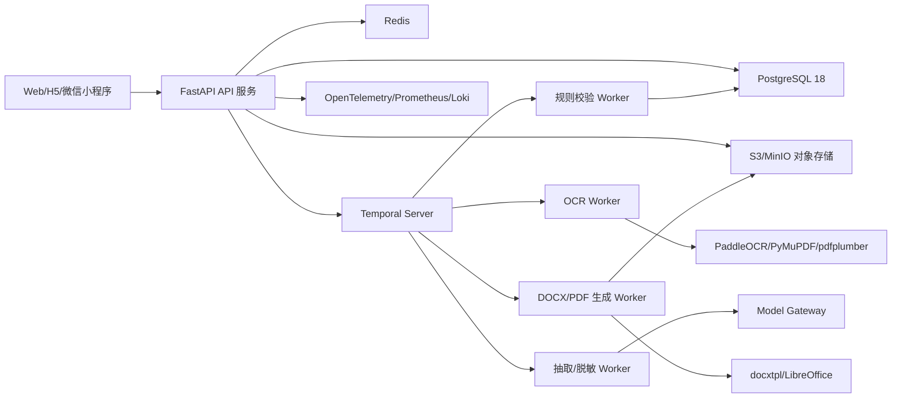
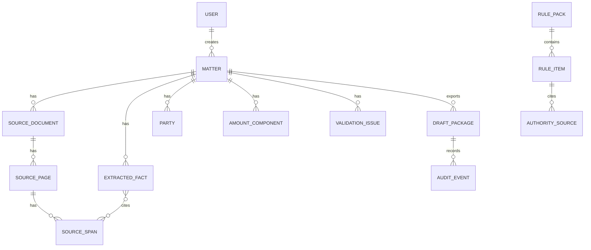
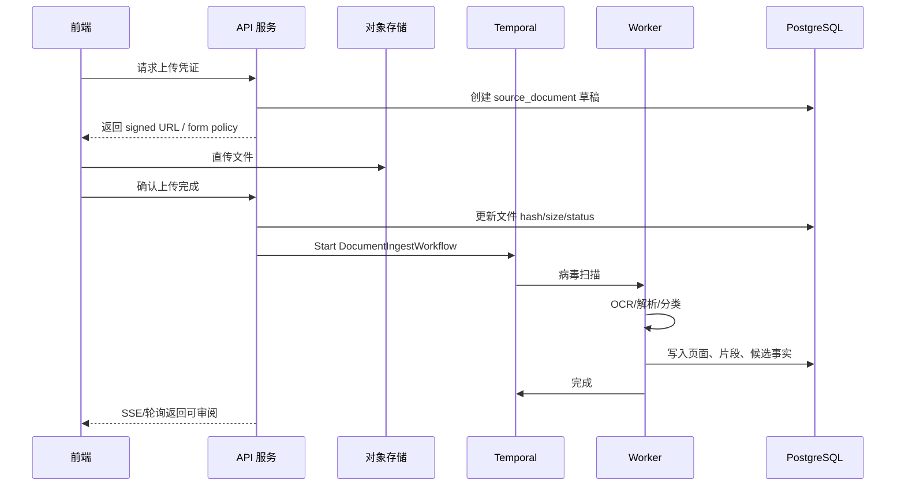
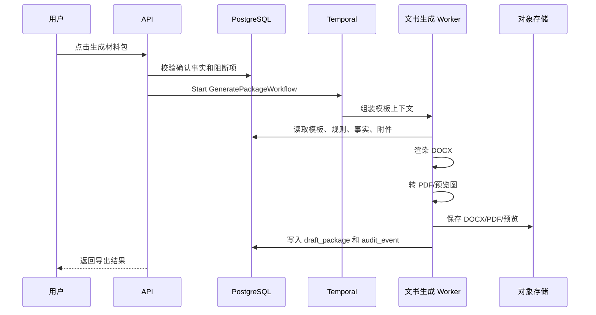
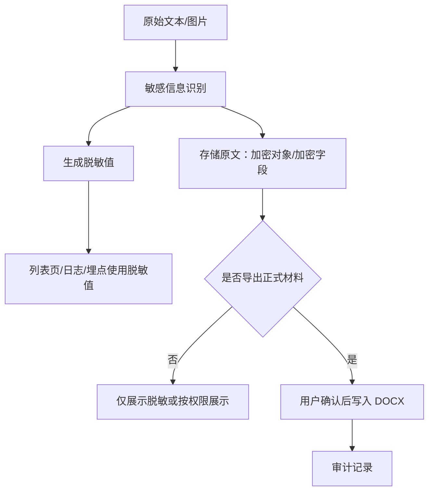
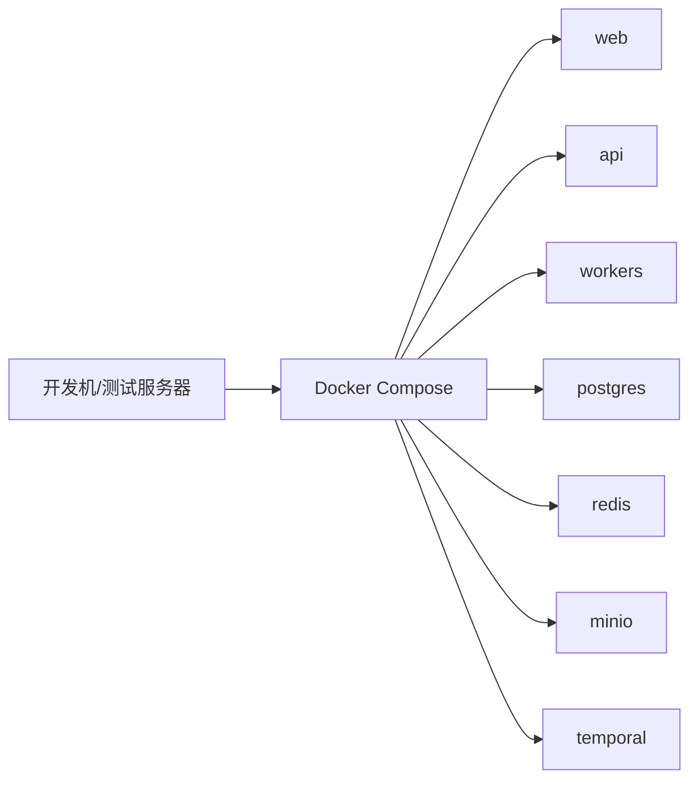
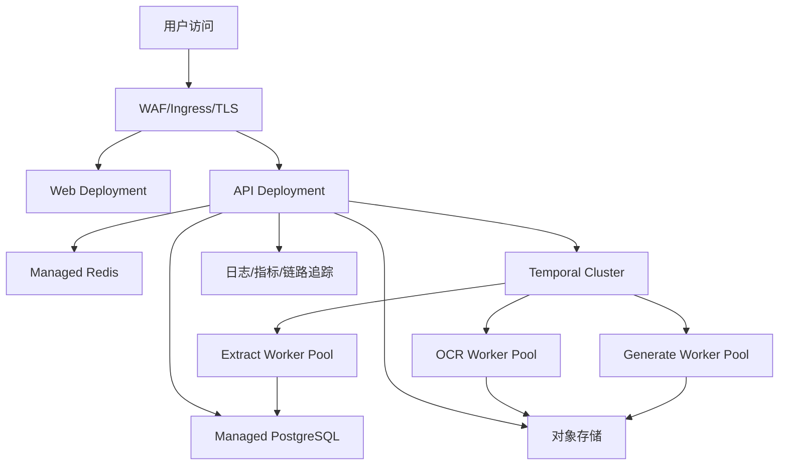

# 全国版强制执行材料生成助手：后端技术方案

版本：v0.1

日期：2026-08-04
目标：支撑材料上传、OCR、事实抽取、规则校验、DOCX 生成、导出、审计和全国/地方规则包管理。

## 1. 技术选型结论

后端采用 Python 优先的文档处理架构：

- API 层：FastAPI + Pydantic v2。
- 长任务编排：Temporal。
- 文档处理：PaddleOCR、PyMuPDF、pdfplumber、python-docx、docxtpl、LibreOffice headless。
- 数据库：PostgreSQL 18。
- 对象存储：S3 兼容存储，开发/私有化用 MinIO，云上可换 OSS/COS/OBS。
- 缓存与进度：Redis。
- 搜索：MVP 可先用 PostgreSQL + pgvector；全国规则库和全文检索规模上来后接 OpenSearch 3.x。
- 模型层：通过 Model Gateway 抽象，不把业务绑定到单一大模型。可接私有化中文模型、国内云模型或 OpenAI-compatible API；敏感材料默认先脱敏或留在私有环境处理。

选择 Python 的核心原因是 OCR、PDF、DOCX、图像处理和法律文书模板生成生态更直接。前端通过 OpenAPI 生成 TypeScript SDK，避免前后端类型割裂。

## 2. 推荐技术栈

| 层 | 选型 | 说明 |
|---|---|---|
| API | FastAPI + Pydantic v2 | 类型声明、校验、OpenAPI 自动生成能力强 |
| 工作流 | Temporal | OCR/抽取/生成是长任务，需要可恢复、可重试、可观测 |
| 关系库 | PostgreSQL 18 | 事务、JSONB、全文/向量扩展、审计数据可靠 |
| 对象存储 | MinIO/S3/OSS/COS | 原始文件、预览图、DOCX/PDF、快照存储 |
| 缓存/进度 | Redis | 短期进度、限流、验证码、SSE 状态 |
| OCR | PaddleOCR 3.5+ | 中文 OCR、文档解析、版面识别适配度高 |
| PDF 解析 | PyMuPDF + pdfplumber | 文本型 PDF 与表格/坐标抽取 |
| DOCX 解析 | python-docx + lxml | 读取段落、表格、图片引用、模板字段 |
| DOCX 生成 | docxtpl + python-docx + OOXML patch | 保留 Word 模板版式，支持表格循环和图片插入 |
| PDF 预览 | LibreOffice headless + Poppler | 将 DOCX/PDF 转为预览图 |
| 搜索 | pgvector，后续 OpenSearch | 来源定位、规则库检索、语义召回 |
| 观测 | OpenTelemetry + Prometheus + Grafana + Loki | 请求链路、任务耗时、错误、审计 |
| 部署 | Docker Compose 起步，Kubernetes 生产 | MVP 快速落地，后续弹性扩展 |

版本依据：

- FastAPI 基于 Python 类型提示提供校验、转换和 OpenAPI 文档：https://fastapi.tiangolo.com/python-types/
- Temporal 提供持久执行、失败恢复和重试能力：https://docs.temporal.io/
- PostgreSQL 18 已于 2025-09-25 发布：https://www.postgresql.org/about/press/presskit18/
- Docker Compose 用于定义和运行多容器应用：https://docs.docker.com/compose/
- Kubernetes Deployment 用于声明式管理应用 Pod：https://kubernetes.io/docs/concepts/workloads/controllers/deployment/
- PaddleOCR 3.5 支持文档解析和常见文档格式能力增强：https://github.com/PaddlePaddle/PaddleOCR/releases
- docxtpl 支持基于 Word 模板和 Jinja2 渲染 DOCX：https://docxtpl.readthedocs.io/en/stable/
- OpenSearch 3.7 于 2026-06-09 发布，支持混合检索和向量检索增强：https://docs.opensearch.org/latest/version-history/

## 3. 总体架构



## 4. 服务拆分

### 4.1 API 服务

职责：

- 用户认证与权限。
- 事项、材料、事实、规则、导出接口。
- 上传凭证签发。
- 工作流启动与状态查询。
- OpenAPI 文档输出。
- 审计事件写入。

### 4.2 OCR Worker

职责：

- PDF/DOCX/图片预处理。
- 扫描件 OCR。
- 表格、段落、页码和图片区域识别。
- 输出 `DocumentPage`、`TextBlock`、`TableBlock`、`ImageBlock`。

### 4.3 抽取与脱敏 Worker

职责：

- 材料分类。
- 抽取案件信息、当事人信息、金额、日期、地址、账户、财产线索。
- 识别敏感信息类型。
- 生成脱敏展示值。
- 将每个候选事实绑定来源页和文本片段。

### 4.4 规则校验 Worker

职责：

- 加载全国基线规则包。
- 加载目标法院地方规则包。
- 处理规则缺失、过期和冲突。
- 生成缺口清单、阻断项、警告项和提示项。

### 4.5 文书生成 Worker

职责：

- 将已确认事实映射到 DOCX 模板上下文。
- 渲染申请执行书、账户确认书、送达地址确认书、财产线索清单、材料目录。
- 插入证件图片和附件页。
- 生成 DOCX。
- 生成 PDF/PNG 预览。
- 输出导出审计摘要。

## 5. 核心数据模型



关键表：

- `users`：用户和认证主体。
- `organizations`：企业、律所、团队。
- `matters`：执行申请事项。
- `source_documents`：上传文件元数据、哈希、存储 key、类型、OCR 状态。
- `source_pages`：页码、图片预览、OCR 质量。
- `source_spans`：文本片段、坐标、所属页面。
- `extracted_facts`：候选事实、置信度、来源、确认状态。
- `parties`：申请执行人、被执行人、代理人等。
- `amount_components`：本金、利息、费用、已履行金额、计算截止日。
- `rule_packs`：全国基线、SPC、地方、场景、平台规则包。
- `rule_items`：具体规则项、阻断级别、来源映射。
- `authority_sources`：权威来源注册表。
- `validation_issues`：缺口、冲突、过期、风险提示。
- `draft_packages`：DOCX/PDF、模板版本、规则版本、导出状态。
- `audit_events`：查看、修改、确认、导出、规则覆盖。

## 6. 上传与处理流程



## 7. DOCX 生成流程



## 8. 规则包模型

```yaml
rule_pack:
  id: cn-national-enforcement-baseline
  scope: national
  scenario: civil_judgment_or_mediation
  version: 2026.08.04
  status: approved
  review_required_after: 2026.09.04
  sources:
    - authority_source_id: spc-execution-guidance-2018
  rules:
    - id: application_document_required
      severity: blocking
      title: 必须生成申请执行书
      applies_when: always
      check: package.documents.contains("enforcement_application")
    - id: applicant_identity_required
      severity: blocking
      title: 申请执行人身份证明材料必需
      check: documents.any(type in ["id_card", "business_license"])
    - id: local_rule_missing_warning
      severity: warning
      title: 目标法院地方规则未确认
      check: local_rule_pack.exists
```

规则严重级别：

- `blocking`：不处理不得导出。
- `high`：默认阻断，法务或用户可记录例外。
- `warning`：允许导出但写入风险提示。
- `info`：提示信息。

## 9. 模板与字段映射

### 9.1 模板模块

- `cover.docx`：材料包封面。
- `materials_index.docx`：材料目录。
- `enforcement_application.docx`：强制执行申请书。
- `applicant_identity.docx`：申请执行人身份证明材料。
- `payment_account_confirmation.docx`：执行案款收款账户确认书。
- `service_address_confirmation.docx`：送达地址确认书。
- `respondent_identity.docx`：被执行人身份信息材料。
- `asset_clue_list.docx`：被执行人财产线索清单。
- `paper_submission_checklist.docx`：纸质递交材料清单。

### 9.2 字段上下文示例

```json
{
  "matter": {
    "case_cause": "民间借贷纠纷",
    "court_name": "目标人民法院",
    "legal_document_no": "案号",
    "legal_document_type": "民事调解书"
  },
  "applicant": {
    "name": "申请执行人姓名",
    "id_no": "身份证号",
    "address": "送达地址",
    "phone": "联系电话"
  },
  "respondent": {
    "name": "被执行人姓名",
    "id_no": "身份证号",
    "known_address": "已知地址"
  },
  "amounts": {
    "principal": 100000,
    "interest": 0,
    "fees": 0,
    "paid": 0,
    "calculated_until": "2026-08-04"
  },
  "asset_clues": [
    {
      "type": "银行账户",
      "detail": "脱敏展示，正式导出使用确认明文",
      "requested_measure": "请求依法查询、冻结、划拨"
    }
  ]
}
```

## 10. 信息抽取与脱敏

### 10.1 抽取策略

- 正则：身份证号、手机号、银行卡号、案号、金额、日期、统一社会信用代码。
- 词典：法院名称、文书类型、案由、执行措施、财产类型。
- 版面：标题、表格、页眉页脚、证件图片区。
- 模型：复杂事实抽取、调解条款解析、分期履行解析、财产线索归类。
- 人工确认：所有高影响字段必须确认。

### 10.2 脱敏策略



敏感字段不得进入：

- 普通应用日志。
- 前端埋点。
- 异常堆栈。
- 模型调试日志。
- 未授权运维页面。

## 11. API 设计草案

```text
POST   /api/v1/matters
GET    /api/v1/matters
GET    /api/v1/matters/{matter_id}
POST   /api/v1/matters/{matter_id}/upload-intents
POST   /api/v1/matters/{matter_id}/documents/{document_id}/complete-upload
GET    /api/v1/matters/{matter_id}/documents
GET    /api/v1/matters/{matter_id}/facts
PATCH  /api/v1/matters/{matter_id}/facts/{fact_id}
PUT    /api/v1/matters/{matter_id}/address-confirmation
PUT    /api/v1/matters/{matter_id}/account-confirmation
PUT    /api/v1/matters/{matter_id}/amounts
POST   /api/v1/matters/{matter_id}/validate
POST   /api/v1/matters/{matter_id}/generate-package
GET    /api/v1/matters/{matter_id}/exports
GET    /api/v1/matters/{matter_id}/audit-events
GET    /api/v1/rule-packs
POST   /api/v1/admin/rule-packs
```

所有修改接口要求：

- 幂等键 `Idempotency-Key`。
- 操作人、组织、IP、UA 入审计。
- 敏感字段单独审计查看和导出。

## 12. 部署方案

### 12.1 MVP 本地/测试环境

使用 Docker Compose：

- `api`
- `worker-ocr`
- `worker-extract`
- `worker-generate`
- `postgres`
- `redis`
- `minio`
- `temporal`
- `web`

适合快速开发、演示和测试。



### 12.2 生产环境

建议 Kubernetes：

- Web、API、Worker 分 Deployment。
- OCR Worker 独立节点池，可选 GPU。
- PostgreSQL 使用云数据库或高可用集群。
- 对象存储使用云 OSS/COS/OBS 或企业版 MinIO。
- Redis 使用云 Redis 或 Sentinel/Cluster。
- Temporal 使用自托管高可用或托管服务。
- Ingress + TLS + WAF。
- 独立密钥管理 KMS。
- 对象存储开启版本、生命周期、服务端加密。



## 13. 安全与合规

### 13.1 数据安全

- 原始文件和导出文件使用对象存储服务端加密。
- 身份证号、银行卡号、手机号、详细地址等字段使用应用层加密。
- 文件访问只使用短期签名 URL。
- 预览图加水印。
- 导出文件设置有效期和下载审计。
- 删除事项时进入可配置保留期，过期后清除对象和索引。

### 13.2 权限

- RBAC：个人、企业管理员、律师/代理人、法务审核员、平台运营。
- 敏感字段明文查看需要权限和审计。
- 管理员不能默认查看用户原始材料。
- 法务审核规则包不等于查看用户案件材料。

### 13.3 合规基线

- 个人信息保护法：敏感个人信息最小必要、告知同意、访问/删除/导出权利。
- 数据安全法：数据分类分级、风险监测、处理活动安全。
- 网络安全法：网络运行安全、日志留存、访问控制。
- 法律材料处理：不得将用户材料提交到外部模型，除非获得明确授权并满足数据处理要求。

## 14. 质量保障

### 14.1 自动化测试

- 单元测试：字段识别、脱敏、金额计算、规则命中、模板上下文。
- 集成测试：上传、OCR、抽取、确认、生成、导出。
- 黄金文件测试：固定输入生成稳定 DOCX。
- 回归测试：模板变更后比对 DOCX XML 和 PDF/PNG 预览。
- 安全测试：越权、签名 URL、敏感日志、恶意文件。

### 14.2 文书 QA

- DOCX 生成后转换为 PDF/PNG 预览。
- 检查页数、表格溢出、图片缺失、占位符、页眉页脚。
- 检查所有导出字段来源。
- 检查材料目录与实际附件一致。

## 15. 后端里程碑

### 第 1-2 周：基础服务

- FastAPI 项目、数据库 schema、认证、事项 API。
- 对象存储签名上传。
- 审计日志。

### 第 3-4 周：文档解析

- OCR Worker。
- PDF/DOCX/图片解析。
- 材料分类。
- 页面预览。

### 第 5-6 周：事实抽取与规则

- 候选事实 schema。
- 敏感字段识别与脱敏。
- 全国基线规则包。
- 校验和缺口分析。

### 第 7-8 周：DOCX 生成

- docxtpl 模板工程。
- 申请执行书、地址确认书、账户确认书、财产线索清单。
- DOCX/PDF 导出。
- 导出前阻断。

### 第 9-10 周：生产化

- Kubernetes 部署。
- 观测与告警。
- 权限细化。
- 性能压测。
- 安全测试和灰度发布。

## 16. 风险与对策

| 风险 | 对策 |
|---|---|
| OCR 对扫描件、拍照件识别不稳定 | 图片增强、质量评分、低置信度强制人工确认 |
| DOCX 模板版式漂移 | 使用 Word 模板 + docxtpl，生成后转 PDF/PNG 做 QA |
| 地方规则变化频繁 | 权威来源注册表、复核周期、过期提示、规则包版本化 |
| 大模型输出不可靠 | 结构化 schema、来源引用、人工确认、禁止未确认事实入文 |
| 敏感数据泄露 | 加密、脱敏日志、权限、审计、短期 URL、最小化模型输入 |
| 长任务失败 | Temporal 重试、幂等活动、断点恢复、任务状态可观测 |
| 小程序上传限制 | 直传对象存储、分片上传、失败重试、复杂操作跳转 H5 |

## 17. 参考资料

- FastAPI 类型与 OpenAPI 能力：https://fastapi.tiangolo.com/python-types/
- Temporal 文档：https://docs.temporal.io/
- PostgreSQL 18 发布说明：https://www.postgresql.org/about/press/presskit18/
- Docker Compose 文档：https://docs.docker.com/compose/
- Kubernetes Deployment 文档：https://kubernetes.io/docs/concepts/workloads/controllers/deployment/
- PaddleOCR 发布说明：https://github.com/PaddlePaddle/PaddleOCR/releases
- docxtpl 文档：https://docxtpl.readthedocs.io/en/stable/
- MinIO 对象存储文档：https://min.io/docs/minio/linux/index.html
- OpenSearch 版本历史：https://docs.opensearch.org/latest/version-history/
- 《中华人民共和国个人信息保护法》：https://www.npc.gov.cn/WZWSREL25wYy9jMi9jMzA4MzQvMjAyMTA4L3QyMDIxMDgyMF8zMTMwODguaHRtbD9yZWY9aW1i
- 《中华人民共和国数据安全法》：https://en.npc.gov.cn.cdurl.cn/2021-06/10/c_689311.htm
- 《中华人民共和国网络安全法》现行修正信息参考：https://www.gjbmj.gov.cn/n1/2026/0421/c409088-40705863.html
