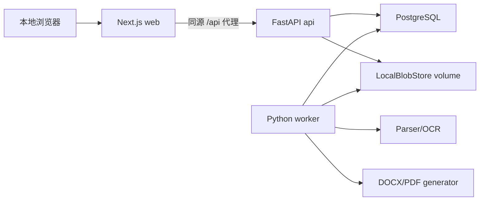
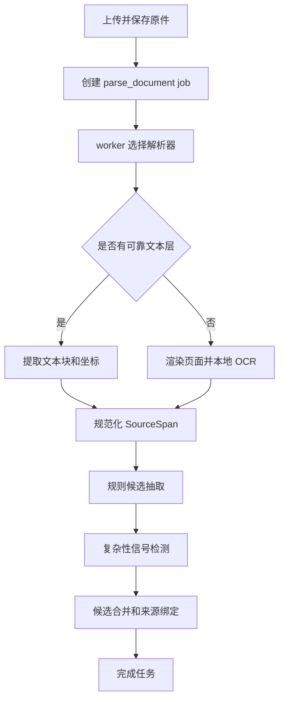
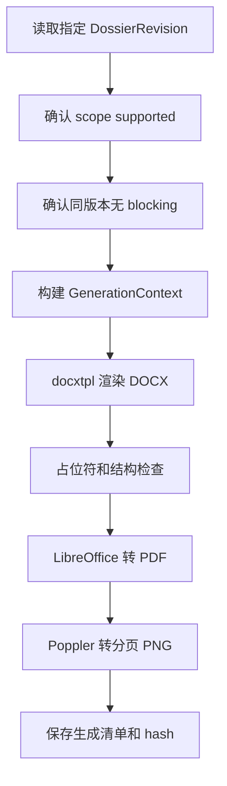

# 全国版强制执行材料生成助手：后端技术方案

版本：v0.4

日期：2026-08-05

目标：使用可延续到第二版和平台化阶段的服务端技术基线，实现“本人办理、单一申请执行人、单一被执行人、无代理人”的本地 MVP。服务端必须稳定生成支持范围内的文书，并可靠阻断多当事人、代理关系和其他复杂案件。

## 0. 本次 Review 结论

后端同时进行产品收敛和技术基线升级。

产品收敛：

- MVP 固定 `workflow_profile=self_single_v1`。
- 只允许一名申请执行人和一名被执行人。
- 不接受代理人、法定代理人、委托代理人或复杂主体关系进入最终卷宗。
- 首批可靠性验收以自然人对自然人的民事调解书和民事判决书为主。
- 只支持一项明确的主要金钱给付义务和确定性金额运算。
- MVP 不实现生成式 AI、模型网关、AI 配置接口或模型任务。
- 检测到复杂关系时返回不可绕过的产品门禁，不尝试猜测或降级生成。

技术升级：

- 元数据数据库从 SQLite 调整为 PostgreSQL，避免第二版再迁移事务、JSONB、并发任务和多用户数据。
- 文档解析和生成从 API 进程分离为独立 worker。
- 任务队列使用 PostgreSQL job 表和 `FOR UPDATE SKIP LOCKED`，MVP 不额外引入 Redis/Celery。
- 通过 Docker Compose 统一运行 Next.js、FastAPI、worker 和 PostgreSQL。
- 文件仍保存在本地持久化卷，但通过 `BlobStore` 接口隔离，后续可替换对象存储。
- 保留模块化单体，不在 MVP 拆分微服务或提前实现登录、律师和 AI 业务。

## 1. 产品与技术契约

### 1.1 支持范围

一个事项必须满足：

```text
workflow_profile = self_single_v1
applicant_count = 1
respondent_count = 1
representative_count = 0
party_type = natural_person（首批验收范围）
basis_type in [civil_mediation, civil_judgment]
primary_obligation_count = 1
primary_obligation_kind = monetary
```

用户可以通过手工填写完成支持范围内的字段。OCR 和规则自动化不是生成成功的前置条件。

### 1.2 必须阻断

以下信号触发 `unsupported_case`，不得生成最终申请书：

- 多名申请执行人或多名被执行人。
- 代理人、律师、法定代理人、法定代表人或负责人需要进入当前申请关系。
- 法人、非法人组织或权利承受关系需要额外主体材料。
- 多个独立执行义务。
- 条件履行、复杂分期、债权转让、继承等需要额外法律判断。
- 执行依据不属于当前支持类型。

材料中出现原诉讼律师姓名不一定代表执行申请使用代理人。系统可以把它标记为复杂性信号，但最终门禁以材料结构、用户确认和服务端规则共同判断；系统不得把律师误填为申请执行人或被执行人。

### 1.3 正确术语

源文书中的原告、被告是诉讼角色。确认卷宗和生成文书统一使用申请执行人、被执行人。API 字段不得继续使用 `plaintiff`、`defendant` 作为最终角色名。

## 2. 技术选型

后端采用 Python 模块化单体，API 与 worker 使用同一业务包和不同启动命令。

| 层 | MVP 选型 | 扩展价值 |
|---|---|---|
| 运行时 | Python 3.12 | 文档、OCR 和服务端生态成熟 |
| API | FastAPI + Pydantic v2 | OpenAPI 契约、强校验和后续多实例部署 |
| ORM/迁移 | SQLAlchemy 2 + Alembic | 明确事务边界和版本化迁移 |
| 数据库 | PostgreSQL 16 | JSONB、事务、并发 worker 和未来多用户 |
| 数据库驱动 | psycopg 3 | PostgreSQL 官方能力和 SQLAlchemy 支持 |
| 任务 | PostgreSQL job table + 独立 worker | 本地可靠运行，可横向增加 worker |
| 文件 | LocalBlobStore | 本地持久化，未来替换 S3/MinIO/OSS/COS |
| PDF | PyMuPDF + pdfplumber | 文本块、页面坐标和表格辅助 |
| DOCX 读取 | LibreOffice 派生 PDF + python-docx | 稳定页码坐标和结构读取 |
| OCR | PaddleOCR 基础 OCR + 可选 PP-StructureV3 | 本地处理，按硬件分档 |
| 图像 | OpenCV + Pillow | 方向、裁剪、去噪和页图 |
| 候选抽取 | Python regex/dictionary/layout extractors | 可测试、可解释、无生成式模型依赖 |
| 业务校验 | Python rules + 版本化元数据 | 简单案件门禁和全国基础提示 |
| DOCX | docxtpl + python-docx | 确定性模板和 OOXML 后处理 |
| 预览 | LibreOffice headless + Poppler | DOCX 转 PDF/PNG 视觉核验 |
| 容器 | Docker Compose | 一条命令运行多进程和持久化依赖 |
| 测试 | pytest + golden files + Playwright | 单元、集成、文书和端到端 |

### 2.1 为什么 MVP 使用 PostgreSQL

使用 Next.js 和 Redux 只是前端扩展基线，服务端同样需要避免第二版重做核心存储。第二版的登录、律师事项、多 worker、AI 长任务和审计都会依赖更稳定的并发事务和查询能力，因此从 MVP 起使用 PostgreSQL。

代价是本地多一个数据库服务。Docker Compose、固定镜像版本、健康检查和持久化 volume 将这一复杂度封装在启动流程中。

### 2.2 为什么暂不使用 Redis/Celery

MVP 已经需要 PostgreSQL。使用 PostgreSQL job table 可以可靠保存任务、重试、进度和 lease，并使用 `SKIP LOCKED` 支持多个 worker 领取不同任务。

当前不再增加 Redis/Celery，避免本地依赖继续膨胀。任务访问通过 `JobQueue` 接口隔离；第二版只有在任务吞吐、调度或路由需求超过 PostgreSQL 队列时再替换。

## 3. 本地部署架构



长期运行服务：

```text
web       Next.js Node server
api       FastAPI API
worker    文档解析和生成 worker
postgres  PostgreSQL
```

另有一次性 `migrate` 命令在 API 和 worker 启动前执行 `alembic upgrade head`。

网络：

- 只把 `web` 映射到宿主机 `127.0.0.1`。
- API、worker 和 PostgreSQL 只在 Compose 内部网络通信。
- Next.js 代理 `/api/*`，浏览器不直接访问内部 API 端口。
- 开发调试如需暴露 API，必须使用仅 loopback 的 override 文件。

持久化：

- PostgreSQL 使用独立 volume。
- 原件、解析结果、预览和导出使用独立本地 data volume。
- 删除容器不得默认删除 volume。

## 4. 服务端模块

```text
services/api/
  app/
    main.py
    api/
      dependencies.py
      errors.py
      routes/
        matters.py
        documents.py
        fact_fields.py
        application.py
        validations.py
        generations.py
        jobs.py
        runtime.py
    core/
      config.py
      logging.py
      security.py
    db/
      session.py
      models.py
      migrations/
      repositories/
    matters/
      schemas.py
      service.py
      revisions.py
      eligibility.py
    documents/
      schemas.py
      service.py
      parsers/
      ocr/
    extraction/
      schemas.py
      pipeline.py
      merge.py
      rule_extractors/
    validation/
      engine.py
      rules/
        product_scope/
        national/
    amounts/
      service.py
      schemas.py
    generation/
      context.py
      service.py
      render.py
      verify.py
    jobs/
      queue.py
      schemas.py
      handlers.py
    storage/
      base.py
      local.py
    audit/
      service.py
    shared/
      enums.py
      errors.py
  resources/
    templates/cn-national/
    rule_metadata/cn-national/
  tests/
    fixtures/
    unit/
    integration/
    golden/
services/worker/
  main.py
```

边界：

- API route 只做协议转换、请求上下文和 application service 调用。
- 文档解析模块不决定谁是最终申请执行人。
- extraction 只生成候选和复杂性信号，不修改确认卷宗。
- validation 是产品范围门禁和生成门禁的唯一权威来源。
- generation 只能读取指定版本的已确认卷宗。
- worker 调用和 API 相同的 application services，不复制业务逻辑。

## 5. 扩展接口

MVP 实现以下接口，而不是绑定具体基础设施：

```python
class BlobStore(Protocol):
    def put(self, key: str, source: BinaryIO) -> BlobMetadata: ...
    def open(self, key: str) -> BinaryIO: ...
    def delete_prefix(self, prefix: str) -> None: ...

class JobQueue(Protocol):
    def enqueue(self, command: JobCommand) -> JobRecord: ...
    def claim(self, worker_id: str) -> JobRecord | None: ...
    def heartbeat(self, job_id: UUID, lease_token: str) -> None: ...

class ActorContext(Protocol):
    actor_kind: str
    actor_id: str
```

MVP `ActorContext` 固定为本地匿名操作者，仅用于审计字段，不创建用户表、登录逻辑或权限分支。第二版平台化时可以替换请求上下文，不改变领域 service 签名。

MVP 不定义或实现 `ModelGateway`。第二版 AI 规划保留在文档末尾，防止当前代码出现未使用的模型依赖和配置入口。

## 6. 核心数据模型

### 6.1 Matter

```json
{
  "id": "uuid",
  "title": "string",
  "workflow_profile": "self_single_v1",
  "basis_type": "civil_mediation|civil_judgment",
  "workflow_stage": "materials|facts|application|review|export",
  "data_revision": 7,
  "validated_revision": 6,
  "generated_revision": 6,
  "scope_status": "pending|supported|unsupported",
  "created_at": "datetime",
  "updated_at": "datetime"
}
```

`workflow_stage` 只记录最近步骤。能否生成由 `scope_status`、版本和校验结果共同决定。

### 6.2 EligibilityAttestation

```json
{
  "matter_id": "uuid",
  "is_applicant_self": true,
  "single_applicant": true,
  "single_respondent": true,
  "no_representative": true,
  "will_review_key_facts": true,
  "confirmed_at": "datetime"
}
```

适用条件属于生成门禁并进入版本记录，不只是前端提示。

### 6.3 SourceDocument 与 SourceSpan

```json
{
  "source_document": {
    "id": "uuid",
    "matter_id": "uuid",
    "original_filename": "string",
    "media_type": "application/pdf",
    "sha256": "string",
    "size_bytes": 12345,
    "document_type": "unknown|basis|identity|payment|account|address|asset_clue|other",
    "parse_status": "uploaded|queued|parsing|parsed|needs_attention|failed",
    "parse_revision": 2,
    "parser_version": "string|null",
    "parse_error_code": "string|null"
  },
  "source_span": {
    "id": "uuid",
    "document_id": "uuid",
    "page_number": 1,
    "sequence": 10,
    "text": "string",
    "bbox_normalized": [0.10, 0.20, 0.80, 0.25],
    "text_method": "embedded|ocr",
    "text_quality": 0.91
  }
}
```

页码从 1 开始。坐标统一为 `[left, top, right, bottom]` 的页面归一化值。

### 6.4 FactCandidate

```json
{
  "id": "uuid",
  "matter_id": "uuid",
  "subject_key": "legal_document|applicant|respondent|obligation",
  "field_key": "case_no|name|id_number|amount|due_date",
  "value": "json",
  "source_span_ids": ["uuid"],
  "method": "regex|dictionary|layout",
  "extractor_id": "case-number-regex",
  "extractor_version": "1.0.0",
  "quality": 0.93,
  "review_state": "unreviewed|accepted|rejected"
}
```

MVP `method` 不包含 `model`。一个字段可以有多个候选，但最终只能由用户确认一个值。

### 6.5 ComplexitySignal

```json
{
  "id": "uuid",
  "matter_id": "uuid",
  "code": "multiple_respondents_detected|representative_detected|organization_party_detected|complex_obligation_detected",
  "source_span_ids": ["uuid"],
  "detector_id": "party-heading-detector",
  "status": "open|dismissed_as_parse_error|confirmed_unsupported"
}
```

复杂性信号不能仅凭关键词永久阻断，因为源判决可能包含原诉讼代理人。用户可以把误识别标记为解析错误，但服务端必须重新运行范围校验并记录原因。

### 6.6 DossierRevision

底层使用可扩展集合，MVP Pydantic validator 强制角色基数。这为第二版扩容保留数据形状，但不开放多角色业务。

```json
{
  "matter_id": "uuid",
  "revision": 7,
  "dossier_schema_version": "self-single-1.0",
  "dossier": {
    "legal_document": {},
    "parties": [
      {"role": "applicant", "party_type": "natural_person"},
      {"role": "respondent", "party_type": "natural_person"}
    ],
    "primary_obligation": {
      "kind": "monetary"
    },
    "performance": {},
    "application": {},
    "payment_account": {},
    "service_address": {},
    "asset_clues": []
  },
  "confirmed_fields": {},
  "created_at": "datetime"
}
```

MVP 不包含 `representatives`。如果请求提交额外角色、多个 applicant/respondent 或多个 primary obligation，Pydantic 和 service 同时拒绝。

### 6.7 ValidationRun、GenerationRun 与 Job

```json
{
  "validation_run": {
    "id": "uuid",
    "matter_id": "uuid",
    "data_revision": 7,
    "rule_set_version": "self-single-cn-1.0.0",
    "scope_supported": true,
    "blocking_count": 0,
    "warning_count": 2
  },
  "generation_run": {
    "id": "uuid",
    "matter_id": "uuid",
    "data_revision": 7,
    "validation_run_id": "uuid",
    "template_version": "cn-enforcement-self-single-1.0.0",
    "status": "queued|rendering|docx_ready|preview_ready|failed"
  },
  "job": {
    "id": "uuid",
    "kind": "parse_document|generate_package",
    "status": "queued|running|succeeded|failed|cancelled",
    "priority": 100,
    "attempt": 1,
    "lease_owner": "string|null",
    "lease_expires_at": "datetime|null",
    "heartbeat_at": "datetime|null",
    "idempotency_key": "string",
    "error_code": "string|null"
  }
}
```

## 7. 版本与事务

所有会影响材料包的修改都在数据库事务中：

1. 校验客户端 `expected_revision`。
2. 锁定 Matter 当前行。
3. 写入新的 DossierRevision 或材料变化。
4. 增加 `data_revision`。
5. 提交事务后返回新版本。

推进 `data_revision`：

- 适用条件确认变化。
- 上传、删除或重新分类材料。
- 确认、修改或撤销事实。
- 修改义务、金额、法院、账户、地址或财产线索。
- 重解析导致已确认来源失效。

不推进：

- 页面切换。
- 任务进度和 heartbeat。
- 新增未确认候选但未影响确认卷宗。

旧版本请求返回 `409 revision_conflict`。`validated_revision` 和 `generated_revision` 不等于当前版本时，旧结果自动过期。

## 8. 文档处理

### 8.1 上传门禁

- 文件大小限制。
- 扩展名、声明 MIME 和 magic bytes 一致性。
- SHA-256 和事项内重复检查。
- UUID 物理路径和原始文件名转义。
- PDF、DOCX、JPG、PNG 白名单。
- P0 拒绝 ZIP。

### 8.2 解析流水线



格式规则：

- 文本型 PDF 直接提取文本和坐标，缺少可靠文本层的页面 OCR。
- DOCX 先通过 LibreOffice 生成派生 PDF，从派生 PDF 建立稳定页码；python-docx 辅助读取段落和表格。
- JPG、PNG 作为单页文档处理。
- 转换或 OCR 失败时标记 `needs_attention`，保留手工录入。

OCR profile：

- `basic`：默认，方向校正、文本检测和中文识别。
- `structure-light`：表格、印章遮挡或复杂阅读顺序时人工重试使用。
- `structure-full`：性能允许且样本证明必要时使用，不是 MVP 默认。

模型必须提前安装到本地。案件处理过程中不得静默联网下载。

## 9. 确定性候选抽取

MVP extractors：

- 案号。
- 法院名称。
- 文书标题和类型。
- 日期。
- 身份证号、手机号和银行卡号格式。
- 金额字面值。
- “原告”“被告”“申请执行人”“被执行人”“判决如下”“调解协议如下”等结构标题。

接口：

```python
class CandidateExtractor(Protocol):
    id: str
    version: str

    def supports(self, document: ParsedDocument) -> bool: ...
    def extract(self, document: ParsedDocument) -> list[FactCandidateDraft]: ...
```

规则：

- 候选永不自动成为确认事实。
- 值相同、来源不同的候选聚合并保留全部来源。
- 值不同的候选并列展示。
- 新候选不能覆盖已确认字段。
- 来源删除后候选失效，相关确认字段要求重新确认。
- 复杂性 detector 只提供信号，范围校验才给出最终门禁。

## 10. PostgreSQL 任务队列

API 只创建任务，worker 负责执行。领取任务使用短事务：

```sql
SELECT id
FROM jobs
WHERE status = 'queued'
  AND available_at <= now()
ORDER BY priority ASC, created_at ASC
FOR UPDATE SKIP LOCKED
LIMIT 1;
```

领取后立即写入 `running`、`lease_owner`、`lease_expires_at` 并提交，再执行耗时工作。

可靠性规则：

- job command 只包含 ID，不把 OCR 全文放入任务表。
- handler 使用 `idempotency_key` 防止重复结果。
- worker 定期 heartbeat 并续租。
- lease 超时任务由 recovery 重新排队。
- 达到最大重试次数后保存稳定错误码。
- 输出先写临时 key，完成校验后原子移动或提交正式记录。
- 本地默认一个 worker；未来可以增加多个 worker，共享同一 PostgreSQL 队列。

PostgreSQL 队列是 MVP 的基础设施实现，不影响上层 `JobQueue` 接口。未来迁移 Celery、Temporal 或云队列时，API 和领域命令保持不变。

## 11. 产品范围与生成校验

校验顺序：

1. `ProductScopeRules`。
2. `ConfirmedDataRules`。
3. `NationalBaselineRules`。
4. `TemplateReadinessRules`。

### 11.1 ProductScopeRules

阻断码：

```text
eligibility_not_confirmed
unsupported_multiple_applicants
unsupported_multiple_respondents
unsupported_representative
unsupported_organization_party
unsupported_basis_type
unsupported_multiple_obligations
unsupported_complex_obligation
```

这些阻断属于当前产品不支持，不能通过普通“我已知晓”确认消除。解析误报必须先修正复杂性信号或确认卷宗，再重新校验。

### 11.2 ConfirmedDataRules

- 唯一申请执行人和被执行人字段完整并确认。
- 案号、执行依据、申请法院和请求事项确认。
- 主要义务、文书金额、已履行金额和尚未履行金额确认。
- 进入正文的字段有来源或 `origin=user`。
- 来源未被删除或替换。

### 11.3 NationalBaselineRules

- 申请书结构和基础材料提示。
- 生效信息、申请期间、目标法院和财产所在地风险提示。
- 地方材料差异只生成 warning，不输出必然受理结论。

### 11.4 TemplateReadinessRules

- 当前 revision 已通过前三类校验。
- 所有模板必需字段存在。
- 金额组件可序列化。
- 不存在旧来源、未确认事实和未解决 scope blocker。

## 12. 金额服务

MVP 只做确定性运算：

```text
requested_total = document_amount - performed_amount + user_confirmed_additions
```

约束：

- 金额使用 `Decimal` 和 PostgreSQL `NUMERIC`，不使用浮点数。
- 文书金额、已履行金额和附加金额都需要用户确认。
- 结果、公式版本和确认状态进入 DossierRevision。
- 负数、币种不一致和结果超过文书金额等异常生成 blocker 或 warning。

MVP 不自动确定迟延履行利息、利率、起算日、分段计算或抵扣顺序。用户可以填写已经自行核对的金额，并记录为用户确认来源。

## 13. 文书生成



`GenerationContext` 只包含：

- 指定版本的确认卷宗。
- 指定版本的金额结果。
- 规则、模板和 schema 版本。
- 允许的确定性文本片段。

禁止传入：

- 未确认候选。
- OCR 全文。
- 复杂性信号说明。
- 模型输出或自由生成正文。
- 日志和数据库 ORM 对象。

P0 输出：

- `enforcement_application.docx`。
- `submission_checklist.pdf` 或 DOCX。
- `source_review.html` 或 PDF。

生成门禁要求 `scope_supported=true`、`validated_revision=data_revision` 和零 blocking。最终下载还要求 `generated_revision=data_revision` 且状态为 `preview_ready`。

自动检查：

- 无模板占位符残留。
- 必需段落、签名和日期位置存在。
- DOCX 可以被 python-docx 重新打开。
- PDF 页数大于零且每页可渲染。
- 生成清单、文件 hash、数据和模板版本完整。

模板发布前必须进行页面图视觉检查。

## 14. API 契约

统一前缀 `/api/local`，由 Next.js 同源代理。

### 14.1 事项与材料

```text
POST   /matters
GET    /matters/recent
GET    /matters/{matter_id}
DELETE /matters/{matter_id}
PUT    /matters/{matter_id}/eligibility

POST   /matters/{matter_id}/documents
GET    /matters/{matter_id}/documents
PATCH  /documents/{document_id}
DELETE /documents/{document_id}
POST   /documents/{document_id}/parse-jobs
GET    /documents/{document_id}/pages/{page_number}
```

### 14.2 候选与确认卷宗

```text
GET    /matters/{matter_id}/fact-fields
PUT    /matters/{matter_id}/fact-fields/{field_id}
POST   /matters/{matter_id}/candidate-actions
GET    /matters/{matter_id}/dossier
PUT    /matters/{matter_id}/application
```

前端获得固定视图：`applicant`、`respondent`、`legal_document`、`primary_obligation` 和 `application`，不暴露通用新增角色接口。

### 14.3 校验、生成和运行能力

```text
POST   /matters/{matter_id}/validations
GET    /matters/{matter_id}/validations/latest
POST   /matters/{matter_id}/generations
GET    /matters/{matter_id}/generations
GET    /generations/{generation_id}
GET    /generations/{generation_id}/files/{file_id}
GET    /jobs/{job_id}
POST   /jobs/{job_id}/retry
GET    /runtime/capabilities
```

MVP 没有：

- `/login`、`/users`、`/organizations`。
- `/lawyer`、`/representatives`、`/complex-parties`。
- `/ai-settings`、`/models`、`/model-jobs`。

所有修改卷宗的请求包含 `expected_revision`。

错误结构：

```json
{
  "error": {
    "code": "unsupported_multiple_respondents",
    "message": "当前版本只支持一名被执行人",
    "request_id": "uuid",
    "details": {}
  }
}
```

错误不得包含 OCR 正文、文件绝对路径和敏感字段明文。

## 15. OpenAPI 与前端契约

- Pydantic 是请求和响应 schema 的唯一来源。
- FastAPI operation ID 必须稳定并采用业务动作命名。
- endpoints 按 Matter、Documents、Facts、Dossier、Validation、Generation、Job 标记 OpenAPI tags。
- CI 导出 OpenAPI 到 `packages/contracts/openapi.json`。
- 前端通过 `@rtk-query/codegen-openapi` 生成 RTK Query endpoints。
- CI 检查迁移、OpenAPI 和生成前端代码均无未提交差异。
- scope blocker 使用稳定错误码，不让前端根据中文 message 判断逻辑。

## 16. 文件与隐私

### 16.1 LocalBlobStore

```text
data/
  matters/
    {matter_id}/
      source/{document_id}/original
      parsed/{document_id}/manifest.json
      parsed/{document_id}/pages/
      generations/{generation_id}/files/
      generations/{generation_id}/preview/
```

- 磁盘 key 只使用 UUID 和受控片段。
- 原始文件名仅作为数据库元数据。
- 所有 key 经过根目录约束检查。
- 删除事项通过 BlobStore 删除对应前缀，不能接受客户端文件路径。

### 16.2 日志和网络

- 日志只记录 request、matter、document、job ID、状态、耗时和错误码。
- 不记录 OCR 全文、证件号、电话、账户、地址和文书正文。
- 不接入第三方遥测、远程字体或错误上报。
- OCR 模型、本地字体和模板在案件处理前安装。
- MVP 不包含生成式 AI SDK，不向外部模型发送数据。

### 16.3 数据库

- PostgreSQL 密码通过本地 `.env` 或 secret 提供，不提交 Git。
- 宿主机不公开数据库端口。
- 开发 fixture 和备份示例必须完全虚构。
- 删除事项同时删除业务记录、任务关联、审计记录和 BlobStore 文件。

## 17. Docker Compose 与启动

建议服务：

```yaml
services:
  postgres: {}
  migrate: {}
  api: {}
  worker: {}
  web: {}
```

依赖关系：

- PostgreSQL health check 成功后运行 migrate。
- migrate 成功后启动 API 和 worker。
- API health check 成功后 web 才标记 ready。
- worker 启动时检查 OCR、LibreOffice、Poppler、字体和模板。

用户启动目标：

```text
docker compose up --build
```

浏览器访问 `http://127.0.0.1:3000`。停止服务不得默认删除 volume；彻底删除本地数据必须使用单独、明确确认的命令或 UI 操作。

开发模式可以使用 Turborepo 启动 Next.js，并用 Compose 只运行 PostgreSQL；API 和 worker 原生启动方式必须和容器使用相同配置 schema。

## 18. 测试与评测

### 18.1 单元测试

- Pydantic 强制一名 applicant、一名 respondent、零 representative。
- 多角色和法人主体请求被拒绝。
- 适用条件和 scope blocker。
- 候选去重、冲突和来源失效。
- Dossier revision 和 `409` 并发冲突。
- Decimal 金额和异常值。
- GenerationContext 不包含候选和 OCR 全文。
- 路径约束和日志脱敏。

### 18.2 PostgreSQL 与 worker 集成测试

- Alembic 从空库升级。
- 两个 worker 使用 `SKIP LOCKED` 不重复领取同一任务。
- lease 超时恢复和幂等重试。
- API 重启、worker 重启和数据库短暂不可用恢复。
- 数据修改后旧校验和旧生成失效。
- 删除事项后数据库和文件一致清理。

### 18.3 文档集成测试

- PDF/DOCX/图片到 SourceSpan。
- OCR 失败后手工回退。
- DOCX 生成、PDF 转换和 PNG 渲染。
- 占位符、文件 hash 和预览状态。
- 案件处理过程中无外部网络请求。

### 18.4 虚构评测集

支持样本 30 至 50 份：

- 单一自然人申请执行人和被执行人。
- 文本与扫描型调解书、判决书。
- 一项明确金钱义务。
- 未履行和简单部分履行。

不支持样本至少 15 份：

- 多申请执行人。
- 多被执行人。
- 代理人或律师进入申请关系。
- 法人和法定代表人。
- 多义务、复杂分期和条件履行。

验收：

- 支持样本都能通过人工修正确认完成生成。
- 不支持样本不会生成最终申请书。
- 未确认事实进入 GenerationContext 的数量为 0。
- 旧版本误导出、占位符残留和任务重复执行为 0。
- 所有正文关键字段都有来源或用户填写记录。
- DOCX 视觉检查通过后才能发布模板版本。

## 19. MVP 实施顺序

### 里程碑 1：可扩展技术基线

- Docker Compose、PostgreSQL、Alembic。
- FastAPI modular monolith 和独立 worker。
- PostgreSQL JobQueue、LocalBlobStore 和健康检查。
- OpenAPI 导出与前端 RTK Query codegen 联调。

### 里程碑 2：固定单一关系生成闭环

- Matter、EligibilityAttestation 和 DossierRevision。
- 唯一 applicant、respondent 和单一 monetary obligation。
- ProductScopeRules 和手工填写 API。
- 强制执行申请书模板、PDF/PNG 预览。

完成标准：不依赖 OCR 和自动候选，虚构简单案件可以手工生成文书；多被执行人请求被阻断。

### 里程碑 3：材料解析和来源

- 上传门禁、PDF/DOCX/图片 parser。
- worker 任务、基础 OCR 和恢复。
- SourceSpan、页预览和来源核对。

### 里程碑 4：规则候选和版本一致性

- 案号、法院、日期、证件号和金额 extractors。
- ComplexitySignal 和不支持案件检测。
- 数据版本、校验和生成失效。
- 材料清单和内部来源核对表。

### 里程碑 5：可靠性与发布准备

- 支持与不支持虚构样本集。
- 多 worker、重启和清理测试。
- DOCX/PDF/PNG 视觉回归。
- 本地启动、备份、删除和隐私说明。

MVP 实施顺序不包含登录、律师入口、多角色编辑器和生成式 AI。

## 20. 第二版规划留档，不进入当前实现

第二版产品入口：

- `self`：默认单一被执行人流程，明确适用范围。
- `lawyer`：复杂案件工作台，支持多方、代理人和组织主体。

第二版后端演进：

- 增加 User、Organization、Membership 和 MatterOwner。
- 增加经过权限检查的 ActorContext 实现。
- 放宽 Dossier party cardinality，引入 representative 和 organization schemas。
- 增加复杂义务 schema 和专业规则包。
- 增加 `ModelGateway` 和 AI extraction worker task。
- 律师激活 AI 时创建高资源任务，并返回预计排队/处理状态。
- 外部模型调用必须记录授权、提供方、最小发送范围和数据处理配置。
- AI 仍只产生带有效来源的候选，不能直接进入 GenerationContext。

扩展基础：

- PostgreSQL 无需从 SQLite 迁移。
- worker 可以横向增加；任务系统达到瓶颈后替换 JobQueue adapter。
- LocalBlobStore 可以替换对象存储。
- FastAPI 可以增加多个 API 实例。
- Next.js、Redux Toolkit、RTK Query 和共享 UI 包继续复用。

这些内容只用于架构留档。MVP 仓库不创建空 User 表、AI adapter、律师 API 或隐藏 feature flag。

## 21. 官方技术依据

- FastAPI 容器部署：https://fastapi.tiangolo.com/deployment/docker/
- SQLAlchemy PostgreSQL dialect：https://docs.sqlalchemy.org/en/20/dialects/postgresql.html
- PostgreSQL `SKIP LOCKED` 队列式访问说明：https://www.postgresql.org/docs/16/sql-select.html
- Docker Compose：https://docs.docker.com/compose/
- PaddleOCR PP-StructureV3：https://www.paddleocr.ai/latest/en/version3.x/pipeline_usage/PP-StructureV3.html
- 最高人民法院《执行程序须知》：https://www.court.gov.cn/zixun/xiangqing/78732.html
- 最高人民法院诉讼文书样式《申请书（申请执行用）》：https://www.court.gov.cn/susongyangshi/xiangqing/639.html
