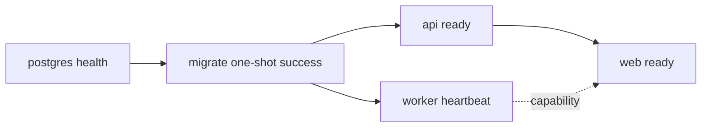

# Case Filing Assistant 项目架构与工程化规范

版本：v0.3

日期：2026-08-07

适用范围：`self_single_v1` 本地可靠 MVP，以及不改变 MVP 边界的后续工程演进。

## 1. 文档结论

本项目采用“前端 Monorepo + Python 模块化单体 + PostgreSQL 可靠任务队列”的结构：

- Web 侧使用 pnpm workspace 与 Turborepo，当前只有一个 Next.js 应用和少量边界清楚的共享包。
- 后端使用单一 FastAPI/Python 项目；API、worker、迁移复用同一代码、依赖锁和最终镜像，仅分离进程入口。
- PostgreSQL 同时承担业务数据、版本一致性和小规模可靠任务队列；MVP 不额外引入 Redis/Celery。
- 浏览器只访问 Next.js；Next.js 将 `/api/v1` 同源代理到 Compose 内部 FastAPI，API 与数据库不暴露到宿主公网接口。
- `outputs/` 是产品和研发输入，不是运行依赖。设计稿、需求/方案、测试报告和本地案件数据不得进入镜像、安装包或发布压缩包。
- 微信小程序属于后续客户端。它可以复用 contracts、design tokens 和经跨端验证的纯领域映射，不复用 DOM、Ant Design 或 Web 路由组件。

可靠 MVP 的判断标准不是“能启动一次”，而是：范围门禁正确、数据可追溯、版本不会错配、任务可恢复、文书可渲染复核、敏感数据不外泄、构建产物可审计。

### v0.3 架构加固决策

- 前端采用 feature slice：页面负责组合，controller 负责编排生成契约驱动的 API hooks，服务端 `step_gates` 是工作流门禁唯一权威。
- 后端继续保持一个 Python 模块化单体和三个进程入口；worker 通过 lease token CAS 与 heartbeat 实现至少一次执行下的一次发布收敛。
- 校验与生成建立 `ValidationRun → GenerationInput hash → Generation → manifest` 审计链，生成器不得依赖可变 ORM aggregate。
- Web 只依赖 API ready；worker 健康通过 capability 单独报告，避免后台处理故障扩大为整个读取界面不可用。
- GitHub Actions 分为代码质量与最终镜像审计两类门禁。前者使用真实 PostgreSQL 执行并发/迁移测试，后者导出 production image 文件清单检查运行目录禁入项。
- Docker 继续采用 build-context denylist 和 final-stage allowlist 双层隔离；`outputs/`、测试、本地数据、设计/需求材料和秘密文件不得进入最终镜像。
- pnpm、uv、Node 和 Python 版本在本机脚本、CI 与 Dockerfile 中保持一致，避免“本机可用、CI 重装、镜像漂移”的依赖环境分叉。

## 2. 当前实现状态与运行目标

### 2.1 当前状态

可靠 MVP 已按本规范落地：

- `apps/web` 已实现 Next.js App Router 四步流程、桌面/移动响应式界面、RTK Query 数据访问和同源 API 代理。
- `services/api` 已实现 FastAPI、数据库迁移、任务 worker、材料存储、确定性抽取/校验和 DOCX/PDF/ZIP 生成。
- `packages/contracts` 由后端 OpenAPI 生成 TypeScript 类型，并通过漂移检查保持同步。
- 根目录已有冻结的 pnpm/uv 锁文件、统一启动/测试脚本、Compose 编排、健康检查和制品审计。
- Windows 本机 SQLite 开发链路、桌面/移动 E2E、前后端测试、生产 Web 构建和文书渲染均已通过；本机没有 Docker daemon，Compose 运行仍需在 Docker 主机补充确认。

运行时实现仍严格遵守 `self_single_v1`，未扩展登录、平台管理、自动法院提交、生成式 AI 或微信小程序等非 MVP 能力。

### 2.2 Compose 运行目标

目标命令：

```bash
docker compose up --build
```

该命令的运行验收标准如下：

1. PostgreSQL 健康后，`migrate` 一次性执行并成功退出。
2. API 与 worker 只在迁移成功后启动；API readiness 通过后 Web 才进入可操作状态。
3. Web 可从 `http://127.0.0.1:3000` 完成四步核心流程。
4. worker 缺失依赖或不健康时，Web 仍可打开并显示明确降级原因，但解析/生成操作被服务端 capability 阻断。
5. 停止和重启不会丢失已提交数据，不会重复发布生成物，也不会默认删除持久化 volume。
6. 最终镜像和发布包通过 allowlist/denylist 制品审计。
7. 虚构样本的桌面与移动 Web 端到端流程、契约测试和 DOCX/PDF 渲染检查通过。

## 3. 架构原则

### 3.1 单一事实来源

- FastAPI 是适用范围、确认状态、数据 revision、校验、金额计算和生成门禁的唯一服务端权威。
- OpenAPI 是前后端协议的唯一可生成来源；提交的快照与生成客户端必须通过漂移检查。
- 设计 token 以纯数据包为来源；Web 编译为 CSS variables，未来小程序转换为自身样式变量。
- 文书只能读取已确认、指定 revision 的不可变快照，不能直接读取 OCR 候选或浏览器未提交表单。

### 3.2 简单优先，按验证结果扩展

- MVP 只维护一个 Python 领域实现，不拆微服务，也不复制 API/worker 领域模型。
- 共享包必须有明确消费者和所有者；只有被两个运行端真实复用时才新建跨端纯逻辑包。
- 不因未来微信小程序提前抽象 Web DOM 组件，也不因未来云部署提前加入账号、对象存储或分布式消息系统。
- 基础设施通过接口隔离，但 MVP 只实现经过验收的一种本地适配器。

### 3.3 默认私密和可审计

- 本地模式禁止第三方 analytics、在线字体、远程 OCR、远程错误上报和案件内容遥测。
- 来源、候选、确认、validation run、generation run、模板版本和规则版本建立可追溯链。
- 日志、指标和诊断包只使用 request/job ID、稳定错误码、阶段和耗时，不含材料正文或敏感字段。

## 4. 目标目录树

```text
case-filing-assistant/
├─ apps/
│  ├─ web/                         # MVP Next.js；桌面基准 + 移动 Web 响应式
│  └─ miniprogram/                 # 未来预留；MVP 不构建、不发布
├─ services/
│  └─ api/                         # 单一 Python 项目，含 api/worker/migrate 入口
│     ├─ app/
│     ├─ resources/                # 版本化规则、模板、字体清单
│     ├─ tests/
│     ├─ pyproject.toml
│     ├─ uv.lock
│     └─ Dockerfile
├─ packages/
│  ├─ contracts/                   # OpenAPI 快照、生成类型和契约工具
│  ├─ design-tokens/               # 跨端纯数据，不含 DOM
│  └─ ui/                          # Web/DOM 通用组件，不含案件领域模型
├─ infra/                          # Compose、健康检查和本地运维脚本
├─ outputs/                        # 研发输入；永不进入运行/发布制品
├─ compose.yaml                    # PostgreSQL、迁移、API、worker、Web 编排
├─ package.json                    # pnpm/Turbo 根任务
├─ pnpm-workspace.yaml
├─ pnpm-lock.yaml
├─ turbo.json
├─ .dockerignore
├─ .gitignore
├─ AGENTS.md
└─ README.md
```

目录约束：

- 不创建 `services/worker`；worker 是 `services/api` 同一 Python package 的独立入口。
- `apps/miniprogram` 当前只是路线占位，不得被根 build、test 或 deploy 默认任务纳入。
- `packages/ui` 不能依赖案件、当事人、执行依据或文书生成模型；带业务含义的组件留在 `apps/web`。
- `packages/contracts` 不依赖 React、DOM、数据库 ORM 或本机文件路径。
- 若未来增加纯领域包，必须证明 Web 与小程序确有共同消费者；服务端法律规则仍以 Python 实现和契约输出为权威，不能在 TypeScript 中复制第二套生成门禁。

## 5. Web 与共享包架构

### 5.1 工具链

- pnpm workspace 负责唯一 JS/TS lockfile、workspace 引用和依赖安装。
- Turborepo 只编排确定的 lint、typecheck、test、build、codegen 和 artifact-audit 任务。
- 远程缓存默认关闭；本地缓存不得包含案件材料、环境变量、OCR 文本或运行数据。
- 每个任务显式声明 inputs、outputs 和环境变量；文档目录和本地数据不属于生产任务输入。

当前根任务统一为：

```text
pnpm lint
pnpm typecheck
pnpm test
pnpm test:e2e
pnpm contracts:check
pnpm build
pnpm artifact:audit
pnpm verify
```

`pnpm verify` 聚合静态检查、前后端测试、契约漂移、生产构建和制品审计；`pnpm test:e2e` 单独启动隔离服务并执行桌面与移动端完整闭环。

### 5.2 Next.js 边界

- App Router 只负责 Web 路由、布局、同源转发和构建；法律业务规则留在 FastAPI。
- 案件路由动态运行，敏感响应使用 `Cache-Control: no-store, private`。
- 案件内容不得写入 URL、静态页面、构建缓存、浏览器持久化存储或 Redux DevTools。
- 生产使用 `output: "standalone"`，关闭生产浏览器 source map，按需导入 UI 和图标。
- 浏览器调用 `/api/v1/*`；服务端代理读取仅运行时可见的内部 API 地址，不能把内部主机名或端口注入客户端 bundle。

### 5.3 响应式和兼容性

- 桌面 Web 是视觉与效率基准；移动 Web 必须完成相同四步核心闭环，不建立第二套状态或路由语义。
- 发布时用 Browserslist 锁定维护范围，并在 CI 输出解析后的浏览器版本；验收覆盖近期两个主要版本的 Chrome、Edge、Firefox、Safari 和相应 Android/iOS WebView。
- 重点 viewport：1280、1440、768、430、390、360 CSS px。
- 交互不依赖 hover；触控热区、键盘导航、焦点、屏幕阅读器标签和 `prefers-reduced-motion` 必须纳入自动与人工检查。
- 上传、预览和下载在低内存移动设备上使用分页/流式策略，不把完整 PDF 或大文件长期持有在浏览器内存。

### 5.4 跨端边界

未来微信小程序复用：

- OpenAPI schema、字段 key、错误码和状态枚举。
- 纯数据 design tokens。
- 经测试确认不依赖 DOM/Node 的格式化与展示映射。

未来微信小程序不复用：

- `packages/ui`、Ant Design、Next.js 路由、Route Handler。
- DOM 上传、Dialog、分页图片预览和浏览器下载实现。
- 浏览器存储、CSS 实现或 Web 专用可访问性适配。

是否采用 Taro/React 在小程序实施里程碑重新做最小验证；当前不把框架选择写成已完成事实。

## 6. 后端模块化单体

### 6.1 项目和依赖

- `services/api` 是单一 Python project，使用 `pyproject.toml` 与提交的 `uv.lock` 精确锁定依赖。
- API、worker、迁移、测试和 CI 从同一 frozen lock 安装；不维护多份 requirements 漂移。
- 当前只有一个 Python project，不引入 uv workspace；出现第二个真正独立且需要联动开发的 Python package 后再评估。
- OCR、LibreOffice、Poppler 和字体作为可验证运行依赖固定版本或 digest，启动时输出不含路径/敏感信息的 capability。

### 6.2 模块职责

```text
API routes → application services → domain rules/repositories → PostgreSQL/BlobStore
worker     → job handlers         → 同一 application services
migrate    → Alembic              → 同一 schema 与依赖锁
```

- API route 只做协议转换、权限/上下文占位、幂等键和 application service 调用。
- extraction 只产生带来源候选和复杂性信号，不能直接覆盖确认卷宗。
- validation 是适用范围和生成门禁唯一权威。
- generation 只读取确认快照，不允许用“高置信度”绕过人工确认。
- BlobStore 使用 opaque key；数据库和 API 不暴露本机绝对路径。

### 6.3 进程与镜像

同一最终后端镜像提供三个 exec-form 入口：

```text
api      python -m app.entrypoints.api
worker   python -m app.entrypoints.worker
migrate  python -m app.entrypoints.migrate
```

复用镜像减少依赖、模板和规则漂移；进程仍分容器运行，使 OCR/LibreOffice 子进程故障不会直接终止 API。只有性能数据证明依赖体积或安全边界需要拆分时，才考虑独立 worker 镜像。

## 7. PostgreSQL 任务可靠性

MVP 使用 job table 与 `FOR UPDATE SKIP LOCKED`：

- job 唯一键覆盖类型、事项、输入 revision 和幂等作用域，重复请求返回既有任务或结果。
- 领取任务时写入随机 lease token、`leased_until`、worker ID 和递增 `attempt_count`。
- heartbeat 只能用当前 token 延长租约；完成/失败更新也必须匹配 token，过期 worker 不得发布结果。
- retry 使用有界次数、指数退避和 jitter；输入错误进入终态失败，资源瞬时错误才可重试。
- 生成文件先写临时 key，完成 size/hash/manifest 校验并在事务内发布元数据；失败和失租结果进入可清理区。
- 修改事实、金额、法院或来源推进 revision，使旧 validation/generation 过期；旧 worker 即使完成也不能发布为当前结果。
- worker 优雅退出时停止领取新任务、终止或回收子进程、尽力释放/缩短租约；超时后依赖租约恢复。

数据库配置必须包含有界连接池、连接存活检查、连接/statement/lock timeout。未知提交结果不得由服务端盲目重放，客户端只能依赖幂等键安全重试。

## 8. Compose 启动拓扑

目标依赖链：



关键约束：

- `postgres` 通过实际连接与简单查询判定健康。
- `migrate` 使用 `service_completed_successfully`，失败必须阻止 API/worker 启动，且不得自动循环迁移。
- API `/health/live` 仅判断进程存活；`/health/ready` 检查数据库、迁移版本、Blob 根目录、规则/模板 manifest。
- worker 不需要伪造 HTTP 服务；可用 Compose healthcheck 调用内部 CLI 检查 heartbeat 与运行依赖。
- Web readiness 检查 Node 服务和 API 代理可达；worker 不健康时 Web 可进入只读/降级状态。
- 长期服务设置合理 restart policy；migrate 不设置无限重启。
- API/worker 使用 `init: true`、exec-form command 和明确 `stop_grace_period`。
- 只映射 `127.0.0.1:3000:3000`；内部 API、PostgreSQL 不发布宿主端口，调试 override 也只能绑定 loopback。
- secrets 不进入镜像和 Compose 文件；本地 `.env` 被 Git 与 build context 排除。

`docker compose down` 不删除 volume。销毁数据必须由单独命令或 UI 执行，并要求用户明确确认目标；文档不得把 `down -v` 作为常规停止方式。

## 9. 构建与制品控制

### 9.1 双层控制

第一层是 build context denylist：

- 根 `.dockerignore` 排除 `.git/`、`outputs/`、`work/`、设计资源、需求/方案、测试报告、缓存、环境文件、上传件、OCR 缓存和导出件。
- 后端以 `services/api` 为 context，并维护自身 `.dockerignore`；不能假设根规则会保护子 context。

第二层是最终镜像 allowlist：

- Web runner 只复制 `.next/standalone`、`.next/static`、明确允许的 `public` 资源、许可证和运行所需最小文件。
- 后端 runner 只复制冻结依赖、应用 package、迁移、规则/模板/字体 manifest 和启动所需系统库。
- runner 使用非 root 用户；根文件系统尽量只读，只有声明的 data/tmp volume 可写。
- 测试、编译器、包管理器缓存、源设计、Markdown 方案和本地数据不进入 runner。

### 9.2 制品硬门禁

CI 对每个最终镜像和发布包输出文件清单、大小和层信息，并执行：

1. 路径 denylist：`.git`、`outputs`、`design`、`work`、`tests`、`test-results`、`coverage`、cache、upload、OCR、export。
2. 扩展名 denylist：设计/办公源文件和需求方案 Markdown；运行许可证使用单独 allowlist。
3. 内容扫描：环境密钥、本机绝对路径、疑似证件号/账户、虚构附件和未替换占位符。
4. allowlist 校验：Web/后端最终目录只能出现声明的运行文件集合。
5. 大小预算：记录基线；超出阈值必须提供依赖/层差异说明并经过 review。

禁止先复制整个仓库再在 runner 中删除文档；删除无法消除前一镜像层、缓存或传输上下文中的泄露。

## 10. 稳定性与可观测性

- 所有外部子进程有超时、退出码、输出大小和并发上限；超时后终止进程树并回收临时文件。
- 上传采用流式读取、magic bytes、大小/页数/像素/解压后尺寸限制；文件名只用于显示，不用于存储路径。
- Blob 写入遵循临时写入、flush/fsync、原子 rename、hash/manifest 校验；数据库提交失败时可重试清理。
- 下载只按数据库 artifact ID 反查受控 key，并验证事项、revision、发布状态和 hash。
- API 返回稳定错误码和 request ID；日志对正文、文件名、证件、电话、账户、地址脱敏。
- 本地 metrics 至少覆盖 API 延迟/错误、DB pool 等待、队列深度/最老任务、重试/终态失败/租约过期、解析/生成耗时、Blob 清理失败。
- 诊断包只包含版本、能力、健康摘要、脱敏错误码和时间范围，不包含 OCR 全文、请求/响应正文或文件系统路径。

## 11. CI 与验证矩阵

### 11.1 Pull request 门禁

```text
format/lint
typecheck
unit tests
OpenAPI generation + no-diff check
PostgreSQL/worker integration tests
deterministic document golden tests
Web component/accessibility tests
container build
artifact audit
```

共享契约、文书模板、规则引擎、revision 或隐私代码变化时必须触发对应的加强测试，不能只运行文档检查。

### 11.2 发布门禁

- 桌面与移动 Web 使用完全虚构样本完成首页门禁和四步流程。
- 覆盖文本 PDF、扫描 PDF、OCR 失败手填、部分履行、复杂关系阻断、修改后旧文书失效、worker 中断恢复和重启恢复。
- DOCX/PDF/PNG 进行实际渲染与视觉核验：分页、字体、表格、页眉页脚、签章位置、占位符和字段溢出。
- 迁移从空库和上一受支持版本执行；失败不会启动 API/worker。
- 网络审计证明本地案件流程不向第三方发起请求。
- 最终制品内容、SBOM/依赖漏洞结果和大小预算通过。
- README 的启动命令已由干净环境复现，且停止/重启/数据保留行为与文档一致。

未通过任一硬门禁时，发布状态必须是“不可用/候选”，不得仅凭开发机演示宣称一键启动完成。

## 12. 代码所有权与变更边界

| 范围 | 主要所有者 | 强制协同 review |
|---|---|---|
| `apps/web`、`packages/ui` | 前端 | contracts、隐私、可访问性变更 |
| `packages/design-tokens` | 前端/设计 | Web 与未来小程序消费者 |
| `packages/contracts` | 前后端共同 | 所有 schema、错误码、枚举变更 |
| `services/api/app/validation`、`generation`、`resources` | 后端/产品 | 产品范围、法律文案、模板变更 |
| job/revision/storage/隐私 | 后端 | 稳定性与安全 review |
| `infra`、镜像、CI、制品门禁 | 工程负责人 | 前端和后端共同验收 |
| `outputs` | 产品/设计/架构 | 相关实现所有者确认可执行性 |

任何一方都不得在自己的层复制另一层的权威规则。跨层变化先更新契约和验收，再实现消费者。

## 13. 分阶段实施

### 阶段 A：可运行工程基线

- 建立 pnpm/Turbo、Next.js、单 Python project/uv lock、PostgreSQL 与 Compose。
- 实现 health/readiness/capability、迁移、同源代理和最小隐私日志。
- 建立 runner allowlist 与 artifact audit；通过后才更新 README 为“可以一键启动”。

### 阶段 B：手工确认闭环

- 不依赖 OCR，先完成适用确认、当事人、依据关键字段、申请内容、revision、校验、确定性 DOCX 和渲染预览。
- 用虚构样本打通桌面与移动 Web。

### 阶段 C：本地解析与可靠任务

- 接入文本提取、OCR、来源定位、lease/retry/heartbeat、能力降级和恢复测试。
- 性能与镜像大小基于实际数据优化，不提前拆服务。

### 阶段 D：发布候选

- 完成浏览器矩阵、渲染 golden、迁移、网络隔离、隐私扫描、SBOM 和制品审计。
- 一键启动验收通过后形成第一个可靠 MVP 标签。

### 阶段 E：微信小程序可行性门禁

- 先验证上传限制、分页预览、下载/保存、网络与本地/远程部署模型，再选择框架。
- 仅复用已证明跨端的 contracts/tokens/纯逻辑；不改变 MVP 法律范围或绕过确认门禁。

## 14. 已拒绝的替代方案

| 方案 | 当前不采用原因 | 重新评估条件 |
|---|---|---|
| API/worker 拆成两个 Python 项目 | 领域、迁移、模板和依赖会漂移 | 独立扩缩容、安全或依赖体积已有数据支持 |
| Redis/Celery | MVP 已有 PostgreSQL，增加运维面 | 队列吞吐、路由或调度超过 PG 方案指标 |
| Web 与小程序直接共享 UI | DOM 与小程序组件模型不同 | 仅评估 headless 纯逻辑，不共享渲染组件 |
| 将 `outputs` 复制进镜像后删除 | 文件会进入 context、缓存或中间层 | 不重新评估，始终使用 denylist + allowlist |
| 多套手写 API 类型 | 必然产生协议漂移 | 不重新评估，以 OpenAPI 生成与漂移门禁为准 |
| 当前即创建完整脚手架配置 | 仓库无实现，容易形成“看似可启动”的错误承诺 | 进入实施阶段并能同步完成验证时创建 |

## 15. 人工确认事项

进入代码实施前，负责人仍需确认：

1. 支持的操作系统与 CPU 架构，以及 PaddleOCR、LibreOffice、Poppler 的镜像体积预算。
2. 本地持久化目录的默认位置、备份/恢复和用户主动销毁交互。
3. 浏览器最低版本和移动设备性能下限。
4. DOCX/PDF 使用的可再分发中文字体与许可证。
5. 第一批全国模板、地方规则包的法律/产品审核责任人与版本发布流程。

这些选择影响实现和发布，但不改变“人工复核、无对外提交”的产品边界。

## 16. 官方技术依据

- pnpm workspace：https://pnpm.io/workspaces
- Turborepo task 配置与缓存：https://turborepo.com/docs/crafting-your-repository/configuring-tasks
- Next.js 自托管与运行边界：https://nextjs.org/docs/app/guides/self-hosting
- Next.js `output: "standalone"`：https://nextjs.org/docs/app/api-reference/config/next-config-js/output
- FastAPI 容器部署：https://fastapi.tiangolo.com/deployment/docker/
- uv 项目与锁文件：https://docs.astral.sh/uv/concepts/projects/
- Docker Compose 启动顺序与健康条件：https://docs.docker.com/compose/how-tos/startup-order/
- PostgreSQL `SKIP LOCKED`：https://www.postgresql.org/docs/current/sql-select.html
